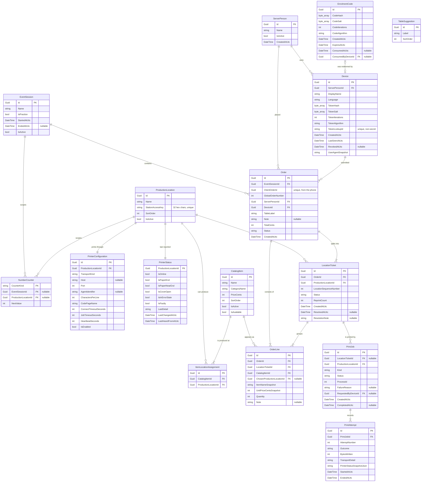
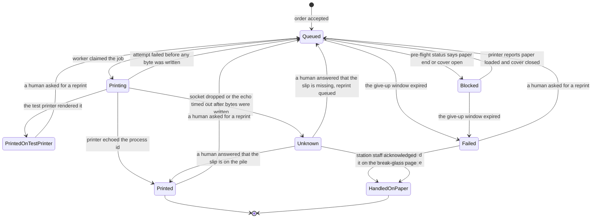
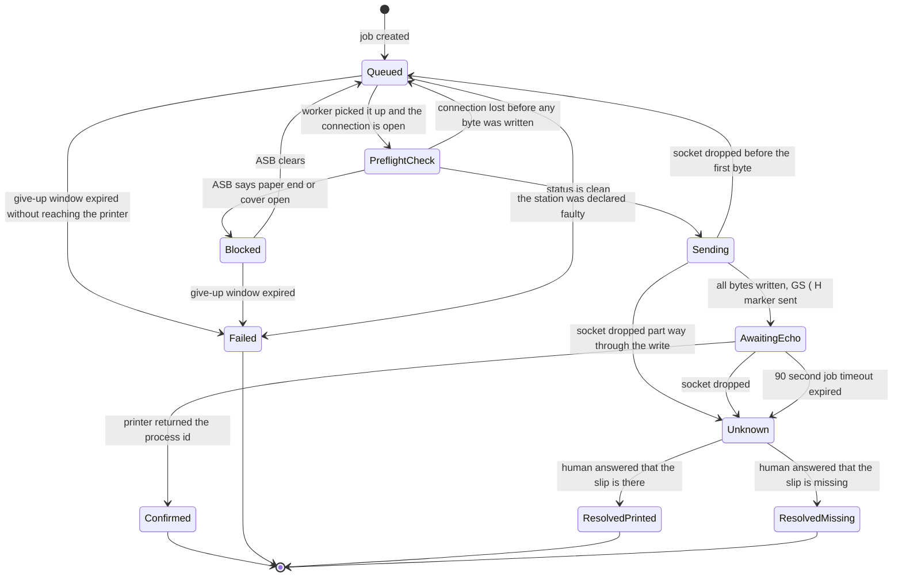

# System specification

Ordering system for volunteer fire department festivals.

Status: draft for owner review. Version 1 scope. Written to be read end to end by a human, not by a
build tool.

Conventions used in this document:

* "Server" always means the person carrying orders and trays, never the machine. The machine is called
  "the backend" or "the laptop".
* Money is stored and calculated in integer cents. No decimal type appears anywhere.
* Times are stored in UTC and rendered in the laptop's local time zone.
* Every user-facing string in this document is given in German and English. Names the admin types in
  (item names, station names, staff names) are data, not chrome, and are stored once in whatever
  language the fire department uses. The app does not translate them.
* Two numbers appear on paper and on screen, and each has exactly one word in each language. The
  global order number is always "Bestellung 137" or "Order 137". The per-station sequence number is
  always "Bon 042" or "Slip 042". No other form of either number exists anywhere in the product.

Contents:

1. Purpose and scope
2. Domain model
3. State machines
4. Numbering
5. REST API
6. SignalR
7. Printing service
8. Frontend screens
9. Offline and failure behaviour on the phone
10. Configuration and setup
11. Testing strategy
12. Open questions

---

## 1. Purpose and scope

### 1.1 What the product does

A server walks table to table with their own phone, picks items and quantities, types the table name,
reads the running total aloud so the guest can pay cash, and places the order. The backend splits the
order by production location, gives each slice its own numbered slip, and prints it on that location's
thermal printer. Kitchen and bar staff work the pile of slips off exactly as they work a pile of paper
today. A server with a free hand carries the tray out.

The product removes one step from the current paper process: the walk from the table to the kitchen.
Nothing else about the process changes.

### 1.2 Why it exists

Orders get lost. A paper slip falls behind a fridge, a server forgets which table a tray belongs to, or
a slip is written twice and the kitchen produces the same order twice. Every design decision in this
document is answerable to that one problem. Two mechanisms carry the weight:

1. Every slip carries a global order number and a per-station sequence number. A missing number in the
   pile is visible to anyone holding the pile. No screen, no login, no software.
2. The server who placed an order can see, on their own phone, whether the slip actually printed. A
   failure is never allowed to look like a success.

### 1.3 Who uses it

| Role | Device | Technical ability assumed | Trained? |
|---|---|---|---|
| Server | Their own phone, any browser | None | No. Possibly never saw the tool before tonight. |
| Admin | The laptop on site | Can type an IP address if told exactly what to type | Read the setup checklist once |
| Kitchen and bar staff | Nothing | None | Not applicable. They touch no software. |

Production location staff click nothing, wait for nothing, and log into nothing. This is a hard
constraint on every design decision below, and the break-glass page in section 8.10 is the single
narrow exception to it.

### 1.4 Scale

Fewer than 10 production locations. Fewer than 10 servers. A catalog of roughly 20 to 60 items. A few
dozen tables. Peak load is a handful of orders per minute. The system is not designed for scale, and
adding scale is not a goal. It is designed for reliability and for operation by people with little
technical ability.

### 1.5 Non-goals

The following are explicitly out of scope. They are listed so that a future change request can be
answered with "that was decided against", not with a redesign.

| Not in scope | Reason |
|---|---|
| Payments of any kind | Cash is handled by hand at the table. The app takes no payment, stores no payment data, and has no card reader. |
| Guest receipts, invoices, tax documents | Any of these would drag German fiscal law (KassenSichV, TSE, GoBD) into a hobby project. The printed slip is a production instruction for staff, not a receipt for a guest. |
| Kitchen display system | Staff work off a pile of paper. Putting a screen in the kitchen would replace the process instead of removing one walk from it. |
| Stock, inventory, sold-out counts | An item can be switched off by the admin. Counting portions is not attempted. |
| Table reservations or floor plans | Tables are moved during the evening. Managing them as objects is more work than the problem is worth. |
| Zones or areas grouping stations | Almost every festival has one kitchen and one bar. Grouping stations into areas made every server perform a shift-start ritual for a case that hardly ever happens. Routing now comes from the item itself, and section 2.6 describes the one remaining choice a server makes. |
| Cloud, remote access, multi-site | There is no internet on site. |
| Accounts, usernames, passwords | Nobody will manage credentials at a festival. Section 2.8 describes what replaces them. |
| Guest self-ordering | The server at the table is the product. |
| Reporting and analytics beyond a list of the evening's orders | Nobody will read it. |
| Native apps, app store distribution, PWA install | There is no secure context over plain HTTP, so no service worker and no install prompt exist. |
| Tray tracking, delivery confirmation | A server carries the tray. The app is not told when it arrives. |
| Cancelling or correcting an order after it is placed | The moment an order is placed, its slip is printing or already lying on the pile at the station. Cancelling in software does nothing to paper that already exists, and a cancel button would tell the server the order is withdrawn while the kitchen carries on cooking it. That illusion is the exact defect this product exists to remove. The honest correction is the one the paper process already uses: walk over and tell the station. Section 3.6 says what the phone tells the server. |
| Deleting or cleaning up a mistaken order | It stays in the database. No money moves through the app and nothing aggregates orders, so a wrong order costs a line in a list the treasurer skims once. A cleanup mechanism would be a second way to make a slip disappear from a screen while it is still on a pile. |

---

## 2. Domain model

### 2.1 Notation

Types are given as they will exist in C#. `Guid` primary keys are generated on the backend, except
`Order.ClientOrderId`, which is generated on the phone. `string(n)` means a maximum length enforced
both in the database schema and in validation. All money is `int` cents.

### 2.2 Entity relationship diagram



`TableSuggestion` has no relationship to anything. It is a list of words the phone offers as buttons,
and section 2.7 explains why that is deliberate.

### 2.3 EventSession

An operating period, normally one festival evening. It exists for one reason: it scopes the numbering
counters, so a fresh evening starts at slip number 1 without making yesterday's numbers ambiguous.

| Field | Type | Notes |
|---|---|---|
| Id | Guid | |
| Name | string(60) | The admin types it, for example "Samstagabend". Defaults to the current date. |
| IsPractice | bool | A practice run. Its orders are excluded from the treasurer's export and a station on the test printer is expected rather than an error. |
| StartedAtUtc | DateTime | |
| EndedAtUtc | DateTime? | Set when the next session starts |
| IsActive | bool | Exactly one row may be active |

Invariants:

* Exactly one `EventSession` has `IsActive = true` at any time. Starting a new session ends the
  previous one in the same transaction.
* An order always belongs to the session that was active when it was accepted. Sessions are never
  reassigned.
* Ending a session deletes nothing. The SQLite file is the whole history and section 10.5 describes the
  backup.

**Starting a session is guarded, because starting one by accident during service is the one action that
breaks both safety mechanisms at once.** Numbering would restart at 1 into a pile that already holds a
001, so the same stack would carry two different slips numbered 042 and neither would be marked as a
reprint. The gap mechanism and the reprint mechanism would both be dead in the same second. The backend
therefore refuses to start a session when any of these is true, and each refusal names what to do:

| Condition | What the admin is told |
|---|---|
| A ticket of the current session is not in a final state | How many, with a link to the order list, and that they must be settled first |
| An `Unknown` question of the current session is unanswered | The same, because those questions vanish from every phone when the session changes |
| An order was accepted within the last hour | The start is allowed only after the admin types the new event's name into a confirmation field |
| An active production location is still on the test printer | Which stations, and the offer to start a practice run instead |

A practice run is exempt from the last condition, because the test printer is the point of it.

### 2.4 ProductionLocation

A kitchen or a bar. Exactly one printer per location. There is no grouping above this: a location is
the whole of the site structure the system models.

| Field | Type | Notes |
|---|---|---|
| Id | Guid | |
| Name | string(40) | Printed in large type at the top of every slip |
| StationAccessKey | string(32) | Random hex, unique. The only thing protecting the break-glass page. |
| SortOrder | int | The order stations appear in, on the phone and in the admin |
| IsActive | bool | Soft delete only |

Invariants:

* Every active location has exactly one `PrinterConfiguration` row and exactly one `PrinterStatus` row.
  Both are created with the location and never exist without it.
* A location cannot be deactivated while it has tickets that are not in a final state.
* **A location cannot be deactivated while it is the last active location of any active item.** The
  refusal names those items. This is what keeps the candidate set in section 2.6 non-empty, and it is
  the reason acceptance never has to invent a station.
* `StationAccessKey` is generated on creation and can be regenerated by the admin, which immediately
  invalidates the old break-glass link. It is stored in plaintext because it has to be rendered back
  into a URL and a QR code whenever the admin asks for the station card. It is never written to the
  request log, and the log's request line for `/station/...` paths is truncated before the key.

### 2.5 CatalogItem

| Field | Type | Notes |
|---|---|---|
| Id | Guid | |
| Name | string(60) | Printed on the slip |
| CategoryName | string(40) | Free text, used only to group buttons on the phone |
| PriceCents | int | Zero is allowed, for example for tap water |
| SortOrder | int | |
| IsActive | bool | Soft delete. Items are never hard deleted because orders reference them. |
| IsAvailable | bool | The "sold out" switch. Flipping it pushes to every phone at once. |

Invariants:

* **An item cannot be saved with zero production locations, and an item with zero production locations
  never appears in the catalog.** The admin form refuses to save and says why, and the API answers 422.
  This is the invariant the whole routing design rests on.
* `PriceCents >= 0`.
* Editing a name or price never changes an existing order. Every `OrderLine` carries a snapshot.
* Deactivating an item is refused while a non-practice session is active. The sold-out switch is the
  tool during service; deactivation is a between-events operation. Without this rule a phone holding a
  cached catalog could offer an item that acceptance would then have to reject, and a rejected order at
  a busy table is the failure this product exists to prevent.

### 2.6 ItemLocationAssignment and routing

Which locations are capable of producing an item. Bratwurst is assigned to the kitchen. Beer at a site
with two bars is assigned to both.

| Field | Type | Notes |
|---|---|---|
| Id | Guid | |
| CatalogItemId | Guid | |
| ProductionLocationId | Guid | |

Invariants:

* `(CatalogItemId, ProductionLocationId)` is unique.
* An item's **candidate set** is its assigned locations that are active. By the invariants in sections
  2.4 and 2.5 the candidate set of an orderable item is never empty, so routing never has a nothing
  case and there is no fallback rule anywhere in the system.

**The routing rule, and the only routing rule in the system:**

1. **One candidate.** The line routes there. The server is never asked, and no station control is
   rendered for that item. This is the normal case at a site with one kitchen and one bar, and it is
   completely invisible.
2. **More than one candidate.** The server chooses, on the phone, at the moment the line is added.
   The choice is stored on `OrderLine.ChosenProductionLocationId`, is shown on the line in the review
   screen, and is changeable until the order is sent.

The choice belongs to the order line. It is not a session setting, not a device setting, and not a
shift setting, and nothing about it is remembered for the next line or the next order.

The one edge the backend has to answer: the chosen location may have been deactivated between the
catalog fetch and the submission. In that case the line routes to the lowest `SortOrder` candidate that
is still active, `ChosenProductionLocationId` keeps what the server actually chose, and the slip prints
the intended station under the lines so the receiving station can see where it was meant to go. The
order is never rejected for a routing reason.

This rule lives in one class, `OrderRoutingResolver`, and is used by the order submission path, by the
admin preview in the assignment screen, and by tests. It is not reimplemented anywhere.

### 2.7 Table naming: free text, with suggestions

**Decision: a table is a free text label on the order, not an entity that orders point to.** A
`TableSuggestion` table exists purely to prefill a list of buttons on the phone.

Justification. At a festival the tables are beer benches. They get moved, added, and joined together
during the evening, and guests sit at whatever is standing. If the order required a foreign key into a
table list, then the first table that is not in the list blocks an order, and blocking an order is the
exact failure this product exists to prevent. Free text can never block. The suggestion list gives the
common case one tap and keeps spellings consistent, which is all the structure that is actually needed:
nothing in the system aggregates by table.

| TableSuggestion field | Type | Notes |
|---|---|---|
| Id | Guid | |
| Label | string(40) | For example "Tisch 12" |
| SortOrder | int | |

Invariants:

* `Order.TableLabel` is required, trimmed, collapsed to single spaces, between 1 and 40 characters.
* `Order.TableLabel` need not match any suggestion.

"Tisch 12", "tisch 12" and "T12" are three labels for one table, and that is accepted rather than
normalised, because nothing aggregates by table and normalising would be work for no gain.

After the first evening the department has a real list for free: the admin screen offers to add every
distinct label that servers actually typed during the last session, so the second festival starts with
suggestions that match how this crew names its tables.

### 2.8 ServerPerson, Device, EnrolmentCode

There are no usernames and no passwords anywhere in the product.

**ServerPerson** is a name to print on the slip, the owner of the evening's orders, and the entry in
the admin list.

| Field | Type | Notes |
|---|---|---|
| Id | Guid | |
| Name | string(40) | |
| IsActive | bool | |
| CreatedAtUtc | DateTime | |

An order belongs to a `ServerPerson`, not to a phone. That is what makes a flat battery, a revoked
phone, or a re-enrolment survivable: the evening's history follows the human, and the questions in
section 3.4 stay answerable by the person who can walk to the station.

**Device** is one enrolled phone.

| Field | Type | Notes |
|---|---|---|
| Id | Guid | |
| ServerPersonId | Guid | Who is carrying it. The admin can reassign it when a phone changes hands between shifts. |
| DisplayName | string(40) | Defaults to the person's name, editable in admin |
| Language | string(2) | `de` or `en`. Every message the backend sends to this phone is rendered by the phone in this language. |
| TokenLookupId | string(32) | Non-secret random id, sent with every request so the backend can find the one row to verify against |
| TokenHash, TokenSalt, TokenIterations, TokenAlgorithm | | PBKDF2-HMAC-SHA512, per-token random salt, iteration count and algorithm name stored alongside the hash so both can be raised later without invalidating existing devices |
| CreatedAtUtc, LastSeenAtUtc | DateTime | |
| RevokedAtUtc | DateTime? | Non-null means every request from this device is rejected |
| UserAgentSnapshot | string(200) | So the admin can tell two phones apart in the list |

**EnrolmentCode** is a single-use, short-lived credential shown on the laptop.

| Field | Type | Notes |
|---|---|---|
| Id | Guid | |
| CodeHash, CodeSalt, CodeIterations, CodeAlgorithm | | Same hashing scheme as device tokens |
| CreatedAtUtc, ExpiresAtUtc | DateTime | Lifetime 5 minutes |
| ConsumedAtUtc, ConsumedByDeviceId | | Set atomically by the first successful redemption |

The six digits and the QR URL of the code currently on screen live in the rotation service's in-memory
state and are never written to the database. Persisting them beside their own hash would make the
hashing decorative.

Invariants:

* Redemption is a single atomic update: a code moves from unconsumed to consumed in the same
  transaction that creates the device, so a photographed QR code cannot enrol a second phone.
* Codes rotate about every 30 seconds while the "Set up a server phone" screen is open, so a whole crew
  can enrol during one briefing. Rotation does not invalidate codes that are still inside their 5
  minute window, because a phone may be slow to open the page.
* Verification is a linear scan over the unconsumed, unexpired codes, of which there are at most a
  handful. This is why a hashed short code needs no plaintext lookup index.
* **A code that is already consumed or expired answers 410 and is not counted as a failed attempt.**
  Eight people scanning the same displayed QR within two seconds is the design goal, not an attack, and
  seven of them get a 410 as a matter of course.
* **A wrong code is counted per source address, and only that address is locked.** Ten wrong codes from
  one address within five minutes lock that address for five minutes. Codes already issued to other
  people are never invalidated by somebody else's mistyping, because that is what turns one person's
  bad thumb into everyone's problem on an open network.
* The admin can lift every lock from the enrolment screen, and the screen lists the locked addresses so
  the person at the laptop can see that it happened at all.
* Tokens are never logged, never returned after enrolment, and never recoverable. A lost phone is
  handled by revoking and enrolling again.
* Revoking a device sets `RevokedAtUtc` and pushes a SignalR message to that device, which clears its
  token and returns to the enrolment screen. **The half-built order on that phone is kept**, for the
  reasons in section 9.4.

### 2.9 Order and OrderLine

| Order field | Type | Notes |
|---|---|---|
| Id | Guid | |
| EventSessionId | Guid | The active session at acceptance |
| ClientOrderId | Guid | Generated on the phone, unique index. This is the idempotency key. |
| GlobalOrderNumber | int | Allocated at acceptance, unique within the session |
| ServerPersonId | Guid | Who placed it. This is what the order list is scoped by. |
| DeviceId | Guid | Which phone submitted it, for the admin's diagnosis only |
| TableLabel | string(40) | |
| Note | string(200)? | An order level note, printed on every station's slip |
| TotalCents | int | Sum of `Quantity * UnitPriceCentsSnapshot`, stored so the slip and the phone can never disagree |
| Status | string | See section 3.1 |
| CreatedAtUtc | DateTime | |

| OrderLine field | Type | Notes |
|---|---|---|
| Id | Guid | |
| OrderId | Guid | |
| LocationTicketId | Guid | The slice this line was routed into |
| CatalogItemId | Guid | |
| ChosenProductionLocationId | Guid? | Null when the item had one candidate. Set when the server chose. |
| ItemNameSnapshot | string(60) | |
| UnitPriceCentsSnapshot | int | |
| Quantity | int | 1 to 99 |
| Note | string(100)? | For example "ohne Zwiebeln", printed under the line |

Invariants:

* An order has at least one line.
* `Quantity >= 1`.
* `line.LocationTicket.OrderId == line.OrderId` for every line.
* `TotalCents` equals the recomputed sum. This is asserted in the acceptance transaction and covered by
  a test, because the total is the only number a guest hears out loud.
* An accepted order is immutable except for its status. Lines are never added, removed, or edited, and
  an order is never cancelled or deleted.
* `ClientOrderId` carries a unique index and is the whole duplicate protection for a resubmission.
  Section 9.3 describes it from the phone's side.

### 2.10 LocationTicket

The per-location slice of an order. This is the thing that gets printed, and the thing that carries a
sequence number.

| Field | Type | Notes |
|---|---|---|
| Id | Guid | |
| OrderId | Guid | |
| ProductionLocationId | Guid | |
| LocationSequenceNumber | int | Allocated at acceptance, unique per location per session |
| Status | string | See section 3.2 |
| ReprintCount | int | Zero on the first print. Every reprint slip says so in its header. |
| CreatedAtUtc | DateTime | The give-up window in section 3.2 is measured from here |
| ResolvedAtUtc | DateTime? | When a human answered an unknown outcome or acknowledged a manual handover |
| ResolutionNote | string(200)? | Who answered and what they answered |

Invariants:

* `(OrderId, ProductionLocationId)` is unique. An order produces at most one ticket per location, and
  every line for that location goes on it.
* A ticket has at least one line.
* `LocationSequenceNumber` is allocated exactly once and never changes, including on reprints.

### 2.11 PrintJob and PrintAttempt

A `PrintJob` is one intent to put a sheet of paper in a station's tray. A `PrintAttempt` is one
connection level try inside that intent. Splitting them is what makes "we sent bytes and do not know
what happened" a recordable fact rather than a guess.

| PrintJob field | Type | Notes |
|---|---|---|
| Id | Guid | |
| LocationTicketId | Guid? | Null only for `Test`, which belongs to a printer rather than an order |
| ProductionLocationId | Guid | Which printer's worker owns it. Always set, including for `Test`. |
| Kind | string | `Initial`, `Reprint`, or `Test` |
| Status | string | See section 3.3 |
| ProcessId | int | 1 to 9999 from that printer's persisted counter. Sent with `GS ( H` and echoed back by the printer when it has finished processing the job. |
| FailureReason | string? | `PaperEnd`, `CoverOpen`, `Unreachable`, `Timeout`, `SocketDropped`, `PrinterError`, `StationDisabled`, `StationFaulty` |
| RequestedByDeviceId | Guid? | Null for the initial job, set when a human asked for a reprint |
| CreatedAtUtc, CompletedAtUtc | | |

| PrintAttempt field | Type | Notes |
|---|---|---|
| Id | Guid | |
| PrintJobId | Guid | |
| AttemptNumber | int | 1 based |
| Outcome | string | `Confirmed`, `Blocked`, `Unreachable`, `SocketDropped`, `Timeout`, `PrinterError` |
| BytesWritten | int | **Bytes handed to the socket for this job's payload.** Not bytes the printer acknowledged, which nothing can know. Any value above zero is treated as possibly delivered, which is the conservative direction. |
| TransportDetail | string(400) | The socket error text or the transport's own message. Never shown raw to a server. |
| PrinterStatusSnapshotJson | string | The ASB or `DLE EOT` state at the end of the attempt |
| StartedAtUtc, EndedAtUtc | | |

Invariants:

* At most one `PrintJob` per ticket is in a non-final state at any moment.
* An attempt with `BytesWritten > 0` never leads to an automatic retry. Only a human can ask for the
  reprint.
* Attempts are append only. Nothing in the print history is ever updated after it ends.
* A process id echo is accepted only on the socket that sent that job. An echo arriving on a new
  connection is discarded, because the counter cycles and a stale match would turn a lost slip into a
  reported success.

### 2.12 PrinterConfiguration and PrinterStatus

| PrinterConfiguration field | Type | Default | Notes |
|---|---|---|---|
| ProductionLocationId | Guid | | One to one |
| TransportKind | string | `Mock` | `Network`, `Agent`, or `Mock`. This is the only place the choice exists. |
| Host | string(64)? | | IP address of the printer or its WiFi bridge |
| Port | int | 9100 | |
| AgentIdentifier | string(64)? | | Reserved for the deferred Pi agent |
| CharactersPerLine | int | 48 | Font A on 80 mm paper |
| CodePageName | string | `PC858` | ESC/POS page 19, which contains the German umlauts and the Eszett |
| ConnectTimeoutSeconds | int | 5 | |
| JobTimeoutSeconds | int | 90 | Matches the printer's own connection timeout |
| HeartbeatSeconds | int | 10 | `DLE EOT n=4` poll interval |
| IsEnabled | bool | true | A disabled printer holds its tickets rather than failing them straight away, and section 3.2 bounds how long that can last |

| PrinterStatus field | Type | Notes |
|---|---|---|
| ProductionLocationId | Guid | |
| IsOnline | bool | A connection is open and the last heartbeat answered |
| IsPaperEnd, IsPaperNearEnd, IsCoverOpen, IsInErrorState | bool | Decoded from ASB and `DLE EOT` |
| IsFaulty | bool | Set by the circuit breaker in section 7.6. The worker has stopped attempting until a human acts. |
| LastDetail | string(200) | |
| LastChangedAtUtc, LastHeardFromAtUtc | DateTime | |

Invariants:

* Status is written only by that printer's worker, so there is one writer per row and no contention.
* Every status change pushes a SignalR event. Clients never poll for printer state.

### 2.13 NumberCounter

One row per counter, with a composite key rather than a formatted string, so the database enforces the
relationship instead of a naming convention. See section 4.

| Field | Type | Notes |
|---|---|---|
| CounterKind | string(20) | `GlobalOrder`, `LocationSequence`, or `PrinterProcessId`. Part of the primary key. |
| EventSessionId | Guid? | Set for `GlobalOrder` and `LocationSequence`, null for `PrinterProcessId`. Part of the primary key. |
| ProductionLocationId | Guid? | Set for `LocationSequence` and `PrinterProcessId`, null for `GlobalOrder`. Part of the primary key. |
| NextValue | int | |

`PrinterProcessId` lives here rather than in memory because a counter that restarts at 1 after a crash
can match a stale echo, and a stale match reports a lost slip as printed.

---

## 3. State machines

Two state machines exist, plus one projection. The ticket state is a machine driven by print jobs and
human answers. The print job state is the machine that touches hardware. The order status is not a
machine at all: it is recomputed from the ticket states, and section 3.1 gives the table that computes
it.

### 3.1 Order status, a projection of its tickets

An order has no draft state on the backend. Until it is accepted it exists only on the phone, as the
draft cart described in section 9.2.

`Order.Status` is computed by `OrderStatusCalculator` from the current ticket statuses and written in
the same transaction as the ticket change that caused it. It is stored rather than derived on read so
that a query for "orders that need checking" is one indexed lookup, and it is computed nowhere else.

Earlier drafts of this document drew the order status as a diagram with transitions. That was wrong,
and it hid real contradictions: a reprint takes a ticket from `Printed` back to `Queued`, and no
diagram of the order state had an arrow for that. Recomputation has no such problem, because there are
no arrows to be missing.

**The calculator. The first row that matches wins.**

| # | Condition over the order's tickets | Order status |
|---|---|---|
| 1 | Any ticket is `Unknown`, `Failed`, or `Blocked` | `NeedsAttention` |
| 2 | Any ticket is `PrintedOnTestPrinter` and the session is not a practice run | `NeedsAttention` |
| 3 | Every ticket is `Printed`, `HandledOnPaper`, or `PrintedOnTestPrinter` | `Printed` |
| 4 | Any ticket is `Printing` | `Printing` |
| 5 | Otherwise, which means at least one ticket is `Queued` | `Accepted` |

Row 1 puts `Blocked` on the attention list on purpose. A station with no paper needs a human, and the
message that reaches the phone says the slip prints by itself once the roll is in, so the row clears
itself the moment somebody acts.

Row 2 is the trap in section 3.5: a station left on the test printer reports every order as printed
while nothing reaches any pile. During a practice run that is the point; during a real evening it is a
silently dropped order and it is reported as one.

The table is total: every combination of ticket states falls into exactly one row, and a new ticket
state is a new row rather than a new arrow somebody forgets to draw.

States:

| State | Meaning | What the server sees on the phone |
|---|---|---|
| `Accepted` | Stored, numbered, split into tickets. Nothing has printed yet. | "Wird gedruckt" / "Printing" |
| `Printing` | At least one printer is working on it. | "Wird gedruckt" / "Printing" |
| `Printed` | Every ticket is on paper, or a human confirmed it is on paper. | "Gedruckt" / "Printed" |
| `NeedsAttention` | At least one ticket failed, is blocked, or is unresolved. | The specific message from section 8.8, with a cause and a next step |

Rules and failure behaviour:

* **An order is never rejected because of a printer.** Acceptance persists the order and its numbers.
  Printing happens afterwards. A dead printer produces `NeedsAttention`, never a lost order.
* **An accepted order is never edited, cancelled, or deleted.** There is no `Voided` state and no
  cancel action anywhere in the product. Section 3.6 says why, and what the server does instead.
* **The same order submitted twice is one order.** A resubmission carrying a `ClientOrderId` that was
  already accepted returns the original order with its original numbers and creates nothing. Section
  9.3 describes the mechanism and the reason it is load-bearing.

### 3.2 LocationTicket



| State | Meaning |
|---|---|
| `Queued` | Waiting for its printer's worker. Safe to retry, because no bytes have reached the printer. |
| `Blocked` | The printer answered, and it has no paper or an open cover. Nothing was sent. |
| `Printing` | Bytes are being written, or the process id echo is being waited for. |
| `Printed` | The printer echoed the process id, or a human confirmed the slip is on the pile. |
| `PrintedOnTestPrinter` | The station is on the test printer. The slip exists on the laptop's screen and nowhere else. |
| `Unknown` | Bytes were written and the outcome is genuinely not knowable from here. |
| `Failed` | Nothing was sent and the give-up window expired. The reason says whether the printer was unreachable, switched off, or declared faulty. |
| `HandledOnPaper` | The station saw the order on the break-glass page and is producing it. The slip will not be chased any further. |

**The give-up window is 5 minutes, and it runs from `LocationTicket.CreatedAtUtc`, not from the first
attempt.** That distinction matters: a ticket queued behind twenty others at a station that answers
slowly is failing from the guest's point of view whether or not the worker has reached it yet. Before
the window expires the phone shows "Wird gedruckt". After it expires the phone shows the failure with
its cause and its next step. Five minutes was chosen because it is roughly how long a volunteer takes
to walk to the bar and back, so a ticket that recovers on its own recovers before anyone acts on the
message.

**Nothing parks forever.** A ticket at a switched off station, a ticket behind a jam, and a ticket at a
station nobody has looked at since 21:00 all reach `Failed` when the window expires, with
`FailureReason` naming which of those it was. The phone then carries a message with an action in it,
the admin overview counts them, and the order shows up in the attention filter. A ticket that never
leaves `Queued` and a phone that says "Wird gedruckt" all evening is the exact shape of a silently
dropped order, and the window is what makes it impossible.

### 3.3 PrintJob

This is the state machine that touches hardware, and the one that decides whether a retry is safe.



Every state in this machine has at least one producer and at least one way out. An earlier draft
declared a `Cancelled` outcome in four separate places without a single transition that could reach it,
which is how a state that nothing can enter survives review.

### 3.4 The unknown outcome, stated directly

The printer holds one connection at a time and drops it after 90 seconds of inactivity. If the socket
dies after the first byte of a job has been written, then from the backend's position the job is in
exactly one of two states and there is no command that distinguishes them: the slip is lying on the
pile, or it is not.

There is no ESC/POS query that answers "did job 42 print". `DLE EOT` reports paper, cover, and error
state; it does not report job history. So:

* **A job that wrote bytes and lost its confirmation enters `Unknown`. It is never retried
  automatically.** An automatic retry here is exactly how a station prints one order twice.
* **`Unknown` is resolved by a human, and only by a human.** The question is asked on the phone of the
  server who placed the order, because that server can walk to the station and look at the pile. It is
  also answerable in the admin order list on the laptop, through an endpoint that exists (section 5.5)
  rather than being promised. Two real surfaces matter: a phone with a flat battery at 21:00 must not
  take an unanswered question out of the world with it.
* **The question names the number that is printed in double height on the paper.** It says "Bon 042",
  the same words in the same order as the slip header, so the answer takes one glance at the top slips.
  Naming the order number here instead would send a server looking for 137 in a pile of slips numbered
  042, and the answer would be a wrong "the slip is missing" followed by a duplicate order.
* **The backend adds evidence, not a decision.** When the connection comes back, the worker reads the
  printer status. If paper end or cover open is set, the phone additionally says that the printer has
  no paper, which makes "the slip is missing" the likely answer. The app still asks. It never guesses.
* **Answering "the slip is there"** moves the ticket to `Printed` and records who answered.
* **Answering "the slip is missing"** queues a reprint. The reprint carries the same global order number
  and the same per-location sequence number, and prints `NACHDRUCK` / `REPRINT` in its header, so if
  both slips somehow exist the station sees two identical numbers and knows to produce one order.
* **`Unknown` never resolves itself by timing out.** An unanswered question stays on the screen and in
  the admin list until someone answers it. A quiet expiry would be a silently dropped order. Because
  such a question would otherwise disappear when the next evening's session starts, starting a session
  refuses while one is open, per section 2.3.

### 3.5 Failure behaviour summary

| What went wrong | Bytes written | Automatic retry | Ticket state | What the server is told |
|---|---|---|---|---|
| Printer not reachable on the network | 0 | Yes, with backoff, until the give-up window | `Queued`, then `Failed` | The station is not answering, with what to do next |
| Paper end or cover open found before sending | 0 | Yes, as soon as the printer reports it is ready | `Blocked` | Which station, what is wrong, and that it prints by itself afterwards |
| Socket dropped before the first byte | 0 | Yes, with backoff | `Queued` | Nothing, unless the give-up window expires |
| Socket dropped part way through the write | > 0 | Never | `Unknown` | The question in section 8.8 |
| 90 second timeout with no echo | > 0 | Never | `Unknown` | The question in section 8.8 |
| Paper ran out part way through a job | > 0 | Never | `Unknown` | The question, plus the note that the printer has no paper |
| Printer reports a mechanical error | Either | Never | `Unknown` if bytes were written, otherwise `Blocked` | The station name and to fetch someone who can look at the printer |
| Two jobs in a row end `Unknown` at one station, or its queue reaches ten | 0 for the queued ones | No, the station is declared faulty | `Failed` for every waiting ticket, at once | To announce the order at the station in person, on every affected phone at the same time |
| Backend restarted mid-job | Unknown | Never | `Unknown` on recovery | The question, on the next connect of that phone |
| Station is disabled in configuration | 0 | Held, then the window expires | `Queued`, then `Failed` | That the station is switched off, and after five minutes that the order has to be announced in person |
| Station is on the test printer during a real event | all | No | `PrintedOnTestPrinter` | That the order went to the test printer and no slip is on the pile |

### 3.6 A guest changes their mind

This happens several times an evening, and the product's answer is deliberately not a button.

**Before the order is placed** there is nothing to specify. The order is a cart on the phone. Removing
a line, changing a quantity, and starting over are ordinary editing, not state transitions, and the
backend has never heard of the order.

**After the order is placed there is no cancel action, anywhere, for anybody.** The moment the order is
accepted its slip is either coming out of a printer or already lying on a pile at the station. Software
cannot take paper back. A cancel button would clear the row on the server's phone, which reads as "that
order is withdrawn", while the kitchen goes on cooking from a slip nobody removed. That is a system
telling a human something untrue about the physical world, which is the one defect this entire document
is written against. It is worse than the problem it solves.

**What happens instead** is what happened before there was any software: the server walks over and tells
the station. That walk is short, it is certain, and it is the same walk that any workable design would
have required anyway. The order detail on the phone carries one sentence saying so, at the moment the
server is looking at the order the guest just changed. The extra order stays in the database, which
costs nothing: no money moves through the app, and nothing aggregates orders except a list the
treasurer skims once.

**This is not the dead printer case.** A station whose printer failed is covered by the `Failed` ticket
and the break-glass page in section 8.10, and that path already ends in a human at the station taking
the order onto paper. There is exactly one escape hatch and it is that one.

---

## 4. Numbering

Two numbers appear on every slip. Both matter, and they do different jobs.

* The **global order number** is how a person says one order out loud across the whole site.
  "Bestellung 137, wo ist das Bier dazu." It is unique per event session and shared by every slip of
  that order.
* The **per-location sequence number** is how a person sees at a glance that something is missing. The
  slips at the kitchen run 1, 2, 3, 4. If the pile jumps from 41 to 43, then 42 is lost and the station
  knows it without touching software. This is the loss detection mechanism, and it is why the number is
  printed large.

### 4.1 Allocation

Counters live in the `NumberCounter` table, keyed by kind and by the ids the counter belongs to:

| CounterKind | EventSessionId | ProductionLocationId | Counts |
|---|---|---|---|
| `GlobalOrder` | set | null | Global order numbers |
| `LocationSequence` | set | set | That location's sequence numbers |
| `PrinterProcessId` | null | set | ESC/POS process ids for that printer, cycling 1 to 9999 |

The key is composite rather than a formatted string. An earlier draft built a string like
`session:{guid}:location:{guid}`, which is 90 characters and did not fit its own 80 character column,
so the first order of the first evening would have failed inside the acceptance transaction and every
phone would have told its server to write orders on paper. The composite key removes both the length
problem and the string parsing.

Order and sequence counters start at 1. Allocation happens inside the single database transaction that
accepts an order:

1. Open a SQLite write transaction (`BEGIN IMMEDIATE`, which SQLite serializes, so there is exactly one
   writer). The busy timeout is 5 seconds, so a concurrent writer waits rather than returning
   `SQLITE_BUSY` to a server standing at a table.
2. Insert the `Order` row and take the next global order number.
3. For each production location the order routes to, insert one `LocationTicket` and take that
   location's next sequence number.
4. Insert the lines.
5. Commit.

Nothing else in the system allocates an order or sequence number. Print attempts do not and reprints do
not. The one other counter in the table, `PrinterProcessId`, belongs to the printing service and is
described in section 7.4.

### 4.2 Why gaps mean what they mean

A gap in the pile has to mean "a slip is missing", otherwise the station learns to ignore gaps and the
mechanism is dead. Four rules keep that true:

* **A number is allocated only by a transaction that commits.** If anything in the acceptance path
  fails, the whole transaction rolls back and the counter rolls back with it. There is no separate
  "get a number" call that can succeed while the order fails.
* **Counters are in the database, never in memory.** A restart, a crash, or a laptop that lost power
  mid-evening resumes at the exact next value. There is no in-process cache and no batch reservation,
  because both hand out numbers that may never be used.
* **A reprint reuses the number.** Reprinting does not consume a new one, so a reprinted slip never
  makes the pile look like it gained an order.
* **Slips are printed in sequence number order at each station.** A blocked job holds its station
  rather than being overtaken by a later one, which is also what the hardware does anyway, since a
  paper-out condition stops everything. Without this rule a pile could read 41, 43, 44 and then 42 a
  minute later, which teaches a station to wait and see, and waiting and see is the same behaviour as
  ignoring gaps.

Because there is no cancellation and no deletion, a committed number always has a slip behind it. Every
gap in a pile means one thing and only one thing: that slip did not come out, and the admin order list
can name which order it belonged to in five seconds.

### 4.3 Across restarts and sessions

* On startup the backend reads nothing into memory. The first order after a restart takes the next
  value straight from the table.
* Starting a new event session creates new counter rows starting at 1. Old orders keep their old
  numbers and stay in the database. Because tickets carry `EventSessionId` through their order, a
  sequence number is only ever ambiguous across sessions, never within one, and the slips from
  yesterday are in yesterday's bin.
* Starting a session is guarded by the conditions in section 2.3, so the ambiguous case cannot be
  created during service. The admin screen also says plainly that numbering starts again at 1.

### 4.4 Display format

* Global order number: printed as given, no padding, always preceded by the word `Bestellung` or
  `Order`. It is written the same way on the phone, in the admin, and on paper. There is no `#` form
  and no "Nr." form anywhere.
* Per-location sequence number: printed at double width and double height, zero padded to three digits,
  always preceded by the word `Bon` or `Slip`, so `BON 042` on the slip header and "Bon 042" on the
  phone. The padding keeps the slips the same visual size all evening, so a jump is obvious in a stack.

One word per number, on screen and on paper, is a safety requirement rather than a style preference.
The whole `Unknown` mechanism depends on a server reading a question on a phone and finding the same
words on a piece of paper in the dark.

---

## 5. REST API

One process, one port. The default is port 5000 bound to `0.0.0.0`, and the scheme, port, and bind
address live in one configuration object so a later move to HTTPS is a setting rather than a rewrite.

### 5.1 Audiences and how each is authenticated

| Audience | Path prefix | Authentication |
|---|---|---|
| Server phones | `/api/...` | `Authorization: Bearer <TokenLookupId>.<secret>`. The backend splits on the dot, loads the one device row by `TokenLookupId`, and verifies the secret with PBKDF2 using that row's stored salt, iteration count, and algorithm. A revoked device is rejected. |
| Admin | `/api/admin/...` | The request must arrive from the laptop itself: the loopback interface, or one of the addresses this process is bound to. No password exists because nobody would manage one. Requests to admin paths from any other address get 404, not 403, so a phone browsing the site learns nothing. |
| Station break-glass | `/api/station/{accessKey}/...` | The 32 character access key in the path is the whole credential. It grants read access to that one location's tickets that need a human and the ability to acknowledge one. |
| Enrolment and health | `/api/enrolment/redeem`, `/api/health` | Anonymous, rate limited |

Loopback only for the admin API is the right trade for version 1. It replaces a credential nobody would
manage with a physical constraint everybody understands: the admin is the person standing at the
laptop. On an open WiFi with plain HTTP any token-based admin login would be readable off the air, so
the physical constraint is genuinely stronger than the alternative, not merely simpler. Accepting the
laptop's own bound addresses as well is safe, because a request from a phone carries the phone's
address, and it removes the one case that otherwise looks like a broken program: the volunteer who
reads `http://192.168.1.23:5000` off the overview screen and types it into the laptop's own browser.

**The admin page is served from every address; the admin API is not.** A phone that opens `/admin` gets
a page with one sentence telling the reader to open the admin on the laptop, and the laptop's address
in it. Serving a broken admin screen with no explanation to a curious server is worse than either
extreme.

Rate limits: 20 requests per minute per IP on `/api/enrolment/redeem`, 600 per minute per device
elsewhere. Exceeding a limit returns 429 with a plain message.

Every error response uses the same shape. The message is not rendered here: the response carries the
key and the parameters, and the caller renders it in its own language from its own resource file. This
is deliberate. A phone has a stored language (section 2.8) that an `Accept-Language` header does not
know about, and a message that exists both as a backend string and as a frontend string will drift.

```json
{
  "code": "PrinterOutOfPaper",
  "messageKey": "ticket.paperEnd",
  "parameters": { "station": "Küche" },
  "details": null
}
```

`details` is present only for admin callers and carries the technical text. A server's phone never
receives a stack trace or a socket error string. Slips are the one exception to client side rendering:
they are rendered on the backend from resx, because the printer has no resource file.

**Database failures have a stated outcome, like every other failure.** A write that cannot complete
returns 503 with `code: DatabaseUnavailable` and a message telling the server to try sending the order
again. On startup the backend verifies that the database file's directory
is writable, and refuses to start with a plain sentence on the console when it is not. A volunteer who
copies the program into `Program Files` on Windows hits exactly that, and a program that starts and
then silently fails every order is the worst possible response to it.

### 5.2 Enrolment and session (server phones)

#### POST /api/enrolment/redeem

Anonymous. This is the only call a phone can make before it has a token.

Request:

```json
{
  "code": "8f2a1c...",
  "sixDigitCode": null,
  "serverPersonId": "c2f1...",
  "newServerName": null,
  "userAgent": "Mozilla/5.0 ..."
}
```

Exactly one of `code` (from the QR URL) and `sixDigitCode` is supplied. Exactly one of
`serverPersonId` (picked from the admin's list) and `newServerName` is supplied.

Response 200:

```json
{
  "deviceId": "9a71...",
  "deviceToken": "K7f3...secret",
  "serverPerson": { "id": "c2f1...", "name": "Anna" },
  "language": "de"
}
```

`deviceToken` is returned exactly once and never again.

| Status | When |
|---|---|
| 200 | Redeemed. The code is now consumed. |
| 400 | Neither code form supplied, or both, or the name is empty |
| 410 | The code was already used or has expired. The message tells the phone to scan again, because the laptop is already showing a fresher code. This does not count as a failed attempt. |
| 423 | This address is locked for five minutes after ten wrong codes. Only this address is locked. |
| 429 | Rate limited |

#### GET /api/session

Device auth. Returns who this device is.

```json
{
  "deviceId": "9a71...",
  "displayName": "Anna",
  "serverPerson": { "id": "c2f1...", "name": "Anna" },
  "eventSession": { "id": "...", "name": "Samstagabend", "isPractice": false },
  "language": "de"
}
```

401 when the token is unknown or the device is revoked.

#### PUT /api/session/language

Device auth. Body `{ "language": "de" | "en" }`. Returns 204. Stored on the device row so a reopened
page keeps the choice, and so every message the backend keys reaches this phone in the right language.

### 5.3 Catalog (server phones)

#### GET /api/catalog

Device auth. One call, everything the ordering screen needs.

```json
{
  "version": "2026-08-26T17:04:11Z",
  "categories": [ { "name": "Essen", "sortOrder": 1 } ],
  "items": [
    {
      "id": "...",
      "name": "Bratwurst mit Brot",
      "categoryName": "Essen",
      "priceCents": 350,
      "sortOrder": 1,
      "isAvailable": true,
      "locationIds": ["kitchen-id"]
    }
  ],
  "locations": [ { "id": "kitchen-id", "name": "Küche", "sortOrder": 1 } ],
  "tableSuggestions": [ { "label": "Tisch 12", "sortOrder": 1 } ]
}
```

`locationIds` holds the item's active candidate locations, always at least one. An item with exactly
one is routed silently. An item with more than one makes the phone ask, once, as the line is added.

The phone caches this in memory and refetches when the `CatalogChanged` SignalR event arrives. The
candidate list is used on the phone for display and for the question, and the routing is recomputed on
the backend at acceptance, which is authoritative.

### 5.4 Orders (server phones)

#### POST /api/orders

Device auth. The single most important endpoint in the system.

Request:

```json
{
  "clientOrderId": "3f7c9d2e-...",
  "tableLabel": "Tisch 12",
  "note": null,
  "expectedTotalCents": 1050,
  "lines": [
    { "catalogItemId": "...", "quantity": 2, "note": null, "productionLocationId": null },
    { "catalogItemId": "...", "quantity": 1, "note": "ohne Ketchup", "productionLocationId": "bar-marquee-id" }
  ]
}
```

`clientOrderId` is the submission id. **The phone generates it once, when the server first taps send,
and reuses the same value for every retry of that same order.** It is never regenerated, not by a
retry, not by a reload, and not by a re-enrolment. Section 9.3 covers it from the phone's side, and it
is the whole reason a manual retry cannot produce a second order.

`productionLocationId` is the server's choice for that line. It is required when the item has more than
one active candidate location and is omitted otherwise. When supplied it must name one of that item's
assigned locations.

`expectedTotalCents` is the total the phone showed and the server read aloud. It is not used to reject
anything. It exists so that a price the admin edited after the phone last fetched the catalog cannot
pass unnoticed by everybody, which is what happens when the backend simply recomputes and stores its
own answer.

Response 201:

```json
{
  "orderId": "...",
  "globalOrderNumber": 137,
  "status": "Accepted",
  "totalCents": 1050,
  "expectedTotalCents": 1050,
  "createdAtUtc": "2026-08-26T17:42:03Z",
  "tickets": [
    {
      "ticketId": "...",
      "locationId": "kitchen-id",
      "locationName": "Küche",
      "sequenceNumber": 42,
      "status": "Queued",
      "lineIds": ["...", "..."]
    }
  ]
}
```

When `totalCents` differs from `expectedTotalCents`, the order is still accepted and the phone shows
one line naming the new total. The cash was taken against the old number and the difference belongs in
front of a human, not in a log.

| Status | When |
|---|---|
| 201 | Accepted and numbered |
| 200 | The same `clientOrderId` was already accepted. The original order is returned unchanged, with its original numbers and its original tickets. No second order is created and no second print job is enqueued. |
| 400 | Empty lines, quantity out of range, table label missing or too long |
| 401 | Unknown or revoked token |
| 409 | The same `clientOrderId` was used with different content. The message tells the server to check their order list before ordering again. |
| 422 | An item id is unknown, or a line names a location the item is not assigned to, or a line omits the station for an item that has more than one candidate |
| 503 | The database could not be written. The order was not accepted and the phone offers the retry again. |

**The 200 answer is the one that keeps a manual retry safe, and it is worth being exact about.** When
the first submission reached the backend but its response was lost on the way back, the server sees a
failure and taps retry. Without the id, the backend would create a second order with a second set of
numbers, both stations would print, and every table would get everything twice. With it, the second
submission finds the row by the unique index on `ClientOrderId` inside the same `BEGIN IMMEDIATE`
transaction that would otherwise insert, and returns what already exists.

The body of a 200 is byte for byte the body of the 201 it repeats, so the phone shows the same
confirmation with the same order number. To the server the two cases are the same event, and the screen
says the same thing, because a screen that distinguishes them would be describing the network rather
than the order.

`ClientOrderId` is stored on the order row with a unique index and is kept exactly as long as the order
is, which is forever: orders are never deleted, so the protection never expires and no cleanup job has
to be written or remembered.

An item that is sold out or has been deactivated since the catalog was fetched is **accepted**, not
rejected. The guest has already ordered it and the server has already read the total aloud. Only an
item id that does not exist at all is a 422, and that is a broken client rather than a guest.

An unreachable printer never produces an error here. The order is accepted and the print state follows.

#### GET /api/orders/mine

Device auth. Query `?since=<iso>` optional, `?limit=` default 50.

**Scoped by `ServerPersonId` and the active event session, not by device id.** A server whose phone was
revoked and set up again is the same person and sees the same evening. Scoping this by device would
mean that the obvious volunteer response to a misbehaving phone, setting it up again, silently orphans
every order that person placed and every unanswered question on them.

```json
{
  "orders": [
    {
      "orderId": "...",
      "globalOrderNumber": 137,
      "tableLabel": "Tisch 12",
      "totalCents": 1050,
      "status": "NeedsAttention",
      "createdAtUtc": "...",
      "tickets": [
        {
          "ticketId": "...",
          "locationName": "Küche",
          "sequenceNumber": 42,
          "status": "Unknown",
          "failureReason": "SocketDropped",
          "printerHasPaper": false
        }
      ]
    }
  ]
}
```

This is the call the phone makes after every reconnect and on every page load. It replaces the phone's
list outright, so the phone never has to reason about what it might have missed.

#### GET /api/orders/{orderId}

Device auth. Full order with lines, each line naming the station it went to. 404 unless the order
belongs to the caller's `ServerPersonId`, or the caller is admin from the laptop.

#### POST /api/orders/{orderId}/tickets/{ticketId}/resolve

Device auth, and only for the `ServerPersonId` that placed the order. Answers an `Unknown` outcome.

Request `{ "slipIsOnThePile": true }` or `{ "slipIsOnThePile": false }`.

Response 200 with the updated ticket. `true` moves it to `Printed`. `false` queues a reprint with the
same numbers and moves it to `Queued`. 403 when the caller is a different person. 409 if the ticket is
no longer `Unknown`, with a message saying that the question was already answered, which happens when
the same person answered it on the laptop or from a second phone.

#### POST /api/orders/{orderId}/tickets/{ticketId}/reprint

Device auth, same person scope. Allowed from `Failed`, `Printed`, and `PrintedOnTestPrinter`. Creates a
`PrintJob` of kind `Reprint`. Response 202 with the ticket. 409 if a job for that ticket is already
running.

There is no endpoint that cancels, edits, or deletes an order. Section 3.6 gives the reasoning, and
section 1.5 records it as a non-goal so the question is answered once rather than every time it is
asked.

#### GET /api/printers/status

Device auth. The list the phone uses to warn before an order is even placed.

```json
{
  "locations": [
    {
      "locationId": "kitchen-id",
      "name": "Küche",
      "isOnline": true,
      "isPaperEnd": false,
      "isPaperNearEnd": true,
      "isCoverOpen": false,
      "isFaulty": false,
      "lastChangedAtUtc": "..."
    }
  ]
}
```

### 5.5 Admin endpoints (the laptop only)

All admin paths return 404 to callers that are neither loopback nor one of the laptop's own bound
addresses.

**Production locations**

| Method | Path | Body | Response |
|---|---|---|---|
| GET | /api/admin/locations | | 200 list, each with its printer configuration and live status |
| POST | /api/admin/locations | `{name, sortOrder}` | 201, also creating a printer configuration with `TransportKind: "Mock"` and a fresh access key |
| PUT | /api/admin/locations/{id} | `{name, sortOrder}` | 200 |
| POST | /api/admin/locations/{id}/deactivate | | 200, or 409 naming the open tickets or the items that would be left with no station |
| POST | /api/admin/locations/{id}/regenerate-access-key | | 200 with the new break-glass URL |
| GET | /api/admin/locations/{id}/station-card | | 200, a printable card with the station name and a QR code to its break-glass URL, meant to be taped inside the printer lid |

**Catalog**

| Method | Path | Body | Response |
|---|---|---|---|
| GET | /api/admin/items | | 200 list with assignments |
| POST | /api/admin/items | `{name, categoryName, priceCents, sortOrder, locationIds[]}` | 201, 422 when `locationIds` is empty |
| PUT | /api/admin/items/{id} | same | 200, 422 when `locationIds` is empty |
| POST | /api/admin/items/{id}/availability | `{isAvailable}` | 200, pushes `CatalogChanged` |
| POST | /api/admin/items/{id}/deactivate | | 200, or 409 while a non-practice session is active |
| POST | /api/admin/catalog/import | CSV upload | 200 with a per-row result list, 422 with row numbers and reasons |

`locationIds` is the whole assignment. There is no priority field: with more than one candidate the
server chooses, and the only automatic ordering left is `ProductionLocation.SortOrder`, which is what
decides where a line goes if the station the server chose was switched off in the meantime.

**Table suggestions**

| Method | Path | Body |
|---|---|---|
| GET | /api/admin/table-suggestions | |
| PUT | /api/admin/table-suggestions | `{labels: ["Tisch 1", ...]}` replaces the list |
| POST | /api/admin/table-suggestions/from-last-session | 200 with the distinct table labels servers actually typed, added to the list |

**Staff and devices**

| Method | Path | Body | Response |
|---|---|---|---|
| GET | /api/admin/server-people | | 200 |
| POST | /api/admin/server-people | `{name}` | 201 |
| POST | /api/admin/server-people/{id}/deactivate | | 200 |
| GET | /api/admin/devices | | 200 with person, last seen, revoked state, user agent |
| POST | /api/admin/devices/{id}/revoke | | 200, pushes `DeviceRevoked` to that device |
| PUT | /api/admin/devices/{id} | `{displayName, serverPersonId}` | 200. Changing the person is the shift handover: the day crew's phone becomes the evening crew's phone without a revoke, and earlier orders stay with the person who placed them. |

**Enrolment**

| Method | Path | Response |
|---|---|---|
| POST | /api/admin/enrolment/session/start | 200 `{qrUrl, sixDigitCode, expiresAtUtc}`. Begins rotation, which then pushes `EnrolmentCodeRotated` about every 30 seconds. |
| POST | /api/admin/enrolment/session/stop | 204. Outstanding codes keep their 5 minute lifetime. |
| POST | /api/admin/enrolment/invalidate-all | 204. Immediately consumes every outstanding code. |
| GET | /api/admin/enrolment/locks | 200 with the addresses currently locked and when each lock expires |
| POST | /api/admin/enrolment/unlock | 204. Lifts every lock at once. |

The QR URL is built from the address the laptop is actually reachable on. The backend enumerates its
non-loopback IPv4 addresses at startup and on every enrolment session start. When there is more than
one, the admin picks which network the phones are on, and the choice is remembered. The URL has the
form `http://192.168.1.23:5000/j/8f2a1c...`.

**The address the phones hold is the address in that QR code, and nothing else in the product survives
it changing.** A phone's stored token lives in the browser's storage for that exact origin, so a router
reboot that hands the laptop a new address leaves every phone holding a token it cannot reach and any
unsent order stranded in storage for an address nobody will visit again. There is no software recovery
for that, which is why the setup checklist makes a fixed address a step rather than a hope, and why the
overview screen names the previous address when it changed. The recovery, when it happens anyway, is
that every phone scans the new QR code, and orders queued on the old address are written on paper.

**Printers**

| Method | Path | Body | Response |
|---|---|---|---|
| GET | /api/admin/printers | | 200 configuration plus live status per location |
| PUT | /api/admin/printers/{locationId} | full configuration | 200. Changing the transport restarts that location's worker. |
| POST | /api/admin/printers/{locationId}/test-print | | 202. Prints a test slip naming the location, the current time, and carrying the station card's QR code. |
| POST | /api/admin/printers/{locationId}/reconnect | | 202. Also clears `IsFaulty`, which is how a human ends a circuit breaker. |
| POST | /api/admin/printers/discover | | 202, then `PrinterDiscovered` events. Scans the laptop's own /24 for open port 9100 and reports what answered. |

Discovery exists because the two checklist steps most likely to go wrong on site are holding a feed
button while powering a printer on, reading an IP address off a self test, and typing it in, once per
printer, at every event, because DHCP moves them. A list to tap replaces all three.

**Mock station**

| Method | Path | Body | Response |
|---|---|---|---|
| GET | /api/admin/mock/{locationId}/slips | | 200, the rendered slips this fake printer has produced, newest first |
| POST | /api/admin/mock/{locationId}/fault | `{fault, mode}` | 200. `fault` is one of `None`, `PaperEnd`, `CoverOpen`, `ConnectTimeout`, `DropSocketMidJob`, `UnknownOutcome`. `mode` is `Once` or `Sticky`. |
| POST | /api/admin/mock/{locationId}/clear | | 204, clears the slip list |
| POST | /api/admin/mock/{locationId}/load-paper | | 204, clears a sticky `PaperEnd` |

**Event session and orders**

| Method | Path | Body | Response |
|---|---|---|---|
| GET | /api/admin/event-session | | 200 current session, plus what currently blocks starting a new one |
| POST | /api/admin/event-session | `{name, isPractice, confirmedName}` | 201. Ends the current session and resets numbering to 1. 409 with the blocking conditions from section 2.3, each naming what to settle first. |
| GET | /api/admin/orders | `?status=&locationId=&since=&search=` | 200 |
| POST | /api/admin/orders/{id}/tickets/{ticketId}/resolve | `{slipIsOnThePile}` | 200. The laptop's answer to the `Unknown` question, for the evening when the placing server's phone is flat, lost, or in a pocket at the far end of the marquee. |
| POST | /api/admin/orders/{id}/tickets/{ticketId}/reprint | | 202 |
| GET | /api/admin/orders/{id}/print-history | | 200 with jobs and attempts, including the technical detail |
| GET | /api/admin/export/orders.csv | | 200 CSV of the session, for the treasurer to look at afterwards |
| POST | /api/admin/backup | | 200 `{fileName}`. Runs `VACUUM INTO` a dated file next to the database. |
| GET | /api/admin/diagnostics | | 200 with version, database path, database size, uptime, listening addresses, per printer status, and the path of the log file |
| GET | /api/admin/log | | 200, the current rolling log file as plain text, so the question "the marquee bar got nothing all evening, why" has an artifact to answer it |

**CSV formats.** Both files are UTF-8 **with a byte order mark** and use the semicolon as the delimiter,
because the audience opens them in German Excel, where a comma delimited file lands in one column and a
UTF-8 file without a mark shows broken umlauts.

The export has one row per order line and the header
`Bestellnummer;Zeit;Tisch;Bedienung;Artikel;Menge;Einzelpreis;Summe;Station;Bonnummer;Status`. Prices
are written with a comma as the decimal separator and no thousands separator. Practice sessions are
excluded.

The import has the header `Name;Kategorie;Preis;Stationen;Sortierung`. `Preis` accepts `3,50` and
`3.50`, and a value with no separator is read as whole euros, so `3` is three euros. `Stationen` is a
list of station names separated by `|`, and a name that does not match an active station rejects that
row. A row with an empty `Stationen` is rejected, because an item with no station cannot be ordered.
The 422 response names the row number and the reason for every rejected row, and no row is imported
when any row fails.

### 5.6 Station break-glass endpoints

Nobody opens these in normal operation. They exist for the evening when a printer dies and food still
has to be produced.

| Method | Path | Response |
|---|---|---|
| GET | /station/{accessKey} | The single page app shell, in station mode |
| GET | /api/station/{accessKey}/tickets | 200 with the tickets at that location that need a human, oldest first, each with its sequence number, order number, table label, lines, and note |
| POST | /api/station/{accessKey}/tickets/{ticketId}/acknowledge | 200, moving the ticket to `HandledOnPaper`. 409 with a stated reason when the ticket is not in a state that needs a human. |
| GET | /api/station/{accessKey}/status | 200 with that location's printer status |

**Which tickets "need a human" is decided on the server, not by wording on the page.** The list is:
tickets in `Failed`, `Unknown`, or `Blocked`, plus tickets in `Queued` whose printer has been offline
for longer than the give-up window. Nothing else appears, and the acknowledge endpoint refuses anything
else with a stated reason.

That rule is the whole safety of this page. If the list contained every `Queued` ticket, then in normal
operation a row would appear for every order for the second or two before it comes off the printer, a
helper who had the page open for an unrelated reason would tap "Übernommen" to tidy the screen, and
that order would be marked as handled, never printed, and reported to the placing server as a normal
successful outcome. The gap in the pile would have no explanation. It also keeps the page genuinely
empty during a working evening, which is the only thing that stops it from quietly becoming the kitchen
display system that section 1.5 refuses.

An unknown or regenerated access key returns 404 with a message telling the reader to ask the person at
the laptop for the current link. The station card printed on the test slip means that link is usually
already taped inside the printer lid.

### 5.7 Health

`GET /api/health` is anonymous and returns 200 with `{ "status": "ok", "eventSession": "...",
"printersOnline": 2, "printersTotal": 3 }`. It is what the setup checklist tells the volunteer to open
in a browser to prove the laptop is reachable from a phone.

---

## 6. SignalR

One hub at `/hub`. Clients connect with the same bearer token they use for REST, passed as an
`access_token` query parameter, which is the transport SignalR supports for WebSockets. The station page
connects with its access key instead. The admin connects from the laptop.

### 6.1 Groups

| Group | Members |
|---|---|
| `person:{serverPersonId}` | Every unrevoked phone belonging to that person. Order and ticket events go here, so a re-enrolled phone keeps receiving the answers to its own questions. |
| `device:{deviceId}` | One phone. Used only for revocation. |
| `devices` | All enrolled, unrevoked phones |
| `admin` | The laptop's admin UI |
| `station:{locationId}` | Any open break-glass page for that location, and the admin mock station view |

### 6.2 Events

| Event | Payload | Sent to | What the client does |
|---|---|---|---|
| `OrderAccepted` | `{orderId, globalOrderNumber, tableLabel, totalCents, tickets[]}` | `person:{placing}`, `admin` | The phone adds the order to its list. The admin list gains a row. |
| `TicketStatusChanged` | `{orderId, globalOrderNumber, ticketId, locationId, locationName, sequenceNumber, status, failureReason, printerHasPaper, messageKey, parameters}` | `person:{placing}`, `admin`, `station:{locationId}` | The phone updates that ticket's chip and, when the status needs a human, renders the message and its next step in its own language. The station page adds or removes a row. |
| `OrderStatusChanged` | `{orderId, status}` | `person:{placing}`, `admin` | The phone updates the order's headline state. |
| `PrinterStatusChanged` | `{locationId, locationName, isOnline, isPaperEnd, isPaperNearEnd, isCoverOpen, isFaulty, lastDetail}` | `devices`, `admin`, `station:{locationId}` | Phones show a banner when a station has no paper, is not answering, or has been declared faulty, so the server knows before they take the next order. The admin printer screen updates its indicator. |
| `PrinterDiscovered` | `{host, port, respondedAtUtc}` | `admin` | The printer search screen adds a row the admin can tap to fill in the address. |
| `CatalogChanged` | `{version}` | `devices`, `admin` | The phone refetches `/api/catalog`. An item that just sold out becomes unavailable in the picker, and any quantity already in the basket for it is flagged rather than silently dropped. |
| `EnrolmentCodeRotated` | `{qrUrl, sixDigitCode, expiresAtUtc}` | `admin` | The enrolment screen swaps the QR image and the six digits, with the remaining seconds shown. |
| `EnrolmentCompleted` | `{deviceId, displayName, serverPersonName}` | `admin` | The enrolment screen adds the newly set up phone to a live list so the admin can watch a crew do it during a briefing. |
| `DeviceRevoked` | `{deviceId}` | `device:{deviceId}`, `admin` | The phone clears its token and shows the enrolment screen with an explanation. **The half-built order on screen is kept**, and comes back when the phone is set up again. |
| `MockSlipPrinted` | `{locationId, sequenceNumber, renderedText, printedAtUtc, kind}` | `admin`, `station:{locationId}` | The mock station view prepends the rendered slip. |
| `EventSessionStarted` | `{eventSessionId, name, isPractice}` | `devices`, `admin`, all stations | Phones clear their local order list, because those orders belong to the previous session, and show a one line notice. A half-built order is untouched. |

### 6.3 Delivery and reconnection

* SignalR is a push channel, not a source of truth. Every event has a REST equivalent, and after any
  reconnect the client refetches (`/api/orders/mine`, `/api/catalog`, `/api/printers/status`) rather
  than assuming it missed nothing.
* Automatic reconnect is on, with the intervals 0, 2, 5, 10, and 30 seconds, then every 30 seconds
  indefinitely. Phones stay on the same page all evening and the connection has to come back on its
  own after a WiFi dropout.
* Connection state is visible in the header of the phone app. Section 8.5 gives the wording.
* Nothing in the ordering path depends on SignalR. If the hub never connects, orders still submit over
  REST and the phone falls back to polling `/api/orders/mine` every 15 seconds. The fallback is written
  once, in the store, and is not a separate code path in components.

---

## 7. Printing service

### 7.1 The hardware facts this design is built around

Taken from the Epson TM-T20IV Technical Reference Guide, part number C31CL47102 (USB, RS-232, and
Ethernet). These are not preferences.

* Port 9100 is bidirectional. Printer status comes back over the same socket that carries print data.
* **Only one printing connection per printer at a time.** The connection is held until it is released,
  with a 90 second timeout. A process that crashes while holding the connection blocks that station for
  90 seconds.
* **A dropped socket means the job outcome is unknown.** Re-querying before re-sending is mandatory, and
  even then the answer is a status, not a job history.
* Paper end detection uses `GS a` automatic status back as the push channel. `DLE EOT n=4` polling is a
  heartbeat, not the primary channel.
* `DLE EOT n=2` bit 2 set means the cover is open.
* `DLE EOT n=4` bits 5 and 6 both set (mask `0x60`) means paper end.

### 7.2 The transport interface

Nothing above this interface knows which implementation it is talking to. A station's transport is
configuration, not code, and a new transport is a new implementation rather than a branch inside an
existing one.

```csharp
public interface IPrinterTransport
{
    PrinterTransportKind Kind { get; }
    Task<IPrinterSession> ConnectAsync(PrinterEndpoint endpoint, CancellationToken cancellationToken);
}

public interface IPrinterSession : IAsyncDisposable
{
    IAsyncEnumerable<PrinterStatusSnapshot> StatusStream { get; }
    Task<PrinterStatusSnapshot> QueryStatusAsync(CancellationToken cancellationToken);
    Task<PrintDispatchResult> SendJobAsync(PrintPayload payload, CancellationToken cancellationToken);
}

public sealed record PrinterEndpoint(
    Guid ProductionLocationId,
    string? Host,
    int Port,
    string? AgentIdentifier,
    TimeSpan ConnectTimeout,
    TimeSpan JobTimeout,
    TimeSpan HeartbeatInterval);

public sealed record PrintPayload(
    int ProcessId,
    ReadOnlyMemory<byte> Bytes,
    string RenderedText);

public sealed record PrinterStatusSnapshot(
    bool IsOnline,
    bool IsPaperEnd,
    bool IsPaperNearEnd,
    bool IsCoverOpen,
    bool IsInErrorState,
    string Detail,
    DateTimeOffset ObservedAt);

public sealed record PrintDispatchResult(
    PrintDispatchOutcome Outcome,
    int BytesWritten,
    PrinterStatusSnapshot StatusAtEnd,
    string Detail);

public enum PrintDispatchOutcome
{
    Confirmed,
    BlockedBeforeSending,
    NotReachable,
    SocketDropped,
    TimedOut,
    PrinterError
}

public enum PrinterTransportKind { Network, Agent, Mock }
```

Every multi-value return is a named record read by name. `BytesWritten` is on the result rather than
inferred, because it is the single fact that decides whether an automatic retry is safe, and it counts
bytes handed to the socket rather than bytes the printer acknowledged, which nothing can know.

Implementations:

| Implementation | Talks to | State |
|---|---|---|
| `NetworkPrinterTransport` | Raw TCP to port 9100, ESC/POS both directions | Version 1 |
| `AgentPrinterTransport` | The Python Pi agent over a small HTTP and WebSocket protocol, for USB attached printers | Deferred. The interface above is the whole contract it will implement. |
| `MockPrinterTransport` | An on-screen fake station | Version 1, and a shipped product feature |

### 7.3 One worker per printer

Serialization is structural, not advisory.

* At startup, and whenever a printer configuration changes, the `PrinterFleet` service starts one
  `PrinterWorker` per enabled production location and stops the worker of a disabled one.
* A worker owns a queue of print job ids with a single consumer. Because there is exactly one consumer
  and exactly one worker per printer, two jobs can never be in flight at the same printer.
* **Jobs are attempted in `LocationSequenceNumber` order**, and a blocked job holds the station rather
  than being overtaken by a later one. That is what the hardware does anyway, since a paper-out
  condition stops everything, and it is what keeps a pile from reading 41, 43, 44 and then 42 a minute
  later. A pile that heals itself teaches a station to wait and see, and waiting and seeing is the same
  behaviour as ignoring gaps.
* The worker owns the connection. Nothing else in the process opens a socket to a printer. This is what
  keeps the "one connection at a time" rule true even while the admin runs a test print, which is why a
  test print is a `PrintJob` of kind `Test` rather than a side channel.
* The worker keeps its session open between jobs, so `GS a` status arrives as a push rather than being
  discovered on the next job. The 90 second idle timeout is kept alive by the `DLE EOT n=4` heartbeat
  every 10 seconds.
* **On startup the worker enqueues every ticket of that location that is `Queued` or `Blocked`,
  regardless of which event session it belongs to**, oldest sequence number first. Scoping this to the
  current session would leave a ticket that was parked behind a paper-out when the next evening began
  invisible to the worker, invisible to the phone, and `Queued` in the database forever. Section 2.3
  also refuses to start a session while such a ticket exists, so the two rules cover the same hole from
  both sides.
* Every ticket that was `Printing` when the process died is moved to `Unknown`, because bytes may have
  been written. This is the crash recovery path and it is covered by an integration test.

### 7.4 The job sequence

1. **Take the job.** Load the ticket, its order, and its lines in one query.
2. **Check that the job is still wanted.** A job whose printer has since been declared faulty is left
   for the circuit breaker in section 7.6 to resolve rather than attempted.
3. **Ensure the connection.** If no session is open, connect with `ConnectTimeout`. Failure marks the
   printer offline, pushes `PrinterStatusChanged`, leaves the job `Queued`, and schedules a reconnect
   with backoff 1, 2, 5, 10, 30 seconds, capped at 30.
4. **Pre-flight.** Take the latest ASB snapshot if it is fresher than one heartbeat interval, otherwise
   query with `DLE EOT n=4` and `DLE EOT n=2`. If paper end, cover open, or a mechanical error is set,
   the job goes to `Blocked` and **no bytes are written**. `PrinterStatusChanged` and
   `TicketStatusChanged` go out. The job is re-queued automatically the moment the ASB reports the
   condition cleared.
5. **Render.** Build the ESC/POS payload for this ticket in the language configured for the location.
   Rendering is pure and has no side effects, so it is unit tested byte for byte.
6. **Take a process id.** The next value of that printer's `PrinterProcessId` counter, which lives in
   `NumberCounter` and therefore survives a crash. A counter that restarted at 1 could match a stale
   echo from a job sent before the restart, and a stale match turns a genuinely lost slip into a
   reported success, which is worse than an honest `Unknown`.
7. **Send.** Write the payload, then `GS ( H` requesting the process id response on print completion.
   Count bytes as they are written.
8. **Wait for the echo,** up to `JobTimeout` (90 seconds). Receiving the matching process id **on the
   same socket that sent the job** is the only thing that produces `Confirmed`. An echo arriving on a
   reconnected socket is discarded.
9. **Record the attempt** with its outcome, byte count, and the status snapshot at the end, then map to
   the job and ticket states in section 3.
10. **Push.** `TicketStatusChanged` and, if it changed, `OrderStatusChanged`.

### 7.5 Status handling

* `GS a 15` is sent immediately after `ESC @` on every connect, which enables automatic status back for
  the drawer, online state, error state, and the roll paper sensor. The printer then sends a four byte
  status block on every change, unprompted.
* The worker parses every inbound four byte block that is not a process id response as an ASB block,
  decodes paper end, paper near end, cover open, and error state, and writes `PrinterStatus` when
  anything changed.
* `DLE EOT n=4` every 10 seconds is the heartbeat. It proves the socket is alive and covers a status
  change that arrived while the socket was down. Two consecutive unanswered heartbeats mark the printer
  offline and force a reconnect.
* **Paper near end is pushed and acted on.** Paper running out in the middle of a job is the single most
  common way this system produces an `Unknown`, and the near end sensor is the warning that prevents
  it. It appears as a row on the admin overview naming the station and asking for a fresh roll to be put
  ready. It is deliberately not shown on the phones: the person who can do something about it is at the
  laptop or at the station, and a warning shown to somebody who cannot act on it is noise that trains
  people to ignore the banner that matters.
* A status change never changes an order or a ticket by itself, with one exception: paper end clearing
  releases `Blocked` jobs at that printer, in sequence number order.

### 7.6 Retry, re-query, and the station circuit breaker

The rule in one sentence: **a job is retried automatically if and only if zero bytes reached the
printer.**

| Outcome | Bytes | Automatic retry | Job state | Ticket state |
|---|---|---|---|---|
| `Confirmed` | all | no | `Confirmed` | `Printed` |
| `BlockedBeforeSending` | 0 | yes, when the condition clears | `Blocked` | `Blocked` |
| `NotReachable` | 0 | yes, with backoff | `Queued` | `Queued`, then `Failed` after the give-up window |
| `SocketDropped` | 0 | yes, with backoff | `Queued` | `Queued`, then `Failed` after the give-up window |
| `SocketDropped` | > 0 | **never** | `Unknown` | `Unknown` |
| `TimedOut` | 0 | yes, with backoff | `Queued` | `Queued`, then `Failed` after the give-up window |
| `TimedOut` | > 0 | **never** | `Unknown` | `Unknown` |
| `PrinterError` | 0 | yes, when the error clears | `Blocked` | `Blocked` |
| `PrinterError` | > 0 | **never** | `Unknown` | `Unknown` |

The zero byte rows are the ones worth being explicit about. A socket that dies during the connect
handshake or before the first write is a common event on festival WiFi. Treating that as `Unknown`
would put a "walk to the kitchen and read the top of the pile" question on a phone several times an
evening for a slip that was never sent, and after the third one the crew learns to answer "Der Bon
liegt da" without walking. That destroys the mechanism for the case where it matters.

Re-query before re-sending, in the exact order:

1. Reconnect and read `DLE EOT n=1`, `n=2`, and `n=4`.
2. Write the result into `PrinterStatus` and push it, so the phone's question can include "the printer
   has no paper" when that is true.
3. **Stop.** Do not re-send. The status tells you the printer's condition, not whether the slip came
   out. The reprint is queued only after a human answers, through
   `POST /api/orders/{id}/tickets/{ticketId}/resolve` on the phone or the matching admin endpoint on
   the laptop.

A reprint keeps the ticket's numbers, increments `ReprintCount`, and prints a reprint banner.

**The station circuit breaker.** A printer that answers TCP but stops echoing, because of a jam, a
wedged firmware, or a cable half out, is the worst shape of failure this system can meet: every job
takes the full 90 seconds and then produces `Unknown`. At three orders a minute, ten minutes of that
leaves roughly 27 jobs waiting, the newest of which would not be attempted for another 40 minutes, and
seven separate "check the pile for Bon NNN" questions on four different phones, each about a slip
queued long enough ago that the server has forgotten the table. Nobody has been told that the station
itself is the problem.

So the worker stops. When two consecutive attempts at one printer end `Unknown` or `TimedOut`, or when
its queue reaches ten waiting tickets, the worker:

1. Sets `PrinterStatus.IsFaulty` and pushes `PrinterStatusChanged`, which reaches every phone, the
   admin, and that station's break-glass page at once.
2. Moves every waiting ticket at that station to `Failed` with `FailureReason: StationFaulty`, in one
   transaction, so every affected server is told at the same moment rather than one at a time over the
   next hour.
3. Attempts nothing further at that station.

A human ends it with the reconnect action on the printer screen, which clears `IsFaulty` and restarts
the worker. The tickets are reprinted from the order list or taken at the station on paper. A queue
depth of ten at a station that normally clears in two seconds is already a diagnosis, and saying so
early is the whole point.

### 7.7 The slip

The slip is user-facing output, so every fixed word on it is a localized resource string, resolved
through the same localization service as the rest of the backend. The language is a per location
setting, defaulting to German, because a kitchen crew reads one language.

**Physical parameters**

| Parameter | Value |
|---|---|
| Paper | 80 mm roll, 72 mm printable, 576 dots |
| Font | Font A, 12 dots wide, so 48 characters per line |
| Double size | `GS ! 0x11`, so 24 characters per line in the large regions |
| Code page | PC858, selected with `ESC t 19`. It contains ä, ö, ü, Ä, Ö, Ü, ß, and the euro sign. |
| Cut | `GS V 66 3`, feed and partial cut, leaving the slip hanging for one hand to tear off |

**Command sequence**

| Region | Commands | Content |
|---|---|---|
| Init | `ESC @`, `ESC t 19`, `GS a 15` | Reset, code page, enable status back |
| Reprint banner, only on a reprint | `ESC a 1`, `GS ! 0x11`, `ESC E 1` | `NACHDRUCK` / `REPRINT`, then the reprint time in normal size |
| Location name | `ESC a 1`, `GS ! 0x11`, `ESC E 1` | Up to 24 characters, truncated with a full stop if longer |
| Sequence number | `ESC a 1`, `GS ! 0x11`, `ESC E 1` | `BON 042` / `SLIP 042` |
| Order header | `ESC a 0`, `GS ! 0x00`, `ESC E 1` for the number line | Order number, table, server, time |
| Lines | `ESC a 0`, `GS ! 0x00` | Quantity, item, and any line note indented by four spaces |
| Footer | `ESC a 0` | Item count, order note, the other stations this order went to, and the chosen station when it differs |
| Finish | `ESC d 4`, `GS V 66 3` | Feed and cut |

**The time on the slip is the time the order was taken**, never the time it was printed. On a reprint
40 minutes later the two differ, and a print time on a slip that reuses the original sequence number
would tell the kitchen that a 40 minute old order had just arrived. The reprint time is printed once,
under the reprint banner, where it belongs.

The price total is **not** printed on the slip. The kitchen does not need it, and printing a total next
to a list of goods is the closest this product would ever come to looking like a receipt.

**Rendered example, German, 48 columns**

```
================================================
KÜCHE
================================================
BON 042
================================================
Bestellung 137
Tisch 12
Bedienung: Anna
26.08.2026, 19:42 Uhr
------------------------------------------------
2 x Bratwurst mit Brot
1 x Pommes groß
    Hinweis: ohne Ketchup
3 x Kartoffelsalat
------------------------------------------------
Artikel gesamt: 6
Hinweis: Ein Teller extra für ein Kind.
Diese Bestellung geht auch an: Theke
================================================
```

**Rendered example, English, 48 columns**

```
================================================
KITCHEN
================================================
SLIP 042
================================================
Order 137
Table 12
Server: Anna
26/08/2026, 19:42
------------------------------------------------
2 x Sausage with bread
1 x Chips, large
    Note: no ketchup
3 x Potato salad
------------------------------------------------
Items in total: 6
Note: One extra plate for a child.
This order also goes to: Bar
================================================
```

The footer counts units, not lines: three lines with quantities 2, 1 and 3 print `Artikel gesamt: 6`.
"Position" means one line and "Artikel" means one unit, in that order of size, and the two words are
never swapped anywhere in the product.

**Rendered example, reprint header, German**

```
================================================
NACHDRUCK
Nachdruck um 20:31 Uhr
================================================
KÜCHE
================================================
BON 042
================================================
Bestellung 137
Tisch 12
```

The reprint banner exists so that two slips with the same number on the same pile are immediately
distinguishable from two separate orders. In English the banner reads `REPRINT`.

**When a line went to a different station than the server chose**, because that station was switched
off between the catalog fetch and the order, the footer carries one more line: `Gewählt war: Theke
Zelt` / `Chosen station was: Bar marquee`. The receiving station can then see at a glance that the
order came to it because somewhere else went dark.

Truncation rules: no information on a slip is ever dropped to make it fit. An item name longer than the
printable width wraps onto a continuation line indented by four spaces. A table label, a server name,
and a station name wrap the same way. Every line on the slip is a single field, so nothing shares a
line with anything that could push it off the paper.

### 7.8 MockPrinterTransport

The mock is a product feature. The entire system is developed, demonstrated, and tested with zero
hardware, and the mock stays the test double afterwards.

It behaves like a real printer session: it holds one connection, it emits an ASB style status stream, it
answers `QueryStatusAsync`, and it returns the same `PrintDispatchResult` record. It renders each slip
to text and pushes it to the mock station view over SignalR.

**A ticket printed by the mock reaches `PrintedOnTestPrinter`, never `Printed`.** That distinction is
the whole defence against the trap in section 3.5: a station whose printer was never configured is
created on the mock, and if the mock reported `Printed` then that station would report every order all
evening as successfully printed, to the phone, to the admin list, and to the attention filter, while
the slips accumulated in a browser tab nobody has open. The volunteer who set up two of three stations
and missed the third would learn about it from a guest.

During a practice run that state is shown as the normal outcome it is. During a real event it puts the
order in `NeedsAttention` and tells the placing server that the order went to the test printer. Starting
a real event refuses while any active station is still on the mock, which is the check that stops it
from happening at all.

Fault injection, set per location, either `Once` or `Sticky`:

| Fault | What the mock does | Outcome returned | Bytes written | Resulting ticket state |
|---|---|---|---|---|
| `None` | Renders the slip after a short delay | `Confirmed` | all | `PrintedOnTestPrinter` |
| `PaperEnd` | Reports paper end in its status stream and refuses at pre-flight | `BlockedBeforeSending` | 0 | `Blocked` |
| `CoverOpen` | Reports cover open, refuses at pre-flight | `BlockedBeforeSending` | 0 | `Blocked` |
| `ConnectTimeout` | Never completes `ConnectAsync` | `NotReachable` | 0 | `Queued`, then `Failed` |
| `DropSocketEarly` | Drops before the first byte | `SocketDropped` | 0 | `Queued`, then `Failed` |
| `DropSocketMidJob` | Accepts about half the payload, then throws as if the socket died | `SocketDropped` | partial | `Unknown` |
| `UnknownOutcome` | Accepts the whole payload, renders nothing, and never sends the process id echo | `TimedOut` | all | `Unknown` |

`PaperEnd` set to `Sticky` is cleared by the "Papier einlegen" / "Load paper" button on the mock station
view, which is exactly the sequence a real paper change produces: blocked, then automatically printed
without anybody re-sending anything.

The mock's timing is configurable and defaults to a 400 millisecond render, so a demonstration looks
like real printing rather than an instant state change.

Every failure mode the real transports can produce is reproducible in the mock. That is the acceptance
criterion for the mock, and section 11 lists the tests that hold it.

---

## 8. Frontend screens

### 8.1 How the text on every screen is written

These rules bind every string in this section and every string added later.

* **German and English are both complete.** A key that exists in one language is an unfinished change.
  Strings live in vue-i18n resource files, never as literals in a template. The two languages carry the
  same placeholders.
* **German uses the Sie form throughout.** The tool is handed to volunteers who may not know each other,
  and mixing du and Sie across screens reads as sloppy. One form, everywhere, including the printed
  slips.
* **Guidance is a complete sentence with a verb at the front.** "Legen Sie eine neue Papierrolle ein."
  Not "Papier leer".
* **A message about a problem names the next step first and the cause second.** A message that only
  names a cause leaves a volunteer holding a phone with no idea what to do.
* **At most three sentences in any guidance block.** If more is needed, the block has more than one job
  and belongs at more than one place on the screen.
* **The app checks whatever it can check instead of writing a sentence about it.** A disabled button
  with a reason underneath beats a paragraph nobody reads. Where a rule appears below as text, it is
  because the app cannot know the answer.
* **One rule is stated in exactly one place.** The same rule written twice at two strengths reads as
  two rules and the reader cannot tell which one binds.
* **No jargon.** The words token, sync, queue, endpoint, session, and cache never appear on a screen.
  "Der Laptop" and "das WLAN" are the two technical nouns a volunteer already owns.
* **One term per concept per language.** A printed slip is always "Bon" in German and "slip" in English.
  A production location is always "Station" in German and "station" in English, and is called by its own
  name ("Küche", "Theke innen") wherever a specific one is meant.
* **The two numbers have one word each.** Always "Bestellung 137" or "Order 137" for the order, always
  "Bon 042" or "Slip 042" for the slip. No "Nr.", no "#", no "No.", on any screen or any piece of
  paper. Section 4.4 says why this is a safety rule and not a style preference.

### 8.2 Screen map

| Screen | Audience | Where |
|---|---|---|
| Enrolment by QR code | Server | `/j/{code}` |
| Enrolment with a six digit code | Server | `/` when the phone has no token |
| Catalog and order building | Server | `/` |
| Review and total | Server | `/review` |
| Order list and order detail | Server | `/orders` |
| Settings sheet | Server | Opened from the header |
| Admin configuration | Admin, on the laptop | `/admin/...` |
| Mock station | Admin, on the laptop | `/admin/mock/{locationId}` |
| Break-glass station page | Station staff, in an emergency | `/station/{accessKey}` |

There is no shift-start screen. A server who has just set up their phone lands on the catalog and can
take an order immediately.

### 8.3 Enrolment by QR code

**Purpose.** Turn a phone that has never seen the tool into an enrolled device, in under fifteen
seconds, during a briefing.

**What is on it.** The name picker, filled from the admin's list of staff, a way to type a name that is
not in the list, and one button. Nothing else.

**What the user can do.** Pick a name or type one, then continue. On success the phone stores its token
and goes straight to the catalog.

**The scan happens in the phone's own camera app**, which opens the URL in the browser. The web app
never asks for the camera. It cannot: `getUserMedia` needs a secure context and this product is served
over plain HTTP, so an in-page scanner is not a feature that was skipped, it is a feature that cannot
exist here.

| Key | Deutsch | English |
|---|---|---|
| `enrol.title` | Dieses Telefon einrichten | Set up this phone |
| `enrol.intro` | Wählen Sie Ihren Namen aus. Danach können Sie Bestellungen aufnehmen. | Choose your name. After that you can take orders. |
| `enrol.nameLabel` | Ihr Name | Your name |
| `enrol.notInList` | Mein Name steht nicht in der Liste | My name is not in the list |
| `enrol.typeName` | Namen eingeben | Enter your name |
| `enrol.continue` | Weiter | Continue |
| `enrol.error.nameMissing` | Geben Sie Ihren Namen ein, damit die Küche sieht, wer die Bestellung aufgenommen hat. | Enter your name so the kitchen can see who took the order. |
| `enrol.error.codeUsed` | Scannen Sie den QR-Code noch einmal. Der Code auf dem Laptop wechselt alle 30 Sekunden, und jeder gilt für ein Telefon. | Scan the QR code again. The code on the laptop changes every 30 seconds and each one is for one phone. |
| `enrol.error.locked` | Warten Sie fünf Minuten und scannen Sie den QR-Code dann noch einmal. Von diesem Telefon wurde zu oft ein falscher Code gesendet. | Wait five minutes and then scan the QR code again. A wrong code was sent from this phone too often. |
| `enrol.error.noConnection` | Prüfen Sie, ob Sie im WLAN des Festes sind. Dieses Telefon erreicht den Laptop nicht. | Check that you are on the festival WiFi. This phone cannot reach the laptop. |
| `enrol.orderHeld` | Ihre angefangene Bestellung ist noch da. Sie steht wieder auf dem Bildschirm, sobald das Telefon eingerichtet ist. | The order you had started is still here. It comes back on the screen as soon as the phone is set up. |
| `enrol.success` | Das Telefon ist eingerichtet. | Your phone is ready. |

`enrol.error.codeUsed` used to tell the reader to ask the person at the laptop for a new code. During a
briefing that is the wrong instruction, because the laptop is already showing a fresher code and
rotating every thirty seconds. The instruction has to be the one that works from where the reader is
standing.

### 8.4 Enrolment with a six digit code

**Purpose.** The fallback when a camera does not work, or when a phone cannot open a QR code. The
laptop shows its own address in large type next to the QR image, so the volunteer types the address
into the browser and lands here.

| Key | Deutsch | English |
|---|---|---|
| `enrolCode.title` | Einrichten mit dem sechsstelligen Code | Set up with the six digit code |
| `enrolCode.intro` | Geben Sie den sechsstelligen Code ein, der auf dem Laptop steht. | Enter the six digit code shown on the laptop. |
| `enrolCode.validity` | Jeder Code gilt fünf Minuten und kann nur einmal verwendet werden. | Each code is valid for five minutes and can be used only once. |
| `enrolCode.field` | Code | Code |
| `enrolCode.continue` | Weiter | Continue |
| `enrolCode.error.wrong` | Lesen Sie die sechs Ziffern noch einmal vom Laptop ab. Dieser Code stimmt nicht. | Read the six digits from the laptop again. This code is not correct. |

The numeric keypad is opened by `inputmode="numeric"`, the field accepts digits only, and the button
stays disabled until six digits are present. That is the app checking what it can check, so no sentence
about the code's length is needed.

### 8.5 The header, always visible

**Purpose.** Two facts the server needs without looking for them: whether the phone is talking to the
laptop, and whether any of their orders needs them.

**What is on it.** The link to the order list on the left, carrying a count when something needs
checking, and the connection state on the right. When the connection is healthy and nothing needs
checking, both sides are quiet. A permanent "connected" badge would train people to ignore that corner.
A station banner appears under the header when a printer has a problem, because the server should know
before they take the next order rather than after they send it.

The settings button opens a sheet with the language choice and the name this phone is serving under.
Language is a device setting, so a server whose phone is set to English gets English from the app and
in every message the laptop sends them.

| Key | Deutsch | English |
|---|---|---|
| `header.reconnecting` | Keine Verbindung zum Laptop. Es wird weiter versucht. | No connection to the laptop. The app keeps trying. |
| `header.backOnline` | Die Verbindung ist wieder da. | The connection is back. |
| `header.attention` | {count} Bestellungen müssen geprüft werden. | {count} orders need checking. |
| `header.stationPaperOut` | Der Drucker an der Station {name} hat kein Papier. | The printer at {name} has no paper. |
| `header.stationOffline` | Die Station {name} antwortet gerade nicht. | Station {name} is not answering right now. |
| `header.stationFaulty` | Sagen Sie an der Station {name} Bescheid. Der Drucker dort nimmt nichts mehr an. | Tell the people at {name}. The printer there is not accepting anything any more. |
| `header.settings` | Einstellungen | Settings |
| `settings.title` | Einstellungen | Settings |
| `settings.person` | Sie bedienen als {name}. | You are serving as {name}. |
| `settings.language` | Sprache | Language |
| `settings.languageGerman` | Deutsch | German |
| `settings.languageEnglish` | Englisch | English |

### 8.6 Catalog and building an order

**Purpose.** Turn what a guest says into lines and quantities with as few taps as possible, one handed,
in the dark.

**What is on it.**

* Category strip across the top, horizontally scrollable.
* A grid of item buttons. Each shows the name and the price. Touch targets are at least 56 by 56
  logical pixels with 8 pixels of spacing.
* Tapping an item adds one. Once an item has a quantity, a minus button and the count appear in the
  button itself, so adding and removing never move the finger far.
* An item that the admin marked unavailable is shown, greyed, not tappable, with its reason under the
  name. Hiding it would make a server search for something that is not there.
* A banner at the top when a station has no paper, is not answering, or has been declared faulty.
* The basket bar at the bottom, always visible, showing the number of items, the running total, and the
  button to the summary.

**What the user can do.** Add and remove quantities, add a note to a line, and move on to the summary.

**Where an item is prepared.** Most items can be prepared in exactly one place, and for those the server
is never asked and no station control is drawn. That is the normal case at a site with one kitchen and
one bar, and it is meant to be invisible. For the few items that more than one station can produce, for
example beer at a site with two bars, tapping the item opens a sheet with one large button per station,
and the line is added once the server picks. The choice is shown on the line, is changeable until the
order is sent, and applies to that line only. Nothing is remembered for the next line or the next order,
because a server carrying a tray to the marquee and then one to the terrace would otherwise be fighting
a setting they never set.

| Key | Deutsch | English |
|---|---|---|
| `catalog.title` | Bestellung aufnehmen | Take an order |
| `catalog.searchPlaceholder` | Artikel suchen | Search for an item |
| `catalog.unavailable` | Heute nicht mehr verfügbar | Not available any more today |
| `catalog.lineNote` | Hinweis für diese Position | Note for this item |
| `catalog.lineNotePlaceholder` | Zum Beispiel: ohne Zwiebeln | For example: no onions |
| `catalog.basketEmpty` | Noch nichts ausgewählt | Nothing chosen yet |
| `catalog.basketSummary` | {count} Artikel, {total} | {count} items, {total} |
| `catalog.toReview` | Weiter zur Übersicht | Go to the summary |
| `catalog.paperWarning` | Der Drucker an der Station {name} hat kein Papier. Sie können weiter bestellen, der Bon wird gedruckt, sobald Papier eingelegt ist. | The printer at {name} has no paper. You can keep ordering, and the slip prints as soon as paper is loaded. |
| `catalog.offlineWarning` | Die Station {name} antwortet gerade nicht. Sie können weiter bestellen, der Bon wird nachgedruckt. | Station {name} is not answering right now. You can keep ordering and the slip prints later. |
| `catalog.itemRemovedFromCatalog` | Nehmen Sie {name} aus der Bestellung. Der Artikel wurde gerade als nicht mehr verfügbar markiert. | Take {name} out of the order. It has just been marked as no longer available. |
| `line.whereTitle` | Wo soll {item} zubereitet werden? | Where should {item} be prepared? |
| `line.whereHelp` | Die Auswahl gilt nur für diese Position. | The choice applies to this item only. |
| `line.station` | Station: {name} | Station: {name} |
| `line.changeStation` | Station ändern | Change the station |

When a `CatalogChanged` event removes an item the server has already added, the quantity stays in the
basket and is flagged with `catalog.itemRemovedFromCatalog`. Silently deleting a line that a guest
already ordered would be a change the server never sees. The order is still accepted if they send it,
per section 5.4, because the guest ordered it and the money was already counted.

### 8.7 Review and total

**Purpose.** Two jobs: name the table, and show the total large enough to read out at arm's length in
the dark.

**What is on it.**

* The lines, grouped by the station they will be printed at, so the split is visible before sending.
* The table field, with suggestion chips above it.
* An optional note for the whole order.
* The total, in the largest type on the screen.
* One sentence under the total saying what the total is for.
* The send button, full width, at the bottom.

**What the user can do.** Change quantities, change the station on a line that has a choice, set the
table, add a note, and send. The send button is disabled while the table field is empty, with the reason
directly under the button.

| Key | Deutsch | English |
|---|---|---|
| `review.title` | Bestellung prüfen | Check the order |
| `review.tableLabel` | Tisch | Table |
| `review.tablePlaceholder` | Zum Beispiel: Tisch 12 | For example: Table 12 |
| `review.tableHelp` | Tragen Sie den Tisch ein, damit das Tablett zum richtigen Tisch kommt. | Enter the table so the tray reaches the right table. |
| `review.tableMissing` | Tragen Sie einen Tisch ein, bevor Sie senden. | Enter a table before you send. |
| `review.orderNote` | Hinweis für die Küche | Note for the kitchen |
| `review.goesTo` | Geht an {name} | Goes to {name} |
| `review.total` | Gesamt | Total |
| `review.totalHelp` | Der Betrag ist nur eine Rechenhilfe. Das Geld nehmen Sie wie bisher am Tisch ein. | The amount is only an aid for adding up. You take the cash at the table as before. |
| `review.send` | Bestellung senden | Send order |
| `review.sending` | Wird gesendet | Sending |
| `review.sent` | Bestellung {number} ist angekommen. | Order {number} has arrived. |
| `review.totalChanged` | Sagen Sie dem Gast die neue Summe: {total}. Der Preis wurde gerade am Laptop geändert. | Tell the guest the new total: {total}. The price was changed at the laptop a moment ago. |
| `review.back` | Zurück zur Auswahl | Back to the items |

**When sending fails.** The screen keeps the order exactly as it was, with every line, quantity, station
and the total, and shows the failure with the retry button directly under it. Nothing is cleared, and
nothing is sent in the background. Section 9 describes the mechanism and why it is deliberately this
plain.

| Key | Deutsch | English |
|---|---|---|
| `review.sendFailed` | Tippen Sie auf "Noch einmal senden". Der Laptop war nicht erreichbar, die Bestellung steht noch vollständig hier. | Tap "Send again". The laptop could not be reached, and the order is still here in full. |
| `review.retry` | Noch einmal senden | Send again |
| `review.sendFailedAgain` | Schreiben Sie die Bestellung auf Papier und bringen Sie sie zur Station. Das Senden hat mehrmals nicht geklappt. | Write the order on paper and take it to the station. Sending has failed several times. |
| `review.duplicateRisk` | Sehen Sie in Ihren Bestellungen nach, bevor Sie diese noch einmal aufnehmen. Sie wurde bereits gesendet. | Check your orders before you take this one again. It has already been sent. |

Prices are formatted by locale: `10,50 €` in German and `€10.50` in English. Both use the euro sign
because the money is euros in both languages, and the symbol goes where each language puts it, because
this is the number a server reads out loud.

### 8.8 Order list and order detail

**Purpose.** Answer one question at a glance: did my orders actually reach the kitchen. This screen is
the reason the product exists, and every state on it must be distinguishable without reading carefully.

**What is on it.** The orders this **person** placed today, newest first, each row showing the order
number, the table, the total, and one status chip. A phone that was set up again mid-evening shows the
same list, because the list belongs to the human, not to the handset. Tapping a row opens the detail,
which lists every station slice with its own slip number, its own state, and the action that state
needs.

| Key | Deutsch | English |
|---|---|---|
| `orders.title` | Meine Bestellungen | My orders |
| `orders.empty` | Sie haben heute noch keine Bestellung aufgenommen. | You have not taken an order yet today. |
| `orders.row` | Bestellung {number}, {table} | Order {number}, {table} |
| `orders.status.printing` | Wird gedruckt | Printing |
| `orders.status.printed` | Gedruckt | Printed |
| `orders.status.attention` | Bitte prüfen | Please check |
| `orders.ticket` | {station}, Bon {sequence} | {station}, slip {sequence} |
| `orders.detailTitle` | Bestellung {number} | Order {number} |

The three states stay distinguishable by colour, by icon, and by wording at the same time, so none of
the three carries the whole signal on its own.

**Messages for each failure, with the action first**

| Key | Deutsch | English |
|---|---|---|
| `ticket.unknown.action` | Schauen Sie am Stapel bei {station} nach Bon {sequence} und antworten Sie hier. | Check the pile at {station} for slip {sequence} and answer here. |
| `ticket.unknown.reason` | Die Verbindung zum Drucker ist abgerissen, während der Bon gesendet wurde, deshalb ist hier nicht bekannt, ob er gedruckt wurde. | The connection to the printer broke while the slip was being sent, so nobody can tell from here whether it printed. |
| `ticket.unknown.paperHint` | Der Drucker hat außerdem kein Papier mehr. | The printer has also run out of paper. |
| `ticket.unknown.yes` | Der Bon liegt da | The slip is there |
| `ticket.unknown.no` | Der Bon fehlt | The slip is missing |
| `ticket.unknown.answered` | Diese Frage wurde bereits beantwortet. | This question has already been answered. |
| `ticket.paperEnd` | Legen Sie eine neue Papierrolle in den Drucker bei {station}. Der Bon wird danach von selbst gedruckt. | Put a new paper roll into the printer at {station}. The slip prints by itself afterwards. |
| `ticket.coverOpen` | Schließen Sie die Klappe am Drucker bei {station}. Der Bon wird danach von selbst gedruckt. | Close the cover on the printer at {station}. The slip prints by itself afterwards. |
| `ticket.failed` | Sagen Sie die Bestellung {number} bei {station} persönlich an. Der Drucker dort antwortet seit fünf Minuten nicht. | Tell {station} about order {number} in person. The printer there has not answered for five minutes. |
| `ticket.stationFaulty` | Sagen Sie die Bestellung {number} bei {station} persönlich an. Der Drucker dort nimmt nichts mehr an. | Tell {station} about order {number} in person. The printer there is not accepting anything any more. |
| `ticket.stationDisabled` | Sagen Sie die Bestellung {number} bei {station} persönlich an. Die Station ist am Laptop ausgeschaltet. | Tell {station} about order {number} in person. The station is switched off at the laptop. |
| `ticket.printerError` | Holen Sie jemanden, der sich den Drucker bei {station} ansehen kann. Der Drucker meldet eine Störung. | Fetch somebody who can look at the printer at {station}. The printer is reporting a fault. |
| `ticket.testPrinter` | Sagen Sie die Bestellung {number} bei {station} persönlich an. Die Station steht am Laptop noch auf dem Testdrucker, es liegt also kein Bon auf dem Stapel. | Tell {station} about order {number} in person. The station is still on the test printer at the laptop, so there is no slip on the pile. |
| `ticket.reprintQueued` | Der Bon wird noch einmal gedruckt. Er trägt wieder dieselbe Nummer und den Vermerk Nachdruck. | The slip is printed again. It carries the same number again and is marked as a reprint. |
| `ticket.handledOnPaper` | Die Station hat diese Bestellung vom Bildschirm übernommen. Es wird kein Bon mehr gedruckt. | The station has taken this order from the screen. No slip will be printed. |
| `ticket.reprint` | Erneut drucken | Print again |
| `order.changedMind` | Sagen Sie der Station Bescheid und nehmen Sie die Änderung als neue Bestellung auf. Eine gesendete Bestellung lässt sich hier nicht zurücknehmen, weil der Bon schon gedruckt wird. | Tell the station and take the change as a new order. A sent order cannot be taken back here, because its slip is already printing. |

`order.changedMind` stands in the order detail, on every order, because that is where a server is
looking when a guest changes their mind. It is the whole of section 3.6 in two sentences, at the point
of action.

### 8.9 Admin configuration

Runs on the laptop, in a browser, at `http://localhost:5000/admin`. It is a wider layout than the phone
app and shares the same localization files.

Opened from a phone, the same page renders one sentence and nothing else, because a volunteer who reads
the laptop's address off the overview screen and types it into a phone would otherwise get a broken
screen with no explanation.

| Key | Deutsch | English |
|---|---|---|
| `admin.notOnLaptop` | Öffnen Sie die Verwaltung direkt am Laptop unter {url}. | Open the admin pages on the laptop itself at {url}. |

**Overview.** The first screen. It is a readiness list, not a dashboard: every item is either done or
names exactly what is missing.

| Key | Deutsch | English |
|---|---|---|
| `admin.overview.title` | Übersicht | Overview |
| `admin.overview.ready` | Alles ist eingerichtet. Sie können jetzt die Telefone einrichten. | Everything is set up. You can now set up the phones. |
| `admin.overview.missingLocation` | Legen Sie mindestens eine Station an, zum Beispiel Küche und Theke. | Create at least one station, for example Kitchen and Bar. |
| `admin.overview.missingPrinter` | Tragen Sie für {name} einen Drucker ein. Solange dort der Testdrucker steht, kommt kein Bon auf den Stapel. | Set up a printer for {name}. While the test printer is set there, no slip reaches the pile. |
| `admin.overview.missingItems` | Legen Sie die Artikel mit ihren Preisen an. | Create the items with their prices. |
| `admin.overview.itemsWithoutLocation` | Ordnen Sie {count} Artikeln eine Station zu. Ohne Station können sie nicht bestellt werden. | Give {count} items a station. Without one they cannot be ordered. |
| `admin.overview.paperNearEnd` | Legen Sie bei {name} eine neue Papierrolle bereit. Die eingelegte Rolle geht zu Ende. | Put a new paper roll ready at {name}. The roll in the printer is running out. |
| `admin.overview.openTickets` | Sehen Sie in der Bestellliste nach. {count} Bons warten noch auf den Druck. | Check the order list. {count} slips are still waiting to print. |
| `admin.overview.address` | Die Telefone erreichen den Laptop unter {url}. | Phones reach the laptop at {url}. |
| `admin.overview.addressChanged` | Lassen Sie alle Telefone den QR-Code neu scannen. Die Adresse des Laptops war zuletzt {previous} und ist jetzt {current}. | Have every phone scan the QR code again. The laptop's address was {previous} and is now {current}. |
| `admin.overview.console` | Lassen Sie das schwarze Fenster offen. Wenn Sie es schließen, nimmt das Programm keine Bestellungen mehr an. | Leave the black window open. If you close it, the program stops taking orders. |

**Stations, items, assignment, tables, staff.** Plain list and form screens. The strings that carry a
rule:

| Key | Deutsch | English |
|---|---|---|
| `admin.locations.title` | Stationen | Stations |
| `admin.locations.help` | Eine Station ist eine Küche oder eine Theke mit einem eigenen Drucker. | A station is a kitchen or a bar with its own printer. |
| `admin.locations.openTickets` | Diese Station hat noch {count} offene Bons und kann jetzt nicht abgeschaltet werden. | This station still has {count} open slips and cannot be switched off right now. |
| `admin.locations.lastForItems` | Ordnen Sie {names} zuerst eine andere Station zu. Diese Station ist für diese Artikel die einzige. | Give {names} a different station first. This station is the only one for those items. |
| `admin.locations.stationCard` | Stationskarte drucken | Print the station card |
| `admin.locations.stationCardHelp` | Kleben Sie die Karte in den Deckel des Druckers. Wenn der Drucker ausfällt, führt der QR-Code auf der Karte zur Notfallseite dieser Station. | Tape the card inside the printer lid. If the printer fails, the QR code on the card opens this station's emergency page. |
| `admin.items.title` | Artikel | Items |
| `admin.items.priceHelp` | Preise dienen nur zum Zusammenrechnen. Über die App wird kein Geld bezahlt. | Prices are only there for adding up. No money is paid through the app. |
| `admin.items.needsLocation` | Kreuzen Sie mindestens eine Station an. Ohne Station kann dieser Artikel nicht bestellt werden. | Tick at least one station. Without one this item cannot be ordered. |
| `admin.items.soldOut` | Heute nicht mehr verfügbar | Not available any more today |
| `admin.items.soldOutEffect` | Der Artikel verschwindet sofort auf allen Telefonen. | The item disappears on every phone immediately. |
| `admin.items.deactivateBlocked` | Nehmen Sie den Artikel mit "Heute nicht mehr verfügbar" aus dem Angebot. Während einer laufenden Veranstaltung kann er nicht gelöscht werden. | Take the item off the list with "Not available any more today". It cannot be deleted while an event is running. |
| `admin.assignment.title` | Zuordnung | Assignment |
| `admin.assignment.help` | Kreuzen Sie an, wo ein Artikel zubereitet werden kann. Bei einer Station läuft es von selbst, bei mehreren wählt die Bedienung beim Aufnehmen aus. | Tick where an item can be prepared. With one station it happens by itself, with several the server chooses while taking the order. |
| `admin.assignment.preview` | Vorschau: {item} geht an {location}. | Preview: {item} goes to {location}. |
| `admin.assignment.previewChoice` | Vorschau: Bei {item} wählt die Bedienung zwischen {locations}. | Preview: for {item} the server chooses between {locations}. |
| `admin.tables.title` | Tische | Tables |
| `admin.tables.help` | Diese Namen erscheinen als Vorschläge auf dem Telefon. Die Bedienung kann jederzeit einen anderen Tisch eintippen. | These names appear as suggestions on the phone. A server can always type a different table. |
| `admin.tables.fromLastSession` | Tischnamen der letzten Veranstaltung übernehmen | Add the table names from the last event |
| `admin.people.title` | Bedienungen | Servers |
| `admin.people.help` | Diese Namen stehen bei der Einrichtung eines Telefons zur Auswahl. | These names can be chosen when a phone is set up. |

**Printers.**

| Key | Deutsch | English |
|---|---|---|
| `admin.printers.title` | Drucker | Printers |
| `admin.printers.kindNetwork` | Netzwerkdrucker | Network printer |
| `admin.printers.kindMock` | Testdrucker am Bildschirm | Test printer on screen |
| `admin.printers.kindAgent` | Drucker am Raspberry Pi | Printer on a Raspberry Pi |
| `admin.printers.hostHelp` | Tragen Sie die IP-Adresse des Druckers ein oder suchen Sie ihn im Netz. | Enter the printer's IP address, or search the network for it. |
| `admin.printers.search` | Drucker im Netz suchen | Search the network for printers |
| `admin.printers.searching` | Es wird gesucht. Das dauert etwa eine Minute. | Searching. This takes about a minute. |
| `admin.printers.searchNone` | Tragen Sie die Adresse vom Selbsttest des Druckers ein. Es wurde kein Drucker gefunden. | Enter the address from the printer's self test. No printer was found. |
| `admin.printers.testPrint` | Testbon drucken | Print a test slip |
| `admin.printers.testPrintHelp` | Drucken Sie an jeder Station einen Testbon, bevor die Gäste kommen. | Print a test slip at every station before the guests arrive. |
| `admin.printers.online` | Antwortet | Answering |
| `admin.printers.offline` | Antwortet nicht | Not answering |
| `admin.printers.paperEnd` | Kein Papier | No paper |
| `admin.printers.paperNearEnd` | Papier geht zu Ende | Paper running out |
| `admin.printers.coverOpen` | Klappe offen | Cover open |
| `admin.printers.faulty` | Störung. Es wird nichts mehr an diesen Drucker gesendet. | Fault. Nothing more is being sent to this printer. |
| `admin.printers.reconnect` | Wieder verbinden | Connect again |
| `admin.printers.reconnectHelp` | Sehen Sie zuerst am Drucker nach Papierstau und Kabel. Danach nimmt der Drucker wieder Bons an. | Check the printer for a paper jam and a loose cable first. After that the printer accepts slips again. |
| `admin.printers.lastHeard` | Zuletzt gemeldet: {time} | Last heard from at {time} |

**Setting up a server phone.** The enrolment screen, kept open during a briefing.

| Key | Deutsch | English |
|---|---|---|
| `admin.enrol.title` | Telefon einrichten | Set up a server phone |
| `admin.enrol.step1` | Lassen Sie diesen Bildschirm offen. | Leave this screen open. |
| `admin.enrol.step2` | Die Bedienung scannt den QR-Code mit der Kamera ihres Telefons. | The server scans the QR code with the camera on their phone. |
| `admin.enrol.step3` | Die Bedienung wählt im Browser ihren Namen aus. | The server chooses their name in the browser. |
| `admin.enrol.rotation` | Der Code wird alle 30 Sekunden erneuert. Jeder Code gilt fünf Minuten und für ein Telefon. | The code is renewed every 30 seconds. Each code is valid for five minutes and for one phone. |
| `admin.enrol.cameraTitle` | Wenn die Kamera nicht funktioniert | If the camera does not work |
| `admin.enrol.cameraStep` | Öffnen Sie im Browser des Telefons {url} und geben Sie dort den Code {code} ein. | Open {url} in the browser on the phone and enter the code {code} there. |
| `admin.enrol.enrolled` | Eingerichtet: {names} | Set up so far: {names} |
| `admin.enrol.stop` | Einrichtung beenden | Stop setting up phones |
| `admin.enrol.invalidate` | Alle offenen Codes sofort ungültig machen | Make every open code invalid now |
| `admin.enrol.locked` | {count} Telefone sind gesperrt, weil sie zu oft einen falschen Code gesendet haben. | {count} phones are locked because they sent a wrong code too often. |
| `admin.enrol.unlock` | Sperren aufheben | Lift the locks |

**Devices.**

| Key | Deutsch | English |
|---|---|---|
| `admin.devices.title` | Eingerichtete Telefone | Phones that are set up |
| `admin.devices.lastSeen` | Zuletzt gesehen: {time} | Last seen at {time} |
| `admin.devices.reassign` | Telefon einer anderen Bedienung geben | Give this phone to a different server |
| `admin.devices.reassignHelp` | Ab jetzt steht der neue Name auf den Bons. Die bisherigen Bestellungen bleiben bei der Person, die sie aufgenommen hat. | From now on the new name is on the slips. Earlier orders stay with the person who took them. |
| `admin.devices.revoke` | Einrichtung entfernen | Remove this phone |
| `admin.devices.revokeConfirm` | Das Telefon von {name} kann danach keine Bestellungen mehr senden. {name} kann es mit einem neuen QR-Code wieder einrichten. | The phone belonging to {name} can no longer send orders afterwards. {name} can set it up again with a new QR code. |
| `admin.devices.revoked` | Einrichtung entfernt | Removed |

**Orders and the event.**

| Key | Deutsch | English |
|---|---|---|
| `admin.orders.title` | Bestellungen | Orders |
| `admin.orders.filterAttention` | Nur Bestellungen, die geprüft werden müssen | Only orders that need checking |
| `admin.orders.unknownQuestion` | Schauen Sie am Stapel bei {station} nach Bon {sequence} und antworten Sie hier. | Check the pile at {station} for slip {sequence} and answer here. |
| `admin.orders.slipIsThere` | Der Bon liegt da | The slip is there |
| `admin.orders.slipIsMissing` | Der Bon fehlt | The slip is missing |
| `admin.orders.reprint` | Erneut drucken | Print again |
| `admin.orders.noCancel` | Sagen Sie der Station Bescheid. Eine gesendete Bestellung lässt sich nicht zurücknehmen, weil ihr Bon schon gedruckt wird. | Tell the station. A sent order cannot be taken back, because its slip is already printing. |
| `admin.event.title` | Veranstaltung | Event |
| `admin.event.current` | Laufende Veranstaltung: {name}, seit {time} | Current event: {name}, since {time} |
| `admin.event.startNew` | Neue Veranstaltung starten | Start a new event |
| `admin.event.startEffect` | Die Bonnummern beginnen wieder bei 1. Alle bisherigen Bestellungen bleiben gespeichert. | Slip numbers start again at 1. Every order so far stays saved. |
| `admin.event.blockedOpenTickets` | Klären Sie zuerst {count} offene Bons in der Bestellliste. Beim Start einer neuen Veranstaltung verschwinden sie von allen Telefonen. | Settle {count} open slips in the order list first. Starting a new event makes them disappear from every phone. |
| `admin.event.blockedQuestions` | Beantworten Sie zuerst {count} offene Fragen zu Bons in der Bestellliste. | Answer {count} open questions about slips in the order list first. |
| `admin.event.blockedMock` | Tragen Sie bei {names} einen Drucker ein oder starten Sie stattdessen eine Übung. Auf dem Testdrucker kommt kein Bon auf den Stapel. | Set up a printer at {names}, or start a practice run instead. On the test printer no slip reaches the pile. |
| `admin.event.confirmName` | Tippen Sie den Namen der neuen Veranstaltung ein, um sie zu starten. In der letzten Stunde wurden noch Bestellungen aufgenommen. | Type the name of the new event to start it. Orders were still being taken in the last hour. |
| `admin.event.practice` | Übung starten | Start a practice run |
| `admin.event.practiceHelp` | In einer Übung ist der Testdrucker in Ordnung, und die Bestellungen stehen später nicht in der Abrechnung. | In a practice run the test printer is fine, and the orders are left out of the takings list later. |
| `admin.event.practiceRunning` | Es läuft eine Übung. Starten Sie die richtige Veranstaltung, bevor die Gäste kommen. | A practice run is going on. Start the real event before the guests arrive. |

**Backup and diagnosis.**

| Key | Deutsch | English |
|---|---|---|
| `admin.backup.title` | Datensicherung | Backup |
| `admin.backup.create` | Sicherungsdatei anlegen | Create a backup file |
| `admin.backup.done` | Kopieren Sie die Datei {name} aus dem Programmordner auf einen USB-Stick. Sie enthält den ganzen Verlauf. | Copy the file {name} from the program folder onto a USB stick. It holds the whole history. |
| `admin.backup.help` | Legen Sie die Sicherungsdatei über diese Schaltfläche an. Die Datenbankdatei einfach zu kopieren, während das Programm läuft, kann die letzten Bestellungen auslassen. | Create the backup file with this button. Copying the database file while the program is running can leave out the most recent orders. |
| `admin.diagnostics.title` | Technische Angaben | Technical details |
| `admin.diagnostics.log` | Protokolldatei öffnen | Open the log file |
| `admin.diagnostics.logHelp` | Hier steht, was das Programm heute Abend getan hat. Diese Datei hilft, wenn eine Station nichts bekommen hat. | This holds what the program did this evening. The file helps when a station received nothing. |

### 8.10 Break-glass station page

**Purpose.** One evening in ten, a printer dies and food still has to be made. This page shows that
station's orders that need a human so the kitchen can keep working. It is not a kitchen display system,
and it must never become part of the normal workflow.

**What keeps it out of the normal workflow is the server, not this paragraph.** The endpoint returns
only the tickets defined in section 5.6, so during a working evening this page is empty. A row appears
when a slip failed, when its outcome is unknown, when the printer is blocked, or when the station has
been offline longer than the give-up window. An order that is printing normally never appears here, so
there is no row for a helper to tidy away, and no way for a tap on this page to stop a slip that was
about to come out of a working printer.

**What is on it.** A warning block at the top saying when to use it, then the station's open tickets,
oldest first. Each row is dominated by the slip number, in the same three digit form as the printed
slip, followed by the order number, the table, and the lines. One button per row marks it as taken.

**What the user can do.** Read, and mark a row as taken. Nothing else. There is no login, no
configuration, and no way to change an order from here. Marking a row as taken can be undone for ten
seconds.

| Key | Deutsch | English |
|---|---|---|
| `station.title` | {name}: Bestellungen am Bildschirm | {name}: orders on screen |
| `station.warningTitle` | Diese Seite ist nur für den Notfall. | This page is only for emergencies. |
| `station.warningBody` | Öffnen Sie sie nur, wenn der Drucker ausgefallen ist. Im Normalbetrieb arbeitet die Station den Bonstapel ab. | Open it only when the printer has failed. In normal operation the station works off the pile of slips. |
| `station.empty` | Es liegen keine offenen Bestellungen an. Alle Bons sind gedruckt. | There are no open orders. Every slip has printed. |
| `station.row` | Bon {sequence}, Bestellung {order}, {table} | Slip {sequence}, order {order}, {table} |
| `station.take` | Übernommen | Taken |
| `station.undo` | Rückgängig | Undo |
| `station.takenNote` | Für diese Bestellung wird kein Bon mehr gedruckt. | No slip will be printed for this order any more. |
| `station.alreadyPrinted` | Dieser Bon wurde inzwischen gedruckt und liegt auf dem Stapel. | This slip has printed in the meantime and is on the pile. |
| `station.printerBack` | Der Drucker antwortet wieder. Neue Bestellungen werden gedruckt. | The printer is answering again. New orders are being printed. |
| `station.unknownKey` | Fragen Sie die Person am Laptop nach dem aktuellen Link. Diese Adresse gilt nicht mehr. | Ask the person at the laptop for the current link. This address is no longer valid. |

The page connects to SignalR and adds rows as tickets fail, so a station that has the page open during
a printer outage does not need to refresh. When the printer comes back the page says so and stops
gaining rows.

**How the station gets the link at 21:00 is a printed card, not a sentence.** Each station's card,
printed from the admin and also printed on its test slip during setup, carries the station name and a
QR code to that station's break-glass URL. It is taped inside the printer lid. Nobody reads 32 hex
characters aloud across a loud marquee.

### 8.11 Mock station view

**Purpose.** Develop, demonstrate, and test the entire system with no hardware present, and reproduce
every printer failure on demand.

**What is on it.**

* A column of rendered slips, newest at the top, in a fixed width typeface at the configured column
  count, so what is on the screen is exactly what would be on the paper.
* The current simulated printer state: paper, cover, connection.
* One button per fault, each of which can be armed once or held on.
* A button that loads paper, which is what clears a held paper end and lets the parked slips print by
  themselves.
* A button that clears the list of slips.

| Key | Deutsch | English |
|---|---|---|
| `mock.title` | Testdrucker: {name} | Test printer: {name} |
| `mock.intro` | Dieser Drucker ist nur auf dem Bildschirm. Sie können damit den ganzen Ablauf ohne Gerät vorführen. | This printer exists only on screen. You can use it to demonstrate the whole process without any hardware. |
| `mock.state.ready` | Bereit | Ready |
| `mock.state.paperEnd` | Kein Papier | No paper |
| `mock.state.coverOpen` | Klappe offen | Cover open |
| `mock.state.disconnected` | Nicht erreichbar | Not reachable |
| `mock.fault.paperEnd` | Papier leer simulieren | Simulate an empty paper roll |
| `mock.fault.coverOpen` | Offene Klappe simulieren | Simulate an open cover |
| `mock.fault.timeout` | Keine Verbindung simulieren | Simulate no connection |
| `mock.fault.dropEarly` | Abbruch vor dem ersten Byte simulieren | Simulate a break before the first byte |
| `mock.fault.dropSocket` | Abbruch mitten im Druck simulieren | Simulate a break in the middle of printing |
| `mock.fault.unknown` | Unklaren Ausgang simulieren | Simulate an unclear outcome |
| `mock.fault.once` | Einmal | Once |
| `mock.fault.sticky` | Bis zum Zurücksetzen | Until it is reset |
| `mock.loadPaper` | Papier einlegen | Load paper |
| `mock.clear` | Bons löschen | Clear the slips |
| `mock.reprintBadge` | Nachdruck | Reprint |
| `mock.empty` | Es wurde noch nichts gedruckt. | Nothing has been printed yet. |

---

## 9. Offline and failure behaviour on the phone

### 9.1 What is possible and what is not

Plain HTTP means no secure context, which means no service worker and no installed app. A phone is
online-only, and nothing in this product runs while its page is closed.

That single fact decides the design of this whole section. **There is no background queue, no retry
timer, no give-up window for a submission, and no data structure holding orders that are waiting to be
sent.** A queue that only runs while somebody is looking at the screen is not a queue, it is a timer
with a promise attached, and a volunteer who reads "5 Bestellungen warten auf die Verbindung" and puts
the phone in their apron has been told something the product cannot keep.

What exists instead is smaller and true: the order stays on the screen, and the server taps a button.

All of the rules below live in `src/core/`, as plain TypeScript with no Vue and no DOM, with unit tests.
Components read the store; they do not implement sending logic.

### 9.2 The draft cart, and why it is not a queue

The order being built lives in `localStorage` under the key `draftOrder`, and it is written on every
change: a line added, a quantity changed, a station chosen, a note typed, the table entered.

```json
{
  "tableLabel": "Tisch 12",
  "note": null,
  "lines": [
    { "catalogItemId": "...", "quantity": 2, "note": null, "productionLocationId": null }
  ],
  "clientOrderId": null
}
```

Its only job is that a reload does not lose a half-built order. `localStorage` survives a tab being
closed, a browser being killed, and a phone rebooting, which is why the device token lives there too.
On page load the app reads `draftOrder` and puts the order back on the screen exactly as it was.

**This is a draft cart and not a queue, and the distinction is load-bearing.** A draft cart holds one
order, the one on the screen, and nothing ever sends it except a person tapping the send button. It has
no retry loop, no ordering, no head, no ages, and no state beyond "the server has not sent this yet".
Any implementation that gives it a list, a timer, or a `state` field has rebuilt the queue this section
deliberately removed, and it should be rejected in review no matter what it is called.

The draft is cleared when the order is accepted, and only then.

### 9.3 Sending an order, and the submission id

When the server taps send:

1. The app generates a `clientOrderId`, a UUID, **once**, and writes it into the draft before the
   request starts.
2. It posts the order.
3. On 201 or 200 it shows the confirmation with the order number, clears the draft, and returns to the
   catalog.
4. On any failure it leaves everything on the screen, shows `review.sendFailed`, and waits.

Tapping "Noch einmal senden" repeats step 2 with **the same `clientOrderId`**. It is regenerated by
nothing: not a retry, not a reload, not a re-enrolment, not the start of a new event session. A new id
is created only when the next order is started.

**This id is the whole reason a manual retry is safe, and the case it covers is the one a volunteer
cannot see.** If the first submission reached the backend and its response was lost coming back, then
an order exists, with numbers, with slips already printing, while the phone shows a failure. The server
taps retry, because that is what the screen told them to do. Without the id the backend would create a
second order, both stations would print, and the table would get everything twice. Two identical orders
in one evening is the second worst outcome in this system, and it would be produced by the honest
behaviour of a server following an instruction.

With the id, the second submission finds the existing row through the unique index on
`Order.ClientOrderId`, inside the same transaction that would otherwise have inserted, and returns the
original order with its original numbers and its original tickets. Nothing new is created and nothing
new is printed. Section 5.4 gives the response.

**The phone shows that answer exactly as it shows a first-time success**, with the same wording and the
same order number, because to the server it is the same event: the order arrived. A screen that
distinguished the two would be reporting on the network instead of on the order, and it would invite
somebody to worry about a case that has already been handled.

The id is stored on the order row and kept as long as the order is, which is forever. Orders are never
deleted, so there is nothing to expire and no cleanup to forget.

### 9.4 The specific failure cases

**WiFi drops while the server is still picking items.** Nothing happens. The basket is local. The header
shows the reconnect line so the server is not surprised at the moment they send.

**WiFi drops after tapping send.** The request fails, the order stays on the screen in full, and the
retry button is under the message. The server can walk ten metres towards the marquee and tap it again.

**The request left and the answer never came.** The dangerous one, and section 9.3 is entirely about it.
The retry carries the same `clientOrderId`, so exactly one order exists either way.

**Sending fails several times.** After the second failure the screen adds the paper instruction: write
the order down and carry it to the station. Telling a server to fall back to paper is the honest answer
when the laptop is not reachable, and paper is what they were doing last year. The order stays on the
screen and the retry button stays there too, so if the WiFi comes back while they are still writing,
one tap still sends it.

**The backend is unreachable when the server taps send.** Same path. Nothing about picking items
requires the backend to be up, so the server can keep taking orders on paper and send them when the
signal is back.

**Reconnect.** SignalR reconnects, then the store calls `GET /api/orders/mine` and replaces its list.
The phone never has to work out what it missed.

**The device was revoked while it was offline.** The next call answers 401. The app clears the token,
**keeps the draft order**, and shows the enrolment screen with a line saying the started order is still
there. Throwing away a half-built order because an admin tapped the wrong row would be destroying a
guest's order to solve an administrative problem.

**The device is revoked and set up again.** The same person's orders are still on the order list,
because the list is scoped by `ServerPersonId` and not by the phone. Every unanswered slip question the
person has is still answerable on the same handset.

**The catalog changed while the basket was open.** See section 8.6. The line stays and is flagged, and
the order is still accepted when sent.

**The event session was restarted while the phone was open.** The `EventSessionStarted` event clears the
phone's order list, because those orders belong to the previous session, and a one line notice explains
it. A half-built draft is untouched and is submitted into the new session when the server sends it.

**Two phones send the same order.** Not prevented, and not preventable: two servers can genuinely take
the same table. The station sees two slips with two different numbers, which is the same situation as
two paper slips, and is resolved the same way. The `clientOrderId` protects against one order being
sent twice, not against two people taking the same order, which is a problem software cannot see.

---

## 10. Configuration and setup

### 10.1 What the admin configures, in order

The order matters, because each step needs the one before it. The overview screen enforces it by naming
the next missing thing rather than letting the admin wander.

1. **Stations.** One per kitchen or bar. At a normal site this is two rows.
2. **Printers.** One per station. During preparation at home, leave every station on the test printer
   and the whole system can be tried out and demonstrated without any hardware.
3. **Items and prices.**
4. **Assignment.** Tick which stations can produce each item. An item must have at least one, and the
   screen shows a live preview of where each item lands or which stations the server will choose
   between.
5. **Tables.** Optional. Only suggestions.
6. **Server names.** Optional. A server can also type their own name during setup.
7. **A practice run.** Optional but recommended, and the right way to place test orders: they are kept
   out of the treasurer's export and the test printer is expected rather than reported as a fault.
8. **Start the event.** This resets slip numbering to 1 and refuses while a station is still on the test
   printer.
9. **Set up the phones.** Last, because the phones fetch the catalog when they are set up.

### 10.2 Setup checklist, English

Print this page and take it with you.

**At home, the day before**

1. Copy the program file onto the laptop and double click it. A black window opens. **Leave it open.**
   Closing that window stops the program and the evening with it.
2. Open the browser on the laptop and go to `http://localhost:5000/admin`.
3. Create the stations, for example Kitchen and Bar.
4. Enter the items with their prices.
5. Tick, for each item, which stations can prepare it. Food usually gets only the kitchen. Beer at a
   site with two bars gets both, and the server then picks one while taking the order.
6. Start a practice run and place a few practice orders from your own phone, with every station still
   on the test printer. Practice orders stay out of the list the treasurer gets.

**On site, before the guests arrive**

7. Switch on the WiFi router and connect the laptop to the same network the phones will use.
8. **Switch off client isolation in the WiFi router.** It is sometimes called AP isolation or guest
   mode. With it switched on the phones cannot reach the laptop, and nothing else in this list will
   help.
9. **Give the laptop a fixed address.** Either reserve one for it in the router, which is usually called
   a DHCP reservation, or set a static address on the laptop's WiFi adapter. If the address changes
   during the evening, every phone loses the laptop at once and the whole crew has to scan the QR code
   again.
10. Plug the laptop into power. Set it so that it does not go to sleep and the screen stays on, and do
    not close the lid.
11. When Windows asks whether the program may communicate on the network, allow it for the private
    network.
12. Set up each printer: paper roll in, power on, network cable or WiFi bridge connected.
13. Open the printer screen and search the network for printers, then tap the one that belongs to each
    station. If the search finds nothing, print the printer's self test to read its address and type it
    in: hold the feed button down while switching the printer on, then let go.
14. Print a test slip at every station. Fetch the slip, check that the station name on it is the right
    one, and tape the station card that prints with it inside that printer's lid. The QR code on the
    card is what the kitchen needs on the evening the printer dies.
15. Open the overview and read the address shown there, for example `http://192.168.1.23:5000`. Open
    that address once from one phone to prove the phones can reach the laptop.
16. Start the event. Slip numbers now begin at 1. The program refuses to start while a station is still
    on the test printer, which is what catches a station nobody set up.
17. Open "Set up a server phone" and let the servers scan the QR code one after another. Watch their
    names appear in the list.

**During the festival**

18. Leave the laptop running with the program open and the black window open.
19. If you are running the evening, carry a phone that is set up. A station that stops answering or runs
    out of paper appears as a banner on every phone, so you find out where you are standing rather than
    by walking back to the laptop.
20. When a printer runs out of paper, put a new roll in. The waiting slips print by themselves.

**Afterwards**

21. Open "Only orders that need checking" and make sure it is empty. This is the one check that catches
    an order nobody produced, and it takes five seconds.
22. Open the backup screen, create the backup file, and copy it onto a USB stick. That file is the whole
    history.

### 10.3 Setup checklist, German

Drucken Sie diese Seite aus und nehmen Sie sie mit.

**Zu Hause, am Tag vorher**

1. Kopieren Sie die Programmdatei auf den Laptop und starten Sie sie mit einem Doppelklick. Es öffnet
   sich ein schwarzes Fenster. **Lassen Sie es offen.** Wenn Sie es schließen, ist das Programm aus und
   der Abend mit ihm.
2. Öffnen Sie am Laptop den Browser und rufen Sie `http://localhost:5000/admin` auf.
3. Legen Sie die Stationen an, zum Beispiel Küche und Theke.
4. Tragen Sie die Artikel mit ihren Preisen ein.
5. Kreuzen Sie bei jedem Artikel an, welche Stationen ihn zubereiten können. Essen bekommt meist nur
   die Küche. Bier bekommt an einem Platz mit zwei Theken beide, und die Bedienung wählt dann beim
   Aufnehmen aus.
6. Starten Sie eine Übung und geben Sie ein paar Übungsbestellungen vom eigenen Telefon auf, während
   alle Stationen noch auf dem Testdrucker stehen. Übungsbestellungen stehen später nicht in der
   Abrechnung.

**Am Festplatz, bevor die Gäste kommen**

7. Schalten Sie den WLAN-Router ein und verbinden Sie den Laptop mit demselben Netz, das die Telefone
   nutzen.
8. **Schalten Sie im WLAN-Router die Client-Isolierung aus.** Sie heißt manchmal AP-Isolation oder
   Gastmodus. Solange sie eingeschaltet ist, erreichen die Telefone den Laptop nicht, und nichts
   anderes aus dieser Liste hilft dagegen.
9. **Geben Sie dem Laptop eine feste Adresse.** Reservieren Sie ihm eine im Router, das heißt dort
   meist DHCP-Reservierung, oder stellen Sie am WLAN-Adapter des Laptops eine feste Adresse ein. Wenn
   sich die Adresse während des Abends ändert, verlieren alle Telefone auf einen Schlag die Verbindung
   und die ganze Mannschaft muss den QR-Code neu scannen.
10. Schließen Sie den Laptop ans Stromnetz an. Stellen Sie ein, dass er nicht in den Ruhezustand geht
    und der Bildschirm anbleibt, und klappen Sie ihn nicht zu.
11. Wenn Windows fragt, ob das Programm im Netzwerk kommunizieren darf, erlauben Sie es für das private
    Netzwerk.
12. Richten Sie jeden Drucker ein: Papierrolle einlegen, einschalten, Netzwerkkabel oder WLAN-Brücke
    anschließen.
13. Öffnen Sie die Seite Drucker, suchen Sie die Drucker im Netz und tippen Sie den an, der zu der
    jeweiligen Station gehört. Wenn die Suche nichts findet, drucken Sie am Drucker den Selbsttest, um
    die Adresse abzulesen, und tragen Sie sie ein. Halten Sie dazu die Papiertaste gedrückt, während Sie
    den Drucker einschalten, und lassen Sie sie dann los.
14. Drucken Sie an jeder Station einen Testbon. Holen Sie den Bon, prüfen Sie, ob der Stationsname
    darauf stimmt, und kleben Sie die Stationskarte, die mit ausgedruckt wird, in den Deckel dieses
    Druckers. Der QR-Code auf der Karte ist das, was die Küche an dem Abend braucht, an dem der Drucker
    ausfällt.
15. Öffnen Sie die Übersicht und lesen Sie die dort angezeigte Adresse ab, zum Beispiel
    `http://192.168.1.23:5000`. Rufen Sie diese Adresse einmal von einem Telefon aus auf, um zu prüfen,
    dass die Telefone den Laptop erreichen.
16. Starten Sie die Veranstaltung. Die Bonnummern beginnen jetzt bei 1. Das Programm startet die
    Veranstaltung nicht, solange eine Station noch auf dem Testdrucker steht, und genau das fällt sonst
    niemandem auf.
17. Öffnen Sie "Telefon einrichten" und lassen Sie die Bedienungen nacheinander den QR-Code scannen. Die
    Namen erscheinen dabei in der Liste.

**Während des Festes**

18. Lassen Sie den Laptop mit dem geöffneten Programm und dem schwarzen Fenster laufen.
19. Wenn Sie den Abend leiten, tragen Sie selbst ein eingerichtetes Telefon bei sich. Eine Station, die
    nicht mehr antwortet oder kein Papier mehr hat, erscheint auf jedem Telefon als Hinweis. So erfahren
    Sie es dort, wo Sie gerade stehen, und nicht erst am Laptop.
20. Wenn ein Drucker kein Papier mehr hat, legen Sie eine neue Rolle ein. Die wartenden Bons werden
    danach von selbst gedruckt.

**Danach**

21. Öffnen Sie "Nur Bestellungen, die geprüft werden müssen" und prüfen Sie, dass die Liste leer ist.
    Das ist die eine Kontrolle, die eine Bestellung findet, die niemand zubereitet hat, und sie dauert
    fünf Sekunden.
22. Öffnen Sie die Datensicherung, legen Sie die Sicherungsdatei an und kopieren Sie sie auf einen
    USB-Stick. Diese Datei ist der gesamte Verlauf.

### 10.4 Configuration that is not in the UI

A small `appsettings.json` next to the executable holds what a volunteer never touches: the port, the
bind address, the scheme, the database path, and the log level. The scheme, host, and port live in one
options object so a later move to HTTPS is a setting rather than a rewrite.

The log is a rolling file next to the database, one file per day, kept for the last fourteen days. It
is reachable from the diagnostics screen. When the marquee bar reports that it received nothing all
evening, the log is the only artifact that can answer why, and a log that only exists on a console
window somebody closed answers nothing.

### 10.5 The backup, and why it is a button

SQLite runs in WAL mode, which is the right journal mode for one writer and several readers. It also
means that the most recent transactions live in `gastronomy.db-wal` rather than in `gastronomy.db`, so
copying the one file a volunteer can see loses the end of the evening, silently, which is the worst
possible way to lose data.

The backup screen therefore has a button. It runs `VACUUM INTO` a dated file next to the database, which
produces one consistent file with everything in it, and then names that file on screen so the volunteer
knows exactly which one to drag onto the USB stick. The program also writes one automatically when an
event session ends, so a volunteer who forgets step 22 still has one.

---

## 11. Testing strategy

Test first, every time, including bug fixes. A failing run that can be quoted is the gate before any
production code is written. Two layers per change, unit and integration, with end to end coverage
required for the order placement flow and the printing pipeline.

### 11.1 Unit tests

**Backend core**, with fakes for every port, no database and no sockets:

| Class under test | What is proven |
|---|---|
| `OrderTotalCalculator` | Totals, including zero priced items, large quantities, and that the stored total equals the recomputed one |
| `OrderRoutingResolver` | One candidate routes with no input, more than one requires the line to name a station, a named station that is not assigned to the item is rejected, a named station that is no longer active falls to the lowest `SortOrder` active candidate and records what was chosen, and the candidate set is never empty for an orderable item |
| `OrderStatusCalculator` | The priority table in section 3.1, exhaustively over every combination of ticket states, including that no combination falls through |
| `TicketStateMachine` | Every transition in section 3.2, and that every transition not listed is refused |
| `PrintJobStateMachine` | Every transition in section 3.3, and specifically that a result with bytes written can never reach a retryable state |
| `RetryPolicy` | The full table in section 7.6, one case per row, including both `SocketDropped` rows and both `TimedOut` rows |
| `StationCircuitBreaker` | Two consecutive unknown outcomes trip it, a queue depth of ten trips it, a confirmed job resets the counter, and tripping moves every waiting ticket at once |
| `GiveUpWindow` | The window is measured from ticket creation, so a ticket that waited behind others expires on time |
| `EscPosSlipRenderer` | Byte for byte output for a normal slip, a reprint with its reprint time, a wrapped long item name, a chosen station that differs from the printing one, umlauts under PC858, and the double size regions |
| `ProcessIdAllocator` | Cycling at 9999, uniqueness within a printer, and resumption from the persisted value after a restart |
| `EnrolmentCodeVerifier` | Correct code, wrong code, expired code, already consumed code, that a consumed code does not count as a failed attempt, and that a lockout applies to one source address and leaves other codes valid |
| `DeviceTokenHasher` | A token verifies against its own hash, a different token does not, and a stored iteration count is honoured |

**Frontend core** (Vitest, `src/core/`, no component mounting):

| Module | What is proven |
|---|---|
| `basket` | Adding, removing, quantity limits, note handling, choosing and changing a line's station, and total formatting in both locales |
| `routingPreview` | Same rules as the backend resolver, with a shared fixture set so the two cannot drift, including that a one candidate item never asks |
| `draftCart` | Written on every change, restored on load exactly as it was, cleared only on acceptance, kept across a revocation, and holding no list, no timer, and no retry state |
| `submission` | The id is generated once on the first send, reused by every retry, not regenerated by a reload or a re-enrolment, and a new order gets a new id |
| `orderStateMachine` | Exhaustive switch coverage with `assertNever`, so a new state is a compile error |
| `messageForTicket` | Each ticket state and failure reason maps to exactly one message key in both languages |

### 11.2 Integration tests

In-memory SQLite (`Data Source=:memory:`) and temp directories from `Path.GetTempPath()`, disposed in
teardown. No test touches a developer's real database or filesystem.

| Area | Scenarios |
|---|---|
| Numbering | Sequential allocation, no gaps under 200 concurrent submissions, correct resumption after a simulated restart, per location independence, reset on a new event session, a rolled back transaction consuming no number, and that every counter key round trips through the composite key with real GUID values |
| Idempotency | Same `clientOrderId` twice returns the same order with 200 and creates no second ticket and no second print job, a different body with the same id returns 409, a hundred parallel duplicates create exactly one order |
| Order acceptance | Split across locations, snapshot of names and prices, a line that names a station, a line whose named station was deactivated in between, a sold out item still accepted, an unreachable printer still producing 201, and a total that changed since the catalog fetch returned alongside the accepted order |
| Configuration invariants | An item cannot be saved without a station, a station cannot be deactivated while it is the last one for an item, and an item cannot be deactivated during a live event |
| Event session start | Refused while a ticket is non-final, refused while a question is unanswered, refused while a station is on the test printer, allowed for a practice run in the same state, and allowed after the typed confirmation when orders are recent |
| Authentication | Valid token, unknown token, revoked token, admin path from a foreign address returns 404, admin path from the laptop's own address succeeds, admin page served with an explanation to a phone, station access key valid and regenerated |
| Enrolment | Code consumed by the first redemption, second redemption returns 410 without counting as a failure, expiry, rotation, lockout confined to one address, unlock, and that the device row and the consumption commit together |
| SignalR | Each event reaches exactly the groups listed in section 6.2 and no others, including that ticket events reach every phone of the placing person |
| Printer worker | Every row of the failure table in section 3.5 against `MockPrinterTransport`, jobs attempted in sequence number order, and a blocked job holding the station rather than being overtaken |
| Circuit breaker | Two unknown outcomes trip the station, every waiting ticket fails in one transaction, and the reconnect action clears it |
| Crash recovery | A ticket left in `Printing` when the process died comes back as `Unknown`, `Queued` and `Blocked` tickets are re-enqueued in order, and a ticket left over from a previous session is enqueued too |
| Storage failures | A busy database waits rather than failing, a write failure returns 503 with a message key, and a read-only database directory refuses to start with a stated reason |
| Files | The CSV export opens with the declared delimiter and encoding, the import accepts `3,50`, `3.50` and `3`, rejects a row with no station, and imports nothing when any row fails |
| Backup | `VACUUM INTO` produces a file that opens on its own and contains the orders written a moment earlier |
| Localization | Every resource key exists in both `Strings.de.resx` and `Strings.en.resx`, every vue-i18n key exists in both locales, and every key's placeholder set is identical in both languages |

### 11.3 End to end tests

Playwright, against the real backend with every station on `MockPrinterTransport`, inside a practice
session so the test printer is the expected transport.

**Order placement flow, required**

1. A phone is set up by redeeming a code, builds an order, sends it, and sees it confirmed printed, with
   the slip visible on the mock station.
2. An order that spans two stations produces two slips with one shared order number and two independent
   sequence numbers.
3. An item with one candidate station is added with a single tap and never asks where it goes.
4. An item with two candidate stations asks once, the chosen station appears on the line and in the
   review screen, changing it before sending moves the line, and the second line of the same item asks
   again rather than reusing the first answer.
5. The total shown on the review screen matches the total stored on the order.
6. **The WiFi drops between tapping send and the request leaving.** The order stays on screen in full,
   the retry button appears, the connection comes back, one tap sends it, and exactly one order exists.
7. **The answer to a submission is lost on the way back.** The server taps retry, the retry carries the
   same `clientOrderId`, and afterwards exactly one order exists, with one set of numbers, and exactly
   one slip per location on the mock stations. The phone shows the same confirmation it would have shown
   the first time.
8. A price is changed at the laptop between the catalog fetch and the send. The order is accepted and
   the phone shows the new total.
9. A revoked device returns to the enrolment screen with its half-built order intact, is set up again,
   and sees its own earlier orders in the list.

**Printing pipeline, required, one scenario per printer failure mode**

| Scenario | Expected |
|---|---|
| Normal print | Ticket `Printed` on a real transport and `PrintedOnTestPrinter` on the mock, slip rendered, phone shows the matching state |
| Paper out before sending | Ticket `Blocked`, order `NeedsAttention`, phone shows the paper message, zero bytes written |
| Paper loaded afterwards | The parked slip prints by itself with no human action, and the ticket reaches its printed state |
| Cover open before sending | Ticket `Blocked`, cover message, zero bytes written |
| Connection timeout | Ticket stays `Queued`, then reaches `Failed` after the give-up window measured from its creation, phone shows the message telling the server to walk over |
| Socket dropped before the first byte | Automatic retry happens, no question is ever asked, and the slip prints |
| Socket dropped mid job | Ticket `Unknown`, no automatic retry happens, the question appears on every phone of the placing person and in the admin list |
| Unknown answered on the laptop | Ticket resolves from the admin endpoint while the placing phone is offline |
| Unknown outcome answered "the slip is there" | Ticket `Printed`, no reprint, one slip in total |
| Unknown outcome answered "the slip is missing" | Exactly one reprint, same numbers, reprint banner and reprint time present |
| Re-send after any failure | Never produces two slips with different numbers for one ticket |
| Two orders arriving at once at one printer | Serialized, both printed, sequence numbers consecutive and in order |
| A blocked ticket and a later one | The later slip does not overtake the blocked one |
| Station declared faulty | Every waiting ticket fails at once, every affected phone shows the message, and the admin printer screen shows the fault |
| Backend restarted mid job | Ticket comes back as `Unknown` and the question appears |
| Station disabled with a slip queued | The slip waits, and after the give-up window the phone says to announce the order at the station in person |
| Station left on the test printer in a real event | The order reaches `NeedsAttention` and the phone says no slip is on the pile |
| Break-glass acknowledgement | A failed ticket reaches `HandledOnPaper`, disappears from the station page, no slip is printed afterwards, and the order leaves `NeedsAttention` |
| Break-glass during normal printing | A queued ticket at a healthy printer never appears on the station page, and acknowledging it by id is refused with a stated reason |

**Admin flow**

1. Configure a station, a printer, an item, and an assignment from an empty database, and place an order
   end to end.
2. Mark an item unavailable and watch it become unavailable on an open phone without a reload.
3. Try to start an event with a station on the test printer, get the refusal, set up the printer, and
   start it.
4. Start a new event and watch numbering restart at 1 while old orders keep their numbers.

### 11.4 What is not tested

No mutation testing and no coverage gate. Load testing is not attempted, because the load is a handful
of orders per minute. Real hardware verification against a physical TM-T20IV is a manual checklist
carried out once before the first festival, and it is listed as an open question below because one
command on it needs confirming.

---

## 12. Open questions

These are genuinely undecided and need the owner, or a printer on a desk, before they can be closed.

1. **The process id echo on real hardware.** The confirmation design in section 7.4 depends on
   `GS ( H` returning the specified process id after printing completes on a TM-T20IV over port 9100.
   The command is documented for the TM series, but it needs confirming on the actual firmware before
   the design is trusted. If it turns out not to be available, the fallback is to treat a clean write
   plus a clean `DLE EOT n=4` read afterwards as a weaker confirmation, and to widen the `Unknown` state
   to cover more cases. That fallback prints correctly but asks the human question more often.

2. **A second printer as a station's fallback.** When a printer dies, the current answer is the
   break-glass page, which asks a station to look at a screen, which the product otherwise refuses. A
   cheaper answer exists and costs one configuration field: let a station name a fallback station whose
   printer takes its slips, with the intended station printed in large type at the top. The marquee
   bar's drinks then print at the indoor bar and somebody carries them thirty metres, which is exactly
   the pre-software process. This is deliberately left out of version 1, because version 1 is being cut
   towards the simplest thing that works, but it is the first feature to add if a printer dies at the
   first festival.

3. **Admin access from something other than the laptop.** Version 1 restricts every admin endpoint to
   the laptop, which means the admin has to stand there. The task that actually needs mobility is not
   revoking a phone, it is knowing that a printer has stopped, and that already reaches every phone
   through `PrinterStatusChanged`, so the checklist now says the person running the evening should carry
   a phone that is set up. That covers most of the value with no new attack surface. Is an admin device
   still wanted for the rest, knowing it is a real widening of the attack surface on an open network?

4. **Address form in German.** This specification uses the Sie form everywhere. A fire department crew
   normally says du to each other. Which one does the owner want on the phones, on the slips, and in the
   printed checklist? Changing it later is a single pass over the resource files, but it should be
   decided once.

5. **Reprint on demand from the station.** Right now a station with a working printer that lost a slip
   has to ask the server to tap "Erneut drucken" on their phone, or open the break-glass page. Should
   the break-glass page also be allowed to reprint a slip? It would be convenient, and it is also the
   first step toward the station using a screen in normal operation, which the product deliberately
   refuses.

6. **Paper width.** Everything here assumes 80 mm rolls, so 48 columns in Font A. If the department
   already owns 58 mm rolls, the column counts and the double size regions change, and the layout in
   section 7.7 needs a second variant.

7. **Order note versus line note on the slip.** Both are printed. Is an order level note actually
   wanted, or is it a field that will be used to write things the kitchen has to read on every slip of
   the order?

8. **The five minute give-up window.** Five minutes before a ticket is called failed, measured from when
   the order was taken. That number is a reasoned guess about how long a volunteer waits before walking,
   and it should be checked against one real evening.

9. **The black console window.** Closing it ends the evening, and nothing in the product defends that
   beyond a bold line in the checklist and a line on the overview screen. A tray icon, or a window that
   asks for confirmation before it closes, is worth more than several of the features specified above.
   Is it worth building for version 1?

10. **A name the phones can use instead of an address.** A fixed address is now a checklist step, which
    is the cheap answer. The thorough answer is for the laptop to advertise a name on the local network
    so a changed address strands nobody. Doing that on Windows means a dependency for mDNS, and backend
    rule 5 is deliberately hostile to dependencies, so this is a trade the owner should make rather than
    the author.
