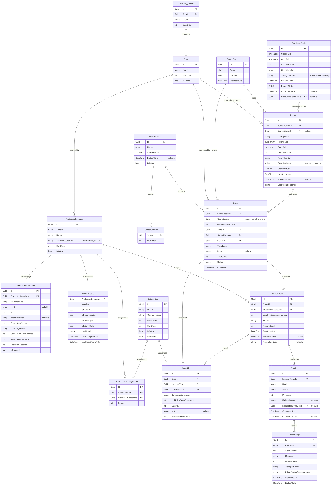
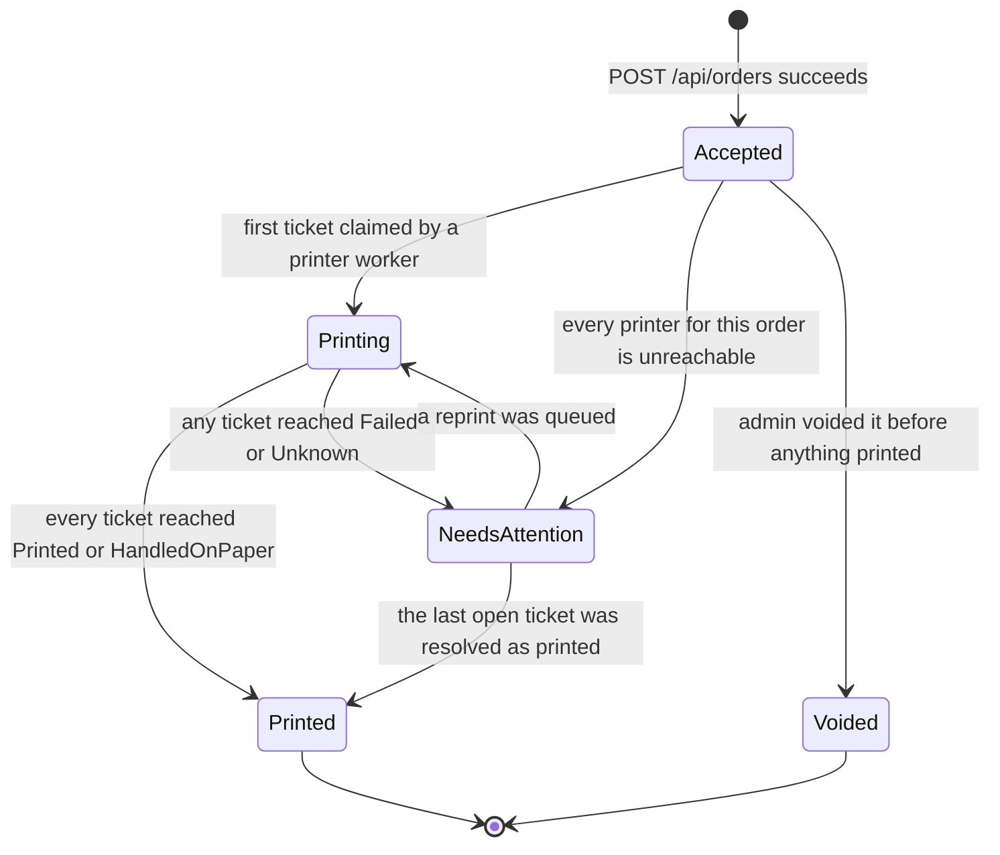
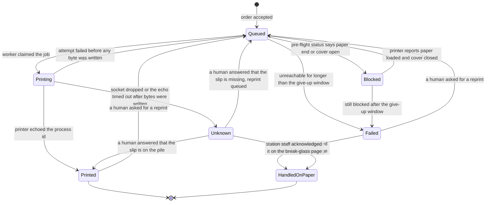
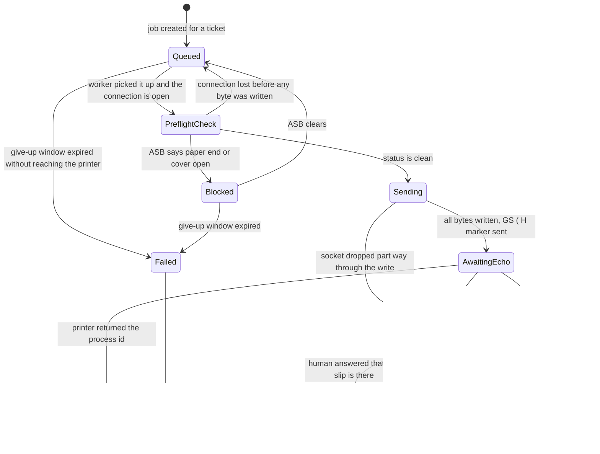

# System specification

Ordering system for volunteer fire department festivals.

Status: draft for owner review. Version 1 scope. Written to be read end to end by a human, not by a
build tool.

Conventions used in this document:

* "Server" always means the person carrying orders and trays, never the machine. The machine is called
  "the backend" or "the laptop".
* Money is stored and calculated in integer cents. No decimal type appears anywhere.
* Times are stored in UTC and rendered in the laptop's local time zone.
* Every user-facing string in this document is given in German and English. Names the admin types in
  (item names, zone names, location names, staff names) are data, not chrome, and are stored once in
  whatever language the fire department uses. The app does not translate them.

Contents:

1. Purpose and scope
2. Domain model
3. State machines
4. Numbering
5. REST API
6. SignalR
7. Printing service
8. Frontend screens
9. Offline and failure behaviour on the phone
10. Configuration and setup
11. Testing strategy
12. Open questions

---

## 1. Purpose and scope

### 1.1 What the product does

A server walks table to table with their own phone, picks items and quantities, types the table name,
reads the running total aloud so the guest can pay cash, and places the order. The backend splits the
order by production location, gives each slice its own numbered slip, and prints it on that location's
thermal printer. Kitchen and bar staff work the pile of slips off exactly as they work a pile of paper
today. A server with a free hand carries the tray out.

The product removes one step from the current paper process: the walk from the table to the kitchen.
Nothing else about the process changes.

### 1.2 Why it exists

Orders get lost. A paper slip falls behind a fridge, a server forgets which table a tray belongs to, or
a slip is written twice and the kitchen produces the same order twice. Every design decision in this
document is answerable to that one problem. Two mechanisms carry the weight:

1. Every slip carries a global order number and a per-location sequence number. A missing number in the
   pile is visible to anyone holding the pile. No screen, no login, no software.
2. The server who placed an order can see, on their own phone, whether the slip actually printed. A
   failure is never allowed to look like a success.

### 1.3 Who uses it

| Role | Device | Technical ability assumed | Trained? |
|---|---|---|---|
| Server | Their own phone, any browser | None | No. Possibly never saw the tool before tonight. |
| Admin | The laptop on site | Can type an IP address if told exactly what to type | Read the setup checklist once |
| Kitchen and bar staff | Nothing | None | Not applicable. They touch no software. |

Production location staff click nothing, wait for nothing, and log into nothing. This is a hard
constraint on every design decision below, and the break-glass page in section 8.11 is the single
narrow exception to it.

### 1.4 Scale

Fewer than 10 production locations. Fewer than 10 servers. A catalog of roughly 20 to 60 items. A few
dozen tables. Peak load is a handful of orders per minute. The system is not designed for scale, and
adding scale is not a goal. It is designed for reliability and for operation by people with little
technical ability.

### 1.5 Non-goals

The following are explicitly out of scope. They are listed so that a future change request can be
answered with "that was decided against", not with a redesign.

| Not in scope | Reason |
|---|---|
| Payments of any kind | Cash is handled by hand at the table. The app takes no payment, stores no payment data, and has no card reader. |
| Guest receipts, invoices, tax documents | Any of these would drag German fiscal law (KassenSichV, TSE, GoBD) into a hobby project. The printed slip is a production instruction for staff, not a receipt for a guest. |
| Kitchen display system | Staff work off a pile of paper. Putting a screen in the kitchen would replace the process instead of removing one walk from it. |
| Stock, inventory, sold-out counts | An item can be switched off by the admin. Counting portions is not attempted. |
| Table reservations or floor plans | Tables are moved during the evening. Managing them as objects is more work than the problem is worth. |
| Cloud, remote access, multi-site | There is no internet on site. |
| Accounts, usernames, passwords | Nobody will manage credentials at a festival. Section 2.9 describes what replaces them. |
| Guest self-ordering | The server at the table is the product. |
| Reporting and analytics beyond a list of the evening's orders | Nobody will read it. |
| Native apps, app store distribution, PWA install | There is no secure context over plain HTTP, so no service worker and no install prompt exist. |
| Tray tracking, delivery confirmation | A server carries the tray. The app is not told when it arrives. |
| Editing an order after it is placed | Covered in section 3.1. A correction is a second order and a word to the kitchen. |

---

## 2. Domain model

### 2.1 Notation

Types are given as they will exist in C#. `Guid` primary keys are generated on the backend, except
`Order.ClientOrderId`, which is generated on the phone. `string(n)` means a maximum length enforced
both in the database schema and in validation. All money is `int` cents.

### 2.2 Entity relationship diagram



### 2.3 EventSession

An operating period, normally one festival evening. It exists for one reason: it scopes the numbering
counters, so a fresh evening starts at slip number 1 without making yesterday's numbers ambiguous.

| Field | Type | Notes |
|---|---|---|
| Id | Guid | |
| Name | string(60) | The admin types it, for example "Samstagabend". Defaults to the current date. |
| StartedAtUtc | DateTime | |
| EndedAtUtc | DateTime? | Set when the next session starts |
| IsActive | bool | Exactly one row may be active |

Invariants:

* Exactly one `EventSession` has `IsActive = true` at any time. Starting a new session ends the
  previous one in the same transaction.
* An order always belongs to the session that was active when it was accepted. Sessions are never
  reassigned.
* Ending a session deletes nothing. The SQLite file is the whole history and a backup is a file copy.

### 2.4 Zone

A part of the site, for example "Innen" and "Zelt". A zone groups production locations and is the one
routing input the server chooses.

| Field | Type | Notes |
|---|---|---|
| Id | Guid | |
| Name | string(40) | Unique among active zones |
| SortOrder | int | Order in the zone picker |
| IsActive | bool | Soft delete only |

Invariants:

* At least one active zone must exist before the first order can be placed. The admin overview blocks
  on this and says so.
* A zone with active production locations cannot be deactivated. The admin gets a message naming the
  locations.

### 2.5 ProductionLocation

A kitchen or a bar. Exactly one printer per location.

| Field | Type | Notes |
|---|---|---|
| Id | Guid | |
| ZoneId | Guid | The zone this location serves |
| Name | string(40) | Printed in large type at the top of every slip |
| StationAccessKey | string(32) | Random hex, unique. The only thing protecting the break-glass page. |
| SortOrder | int | |
| IsActive | bool | Soft delete only |

Invariants:

* Every active location has exactly one `PrinterConfiguration` row and exactly one `PrinterStatus` row.
  Both are created with the location and never exist without it.
* A location cannot be deactivated while it has tickets that are not in a final state.
* `StationAccessKey` is generated on creation and can be regenerated by the admin, which immediately
  invalidates the old break-glass link.

### 2.6 CatalogItem

| Field | Type | Notes |
|---|---|---|
| Id | Guid | |
| Name | string(60) | Printed on the slip |
| CategoryName | string(40) | Free text, used only to group buttons on the phone |
| PriceCents | int | Zero is allowed, for example for tap water |
| SortOrder | int | |
| IsActive | bool | Soft delete. Items are never hard deleted because orders reference them. |
| IsAvailable | bool | The "sold out" switch. Flipping it pushes to every phone at once. |

Invariants:

* An active item must have at least one `ItemLocationAssignment`, otherwise it cannot be routed. The
  admin cannot save an active item without one and is told why.
* `PriceCents >= 0`.
* Editing a name or price never changes an existing order. Every `OrderLine` carries a snapshot.

### 2.7 ItemLocationAssignment

Which locations are capable of producing an item. Beer is assigned to both bars. Bratwurst is assigned
only to the kitchen.

| Field | Type | Notes |
|---|---|---|
| Id | Guid | |
| CatalogItemId | Guid | |
| ProductionLocationId | Guid | |
| Priority | int | Lower wins when two candidates survive zone filtering |

Invariants:

* `(CatalogItemId, ProductionLocationId)` is unique.
* Routing rule, and the only routing rule in the system: take the item's assignments, keep those whose
  location is active and whose location's zone equals the order's zone, and choose the lowest
  `Priority`. Ties break by `ProductionLocation.SortOrder`, then by name, so the result is stable.
* If zone filtering leaves nothing, fall back to the item's assignments in any zone, lowest `Priority`
  first. The order is never rejected for a routing reason. A slip printed at the wrong bar is
  recoverable; a refused order at a busy table is not.
* A line may carry a manual override. The override must be one of the item's assigned locations, and it
  sets `OrderLine.WasManuallyRouted = true`.

This rule lives in one class, `OrderRoutingResolver`, and is used by the order submission path, by the
admin preview in the assignment screen, and by tests. It is not reimplemented anywhere.

### 2.8 Table naming: free text, with suggestions

**Decision: a table is a free text label on the order, not an entity that orders point to.** A
`TableSuggestion` table exists purely to prefill a list of buttons on the phone.

Justification. At a festival the tables are beer benches. They get moved, added, and joined together
during the evening, and guests sit at whatever is standing. If the order required a foreign key into a
table list, then the first table that is not in the list blocks an order, and blocking an order is the
exact failure this product exists to prevent. Free text can never block. The suggestion list gives the
common case one tap and keeps spellings consistent, which is all the structure that is actually needed:
nothing in the system aggregates by table.

| TableSuggestion field | Type | Notes |
|---|---|---|
| Id | Guid | |
| ZoneId | Guid | Suggestions are filtered by the server's current zone |
| Label | string(40) | For example "Tisch 12" |
| SortOrder | int | |

Invariants:

* `Order.TableLabel` is required, trimmed, collapsed to single spaces, between 1 and 40 characters.
* `Order.TableLabel` need not match any suggestion.

### 2.9 ServerPerson, Device, EnrolmentCode

There are no usernames and no passwords anywhere in the product.

**ServerPerson** is a name to print on the slip and to show in the admin list.

| Field | Type | Notes |
|---|---|---|
| Id | Guid | |
| Name | string(40) | |
| IsActive | bool | |
| CreatedAtUtc | DateTime | |

**Device** is one enrolled phone.

| Field | Type | Notes |
|---|---|---|
| Id | Guid | |
| ServerPersonId | Guid | Who is carrying it |
| CurrentZoneId | Guid? | The zone chosen at shift start. Null until chosen. |
| DisplayName | string(40) | Defaults to the person's name, editable in admin |
| TokenLookupId | string(32) | Non-secret random id, sent with every request so the backend can find the one row to verify against |
| TokenHash, TokenSalt, TokenIterations, TokenAlgorithm | | PBKDF2-HMAC-SHA512, per-token random salt, iteration count and algorithm name stored alongside the hash so both can be raised later without invalidating existing devices |
| CreatedAtUtc, LastSeenAtUtc | DateTime | |
| RevokedAtUtc | DateTime? | Non-null means every request from this device is rejected |
| UserAgentSnapshot | string(200) | So the admin can tell two phones apart in the list |

**EnrolmentCode** is a single-use, short-lived credential shown on the laptop.

| Field | Type | Notes |
|---|---|---|
| Id | Guid | |
| CodeHash, CodeSalt, CodeIterations, CodeAlgorithm | | Same hashing scheme as device tokens |
| SixDigitDisplay | string(6) | Kept in plaintext only in memory for the admin screen and never persisted |
| CreatedAtUtc, ExpiresAtUtc | DateTime | Lifetime 5 minutes |
| ConsumedAtUtc, ConsumedByDeviceId | | Set atomically by the first successful redemption |

Invariants:

* Redemption is a single atomic update: a code moves from unconsumed to consumed in the same
  transaction that creates the device, so a photographed QR code cannot enrol a second phone.
* Codes rotate about every 30 seconds while the "Add server" screen is open, so a whole crew can enrol
  during one briefing. Rotation does not invalidate codes that are still inside their 5 minute window,
  because a phone may be slow to open the page.
* Verification is a linear scan over the unconsumed, unexpired codes, of which there are at most a
  handful. This is why a hashed short code needs no plaintext lookup index.
* Ten failed redemption attempts within five minutes invalidate every outstanding code and tell the
  admin to open the screen again.
* Tokens are never logged, never returned after enrolment, and never recoverable. A lost phone is
  handled by revoking and enrolling again.
* Revoking a device sets `RevokedAtUtc` and pushes a SignalR message to that device, which wipes its
  own `localStorage` and returns to the enrolment screen.

### 2.10 Order and OrderLine

| Order field | Type | Notes |
|---|---|---|
| Id | Guid | |
| EventSessionId | Guid | The active session at acceptance |
| ClientOrderId | Guid | Generated on the phone, unique index. This is the idempotency key. |
| GlobalOrderNumber | int | Allocated at acceptance, unique within the session |
| ZoneId | Guid | The device's zone at acceptance, copied so later zone changes do not rewrite history |
| ServerPersonId, DeviceId | Guid | |
| TableLabel | string(40) | |
| Note | string(200)? | An order level note, printed on every location's slip |
| TotalCents | int | Sum of `Quantity * UnitPriceCentsSnapshot`, stored so the slip and the phone can never disagree |
| Status | string | See section 3.1 |
| CreatedAtUtc | DateTime | |

| OrderLine field | Type | Notes |
|---|---|---|
| Id | Guid | |
| OrderId | Guid | |
| LocationTicketId | Guid | The slice this line was routed into |
| CatalogItemId | Guid | |
| ItemNameSnapshot | string(60) | |
| UnitPriceCentsSnapshot | int | |
| Quantity | int | 1 to 99 |
| Note | string(100)? | For example "ohne Zwiebeln", printed under the line |
| WasManuallyRouted | bool | True when the server used the per-item override |

Invariants:

* An order has at least one line.
* `Quantity >= 1`.
* `line.LocationTicket.OrderId == line.OrderId` for every line.
* `TotalCents` equals the recomputed sum. This is asserted in the acceptance transaction and covered by
  a test, because the total is the only number a guest hears out loud.
* An accepted order is immutable except for `Status`. Lines are never added, removed, or edited.

### 2.11 LocationTicket

The per-location slice of an order. This is the thing that gets printed, and the thing that carries a
sequence number.

| Field | Type | Notes |
|---|---|---|
| Id | Guid | |
| OrderId | Guid | |
| ProductionLocationId | Guid | |
| LocationSequenceNumber | int | Allocated at acceptance, unique per location per session |
| Status | string | See section 3.2 |
| ReprintCount | int | Zero on the first print. Every reprint slip says so in its header. |
| CreatedAtUtc | DateTime | |
| ResolvedAtUtc | DateTime? | When a human answered an unknown outcome or acknowledged a manual handover |
| ResolutionNote | string(200)? | Who answered and what they answered |

Invariants:

* `(OrderId, ProductionLocationId)` is unique. An order produces at most one ticket per location, and
  every line for that location goes on it.
* A ticket has at least one line.
* `LocationSequenceNumber` is allocated exactly once and never changes, including on reprints.

### 2.12 PrintJob and PrintAttempt

A `PrintJob` is one intent to put a ticket on paper. A `PrintAttempt` is one connection level try inside
that intent. Splitting them is what makes "we sent bytes and do not know what happened" a recordable
fact rather than a guess.

| PrintJob field | Type | Notes |
|---|---|---|
| Id | Guid | |
| LocationTicketId | Guid | |
| Kind | string | `Initial` or `Reprint` |
| Status | string | See section 3.3 |
| ProcessId | int | 1 to 9999, cycled per printer. Sent with `GS ( H` and echoed back by the printer when it has finished processing the job. |
| FailureReason | string? | `PaperEnd`, `CoverOpen`, `Unreachable`, `Timeout`, `SocketDropped`, `PrinterError`, `Cancelled` |
| RequestedByDeviceId | Guid? | Null for the initial job, set when a human asked for a reprint |
| CreatedAtUtc, CompletedAtUtc | | |

| PrintAttempt field | Type | Notes |
|---|---|---|
| Id | Guid | |
| PrintJobId | Guid | |
| AttemptNumber | int | 1 based |
| Outcome | string | `Confirmed`, `Blocked`, `Unreachable`, `SocketDropped`, `Timeout`, `PrinterError`, `Cancelled` |
| BytesWritten | int | Zero means nothing reached the printer, which is what makes an automatic retry safe |
| TransportDetail | string(400) | The socket error text or the transport's own message. Never shown raw to a server. |
| PrinterStatusSnapshotJson | string | The ASB or `DLE EOT` state at the end of the attempt |
| StartedAtUtc, EndedAtUtc | | |

Invariants:

* At most one `PrintJob` per ticket is in a non-final state at any moment.
* An attempt with `BytesWritten > 0` never leads to an automatic retry. Only a human can ask for the
  reprint.
* Attempts are append only. Nothing in the print history is ever updated after it ends.

### 2.13 PrinterConfiguration and PrinterStatus

| PrinterConfiguration field | Type | Default | Notes |
|---|---|---|---|
| ProductionLocationId | Guid | | One to one |
| TransportKind | string | `Mock` | `Network`, `Agent`, or `Mock`. This is the only place the choice exists. |
| Host | string(64)? | | IP address of the printer or its WiFi bridge |
| Port | int | 9100 | |
| AgentIdentifier | string(64)? | | Reserved for the deferred Pi agent |
| CharactersPerLine | int | 48 | Font A on 80 mm paper |
| CodePageName | string | `PC858` | ESC/POS page 19, which contains the German umlauts and the Eszett |
| ConnectTimeoutSeconds | int | 5 | |
| JobTimeoutSeconds | int | 90 | Matches the printer's own connection timeout |
| HeartbeatSeconds | int | 10 | `DLE EOT n=4` poll interval |
| IsEnabled | bool | true | A disabled printer parks its tickets instead of failing them |

| PrinterStatus field | Type | Notes |
|---|---|---|
| ProductionLocationId | Guid | |
| IsOnline | bool | A connection is open and the last heartbeat answered |
| IsPaperEnd, IsPaperNearEnd, IsCoverOpen, IsInErrorState | bool | Decoded from ASB and `DLE EOT` |
| LastDetail | string(200) | |
| LastChangedAtUtc, LastHeardFromAtUtc | DateTime | |

Invariants:

* Status is written only by that printer's worker, so there is one writer per row and no contention.
* Every status change pushes a SignalR event. Clients never poll for printer state.

### 2.14 NumberCounter

One row per counter. See section 4.

| Field | Type |
|---|---|
| Scope | string(80), primary key |
| NextValue | int |
---

## 3. State machines

Three state machines exist. The order state is a projection of its tickets. The ticket state is a
projection of its print jobs plus human answers. The print job state is the only one driven by
hardware.

### 3.1 Order

An order has no draft state on the backend. Until it is accepted it exists only on the phone and in the
phone's `localStorage` queue.



States:

| State | Meaning | What the server sees on the phone |
|---|---|---|
| `Accepted` | Stored, numbered, split into tickets. Nothing has printed yet. | "Wird gedruckt" / "Printing" |
| `Printing` | At least one printer is working on it. | "Wird gedruckt" / "Printing" |
| `Printed` | Every ticket is on paper, or a human confirmed it is on paper. | "Gedruckt" / "Printed" |
| `NeedsAttention` | At least one ticket failed or is unresolved. | The specific message from section 8.9, with a cause and a next step |
| `Voided` | Cancelled by the admin before any slip printed. | "Storniert" / "Cancelled" |

`Order.Status` is computed by `OrderStatusCalculator` from the ticket statuses, and it is written in the
same transaction as the ticket change that caused it. It is stored rather than derived on read so that
a query for "orders that need attention" is one indexed lookup, but it is never computed anywhere else.

Rules and failure behaviour:

* **An order is never rejected because of a printer.** Acceptance persists the order and its numbers.
  Printing happens afterwards. A dead printer produces `NeedsAttention`, never a lost order.
* **An accepted order is never edited.** A guest who changes their mind gets a second order and the
  server tells the kitchen. Editing would require reprinting a slip that is already on the pile and
  cannot be recalled, and the second slip would be indistinguishable from a duplicate.
* **Voiding** is admin only, on the laptop, and only while every ticket of the order is still `Queued`
  or `Failed` with nothing printed. The global order number and the sequence numbers stay burned and
  the void is listed in the admin order list, so a gap in the pile has a written explanation.

### 3.2 LocationTicket



| State | Meaning |
|---|---|
| `Queued` | Waiting for its printer's worker. Safe to retry, because no bytes have reached the printer. |
| `Blocked` | The printer answered, and it has no paper or an open cover. Nothing was sent. |
| `Printing` | Bytes are being written, or the process id echo is being waited for. |
| `Printed` | The printer echoed the process id, or a human confirmed the slip is on the pile. |
| `Unknown` | Bytes were written and the outcome is genuinely not knowable from here. |
| `Failed` | The printer could not be reached at all within the give-up window. Nothing was sent. |
| `HandledOnPaper` | The station saw the order on the break-glass page and is producing it. The slip will not be chased any further. |

The give-up window is 5 minutes of continuous failure for a single ticket. Before that window expires
the ticket keeps retrying and the phone shows "Wird gedruckt". After it expires the phone shows the
failure with its cause and its next step. Five minutes was chosen because it is roughly how long a
volunteer takes to walk to the bar and back, so a ticket that recovers on its own recovers before
anyone acts on the message.

### 3.3 PrintJob

This is the state machine that touches hardware, and the one that decides whether a retry is safe.



### 3.4 The unknown outcome, stated directly

The printer holds one connection at a time and drops it after 90 seconds of inactivity. If the socket
dies after the first byte of a job has been written, then from the backend's position the job is in
exactly one of two states and there is no command that distinguishes them: the slip is lying on the
pile, or it is not.

There is no ESC/POS query that answers "did job 42 print". `DLE EOT` reports paper, cover, and error
state; it does not report job history. So:

* **A job that wrote bytes and lost its confirmation enters `Unknown`. It is never retried
  automatically.** An automatic retry here is exactly how a station prints one order twice.
* **`Unknown` is resolved by a human, and only by a human.** The question is asked on the phone of the
  server who placed the order, because that server can walk to the station and look at the pile. It is
  also shown in the admin list on the laptop. The question names the number to look for, so the answer
  takes one glance at the top slips.
* **The backend adds evidence, not a decision.** When the connection comes back, the worker reads the
  printer status. If paper end or cover open is set, the phone additionally says that the printer has
  no paper, which makes "the slip is missing" the likely answer. The app still asks. It never guesses.
* **Answering "the slip is there"** moves the ticket to `Printed` and records who answered.
* **Answering "the slip is missing"** queues a reprint. The reprint carries the same global order number
  and the same per-location sequence number, and prints `NACHDRUCK` / `REPRINT` in its header, so if
  both slips somehow exist the station sees two identical numbers and knows to produce one order.
* **`Unknown` never resolves itself by timing out.** An unanswered question stays on the screen and in
  the admin list until someone answers it. A quiet expiry would be a silently dropped order.

### 3.5 Failure behaviour summary

| What went wrong | Bytes written | Automatic retry | Ticket state | What the server is told |
|---|---|---|---|---|
| Printer not reachable on the network | 0 | Yes, with backoff, until the give-up window | `Queued`, then `Failed` | The station is not answering, with what to do next |
| Paper end or cover open found before sending | 0 | Yes, as soon as the printer reports it is ready | `Blocked` | Which station, what is wrong, and that it prints by itself afterwards |
| Write failed before the first byte | 0 | Yes | `Queued` | Nothing, unless the give-up window expires |
| Socket dropped part way through the write | > 0 | Never | `Unknown` | The question in section 8.9 |
| 90 second timeout with no echo | > 0 | Never | `Unknown` | The question in section 8.9 |
| Paper ran out part way through a job | > 0 | Never | `Unknown` | The question, plus the note that the printer has no paper |
| Printer reports a mechanical error | Either | Never | `Unknown` if bytes were written, otherwise `Blocked` | The station name and to fetch someone who can look at the printer |
| Backend restarted mid-job | Unknown | Never | `Unknown` on recovery | The question, on the next connect of that phone |
| Location is disabled in configuration | 0 | Held | `Queued` | That the station is switched off and the slip is waiting |

---

## 4. Numbering

Two numbers appear on every slip. Both matter, and they do different jobs.

* The **global order number** is how a person says one order out loud across the whole site. "Nummer
  137, wo ist das Bier dazu." It is unique per event session and shared by every slip of that order.
* The **per-location sequence number** is how a person sees at a glance that something is missing. The
  slips at the kitchen run 1, 2, 3, 4. If the pile jumps from 41 to 43, then 42 is lost and the station
  knows it without touching software. This is the loss detection mechanism, and it is why the number is
  printed large.

### 4.1 Allocation

Counters live in the `NumberCounter` table, one row per scope:

| Scope key | Counts |
|---|---|
| `session:{eventSessionId}:order` | Global order numbers |
| `session:{eventSessionId}:location:{productionLocationId}` | That location's sequence numbers |

Both counters start at 1. Allocation happens inside the single database transaction that accepts an
order:

1. Open a SQLite write transaction (`BEGIN IMMEDIATE`, which SQLite serializes, so there is exactly one
   writer).
2. Insert the `Order` row and take the next global order number.
3. For each production location the order routes to, insert one `LocationTicket` and take that
   location's next sequence number.
4. Insert the lines.
5. Commit.

Nothing else in the system allocates a number. Print jobs do not, print attempts do not, and reprints do
not.

### 4.2 Why gaps mean what they mean

A gap in the pile has to mean "a slip is missing", otherwise the station learns to ignore gaps and the
mechanism is dead. Three rules keep that true:

* **A number is allocated only by a transaction that commits.** If anything in the acceptance path
  fails, the whole transaction rolls back and the counter rolls back with it. There is no separate
  "get a number" call that can succeed while the order fails.
* **Counters are in the database, never in memory.** A restart, a crash, or a laptop that lost power
  mid-evening resumes at the exact next value. There is no in-process cache and no batch reservation,
  because both hand out numbers that may never be used.
* **A reprint reuses the number.** Reprinting does not consume a new one, so a reprinted slip never
  makes the pile look like it gained an order.

The one deliberate exception is a **voided order**, which keeps its allocated numbers. That is a real
gap in the pile, and it is intentional: the station should notice it. The admin order list shows voided
orders with their numbers so the gap can be explained in five seconds.

### 4.3 Across restarts and sessions

* On startup the backend reads nothing into memory. The first order after a restart takes the next
  value straight from the table.
* Starting a new event session creates new counter rows starting at 1. Old orders keep their old
  numbers and stay in the database. Because tickets carry `EventSessionId` through their order, a
  sequence number is only ever ambiguous across sessions, never within one, and the slips from
  yesterday are in yesterday's bin.
* The admin screen that starts a session says plainly that numbering starts again at 1 and asks for
  confirmation, so nobody does it by accident during service.

### 4.4 Display format

* Global order number: printed as given, no padding, prefixed by the word `Bestellung` or `Order`.
  Rendered in the phone UI as `#137`.
* Per-location sequence number: printed at double width and double height, zero padded to three digits
  (`042`) so the slips are the same visual size all evening and a jump is obvious in a stack.
---

## 5. REST API

One process, one port. The default is port 5000 bound to `0.0.0.0`, and the scheme, port, and bind
address live in one configuration object so a later move to HTTPS is a setting rather than a rewrite.

### 5.1 Audiences and how each is authenticated

| Audience | Path prefix | Authentication |
|---|---|---|
| Server phones | `/api/...` | `Authorization: Bearer <TokenLookupId>.<secret>`. The backend splits on the dot, loads the one device row by `TokenLookupId`, and verifies the secret with PBKDF2 using that row's stored salt, iteration count, and algorithm. A revoked device is rejected. |
| Admin | `/api/admin/...` | The request must arrive on the loopback interface. The admin UI runs on the laptop itself, at `http://localhost:5000/admin`. No password exists because nobody would manage one. Requests to admin paths from any other address get 404, not 403, so a phone browsing the site learns nothing. |
| Station break-glass | `/api/station/{accessKey}/...` | The 32 character access key in the path is the whole credential. It grants read access to that one location's open tickets and the ability to acknowledge one. |
| Enrolment and health | `/api/enrolment/redeem`, `/api/health` | Anonymous, rate limited |

Rate limits: 20 requests per minute per IP on `/api/enrolment/redeem`, 600 per minute per device
elsewhere. Exceeding a limit returns 429 with a plain message.

Every error response uses the same shape, and `message` is already translated into the caller's
language (`Accept-Language`, defaulting to German):

```json
{
  "code": "PrinterOutOfPaper",
  "message": "Der Drucker in der Küche hat kein Papier mehr.",
  "nextStep": "Legen Sie eine neue Rolle ein. Der Bon wird danach automatisch gedruckt.",
  "details": null
}
```

`details` is present only for admin callers and carries the technical text. A server's phone never
receives a stack trace or a socket error string.

### 5.2 Enrolment and session (server phones)

#### POST /api/enrolment/redeem

Anonymous. This is the only call a phone can make before it has a token.

Request:

```json
{
  "code": "8f2a1c...",
  "sixDigitCode": null,
  "serverPersonId": "c2f1...",
  "newServerName": null,
  "userAgent": "Mozilla/5.0 ..."
}
```

Exactly one of `code` (from the QR URL) and `sixDigitCode` is supplied. Exactly one of
`serverPersonId` (picked from the admin's list) and `newServerName` is supplied.

Response 200:

```json
{
  "deviceId": "9a71...",
  "deviceToken": "K7f3...secret",
  "serverPerson": { "id": "c2f1...", "name": "Anna" },
  "zones": [ { "id": "...", "name": "Innen", "sortOrder": 1 } ],
  "currentZoneId": null
}
```

`deviceToken` is returned exactly once and never again.

| Status | When |
|---|---|
| 200 | Redeemed. The code is now consumed. |
| 400 | Neither code form supplied, or both, or the name is empty |
| 410 | The code was already used or has expired. The message says to ask for a new code on the laptop. |
| 423 | Enrolment is locked after ten failed attempts. The message says to open the screen on the laptop again. |
| 429 | Rate limited |

#### GET /api/session

Device auth. Returns who this device is and what it has chosen.

```json
{
  "deviceId": "9a71...",
  "displayName": "Anna",
  "serverPerson": { "id": "c2f1...", "name": "Anna" },
  "currentZone": { "id": "...", "name": "Innen" },
  "eventSession": { "id": "...", "name": "Samstagabend" },
  "language": "de"
}
```

401 when the token is unknown or the device is revoked.

#### PUT /api/session/zone

Device auth. Body `{ "zoneId": "..." }`. Returns 204. 404 when the zone is unknown or inactive.

#### PUT /api/session/language

Device auth. Body `{ "language": "de" | "en" }`. Returns 204. Stored on the device row so a reopened
page keeps the choice.

### 5.3 Catalog (server phones)

#### GET /api/catalog

Device auth. One call, everything the ordering screen needs.

```json
{
  "version": "2026-08-26T17:04:11Z",
  "categories": [ { "name": "Essen", "sortOrder": 1 } ],
  "items": [
    {
      "id": "...",
      "name": "Bratwurst mit Brot",
      "categoryName": "Essen",
      "priceCents": 350,
      "sortOrder": 1,
      "isAvailable": true,
      "locationIds": ["kitchen-id"]
    }
  ],
  "zones": [ { "id": "...", "name": "Innen" } ],
  "locations": [ { "id": "kitchen-id", "name": "Küche", "zoneId": "..." } ],
  "tableSuggestions": [ { "zoneId": "...", "label": "Tisch 12", "sortOrder": 1 } ]
}
```

The phone caches this in memory and refetches when the `CatalogChanged` SignalR event arrives. Routing
is computed on the phone for display (so the review screen can show which station gets what) and
recomputed on the backend at acceptance, which is authoritative.

### 5.4 Orders (server phones)

#### POST /api/orders

Device auth. The single most important endpoint in the system.

Request:

```json
{
  "clientOrderId": "3f7c9d2e-...",
  "tableLabel": "Tisch 12",
  "note": null,
  "lines": [
    { "catalogItemId": "...", "quantity": 2, "note": null, "locationOverrideId": null },
    { "catalogItemId": "...", "quantity": 1, "note": "ohne Ketchup", "locationOverrideId": null }
  ]
}
```

The zone is taken from the device session, not from the request, so a stale phone cannot route into a
zone it no longer has.

Response 201:

```json
{
  "orderId": "...",
  "globalOrderNumber": 137,
  "status": "Accepted",
  "totalCents": 1050,
  "createdAtUtc": "2026-08-26T17:42:03Z",
  "tickets": [
    {
      "ticketId": "...",
      "locationId": "kitchen-id",
      "locationName": "Küche",
      "sequenceNumber": 42,
      "status": "Queued",
      "lineIds": ["...", "..."]
    }
  ]
}
```

| Status | When |
|---|---|
| 201 | Accepted and numbered |
| 200 | The same `clientOrderId` was already accepted. The original order is returned unchanged. This is what makes a retry after a timeout safe. |
| 400 | Empty lines, quantity out of range, table label missing or too long |
| 401 | Unknown or revoked token |
| 409 | The same `clientOrderId` was used with different content. The message tells the server to check their order list before ordering again. |
| 422 | An item is unknown or inactive, or an override names a location the item is not assigned to |
| 428 | No zone chosen yet. The phone reacts by opening the zone screen. |

An unreachable printer never produces an error here. The order is accepted and the print state follows.

#### GET /api/orders/mine

Device auth. Query `?since=<iso>` optional, `?limit=` default 50.

```json
{
  "orders": [
    {
      "orderId": "...",
      "globalOrderNumber": 137,
      "tableLabel": "Tisch 12",
      "totalCents": 1050,
      "status": "NeedsAttention",
      "createdAtUtc": "...",
      "tickets": [
        {
          "ticketId": "...",
          "locationName": "Küche",
          "sequenceNumber": 42,
          "status": "Unknown",
          "failureReason": "SocketDropped",
          "printerHasPaper": false
        }
      ]
    }
  ]
}
```

This is the reconciliation call after a reconnect. The phone compares it against its local list and
drops any queued order whose `clientOrderId` already appears.

#### GET /api/orders/{orderId}

Device auth. Full order with lines. 404 if the order belongs to another device, unless the caller is
admin on loopback.

#### POST /api/orders/{orderId}/tickets/{ticketId}/resolve

Device auth. Answers an `Unknown` outcome.

Request `{ "slipIsOnThePile": true }` or `{ "slipIsOnThePile": false }`.

Response 200 with the updated ticket. `true` moves it to `Printed`. `false` queues a reprint with the
same numbers and moves it to `Queued`. 409 if the ticket is no longer `Unknown`, with a message saying
that somebody already answered.

#### POST /api/orders/{orderId}/tickets/{ticketId}/reprint

Device auth. Allowed from `Failed` and from `Printed`. Creates a `PrintJob` of kind `Reprint`. Response
202 with the ticket. 409 if a job for that ticket is already running.

#### GET /api/printers/status

Device auth. The list the phone uses to warn before an order is even placed.

```json
{
  "locations": [
    {
      "locationId": "kitchen-id",
      "name": "Küche",
      "zoneId": "...",
      "isOnline": true,
      "isPaperEnd": false,
      "isPaperNearEnd": true,
      "isCoverOpen": false,
      "lastChangedAtUtc": "..."
    }
  ]
}
```

### 5.5 Admin endpoints (loopback only)

All admin paths return 404 to non-loopback callers.

**Zones**

| Method | Path | Body | Response |
|---|---|---|---|
| GET | /api/admin/zones | | 200 list |
| POST | /api/admin/zones | `{name, sortOrder}` | 201 |
| PUT | /api/admin/zones/{id} | `{name, sortOrder}` | 200 |
| POST | /api/admin/zones/{id}/deactivate | | 200, or 409 naming the locations that block it |

**Production locations**

| Method | Path | Body | Response |
|---|---|---|---|
| GET | /api/admin/locations | | 200 list, each with its printer configuration and live status |
| POST | /api/admin/locations | `{name, zoneId, sortOrder}` | 201, also creating a printer configuration with `TransportKind: "Mock"` and a fresh access key |
| PUT | /api/admin/locations/{id} | `{name, zoneId, sortOrder}` | 200 |
| POST | /api/admin/locations/{id}/deactivate | | 200, or 409 if tickets are open |
| POST | /api/admin/locations/{id}/regenerate-access-key | | 200 with the new break-glass URL |

**Catalog**

| Method | Path | Body | Response |
|---|---|---|---|
| GET | /api/admin/items | | 200 list with assignments |
| POST | /api/admin/items | `{name, categoryName, priceCents, sortOrder, locationIds[]}` | 201, 422 when `locationIds` is empty |
| PUT | /api/admin/items/{id} | same | 200 |
| POST | /api/admin/items/{id}/availability | `{isAvailable}` | 200, pushes `CatalogChanged` |
| POST | /api/admin/items/{id}/deactivate | | 200. Soft delete only, because orders reference the item. |
| PUT | /api/admin/items/{id}/assignments | `{assignments:[{locationId, priority}]}` | 200 |
| POST | /api/admin/catalog/import | CSV upload | 200 with a per-row result list, 422 with row numbers and reasons |

**Table suggestions**

| Method | Path | Body |
|---|---|---|
| GET | /api/admin/table-suggestions | |
| PUT | /api/admin/table-suggestions | `{zoneId, labels: ["Tisch 1", ...]}` replaces that zone's list |

**Staff and devices**

| Method | Path | Body | Response |
|---|---|---|---|
| GET | /api/admin/server-people | | 200 |
| POST | /api/admin/server-people | `{name}` | 201 |
| POST | /api/admin/server-people/{id}/deactivate | | 200 |
| GET | /api/admin/devices | | 200 with person, current zone, last seen, revoked state, user agent |
| POST | /api/admin/devices/{id}/revoke | | 200, pushes `DeviceRevoked` to that device |
| PUT | /api/admin/devices/{id} | `{displayName}` | 200 |

**Enrolment**

| Method | Path | Response |
|---|---|---|
| POST | /api/admin/enrolment/session/start | 200 `{qrUrl, sixDigitCode, expiresAtUtc}`. Begins rotation, which then pushes `EnrolmentCodeRotated` about every 30 seconds. |
| POST | /api/admin/enrolment/session/stop | 204. Outstanding codes keep their 5 minute lifetime. |
| POST | /api/admin/enrolment/invalidate-all | 204. Immediately consumes every outstanding code. |

The QR URL is built from the address the laptop is actually reachable on. The backend enumerates its
non-loopback IPv4 addresses at startup and on every enrolment session start. When there is more than
one, the admin picks which network the phones are on, and the choice is remembered. The URL has the
form `http://192.168.1.23:5000/j/8f2a1c...`.

**Printers**

| Method | Path | Body | Response |
|---|---|---|---|
| GET | /api/admin/printers | | 200 configuration plus live status per location |
| PUT | /api/admin/printers/{locationId} | full configuration | 200. Changing the transport restarts that location's worker. |
| POST | /api/admin/printers/{locationId}/test-print | | 202. Prints a test slip that names the location and the current time. |
| POST | /api/admin/printers/{locationId}/reconnect | | 202 |

**Mock station**

| Method | Path | Body | Response |
|---|---|---|---|
| GET | /api/admin/mock/{locationId}/slips | | 200, the rendered slips this fake printer has produced, newest first |
| POST | /api/admin/mock/{locationId}/fault | `{fault, mode}` | 200. `fault` is one of `None`, `PaperEnd`, `CoverOpen`, `ConnectTimeout`, `DropSocketMidJob`, `UnknownOutcome`. `mode` is `Once` or `Sticky`. |
| POST | /api/admin/mock/{locationId}/clear | | 204, clears the slip list |
| POST | /api/admin/mock/{locationId}/load-paper | | 204, clears a sticky `PaperEnd` |

**Event session and orders**

| Method | Path | Body | Response |
|---|---|---|---|
| GET | /api/admin/event-session | | 200 current session |
| POST | /api/admin/event-session | `{name}` | 201. Ends the current session and resets numbering to 1. |
| GET | /api/admin/orders | `?status=&locationId=&since=&search=` | 200 |
| POST | /api/admin/orders/{id}/void | `{reason}` | 200, or 409 if anything already printed |
| GET | /api/admin/orders/{id}/print-history | | 200 with jobs and attempts, including the technical detail |
| GET | /api/admin/export/orders.csv | | 200 CSV of the session, for the treasurer to look at afterwards |
| GET | /api/admin/diagnostics | | 200 with version, database path, database size, uptime, listening addresses, per printer status |

### 5.6 Station break-glass endpoints

Nobody opens these in normal operation. They exist for the evening when a printer dies and food still
has to be produced.

| Method | Path | Response |
|---|---|---|
| GET | /station/{accessKey} | The single page app shell, in station mode |
| GET | /api/station/{accessKey}/tickets | 200 with that location's tickets that are not yet `Printed` or `HandledOnPaper`, oldest first, each with its sequence number, order number, table label, lines, and note |
| POST | /api/station/{accessKey}/tickets/{ticketId}/acknowledge | 200. Moves the ticket to `HandledOnPaper` and records that the station took it from the screen. |
| GET | /api/station/{accessKey}/status | 200 with that location's printer status |

An unknown or regenerated access key returns 404 with a message telling the reader to ask the person at
the laptop for the current link.

### 5.7 Health

`GET /api/health` is anonymous and returns 200 with `{ "status": "ok", "eventSession": "...",
"printersOnline": 2, "printersTotal": 3 }`. It is what the setup checklist tells the volunteer to open
in a browser to prove the laptop is reachable from a phone.

---

## 6. SignalR

One hub at `/hub`. Clients connect with the same bearer token they use for REST, passed as an
`access_token` query parameter, which is the transport SignalR supports for WebSockets. The station page
connects with its access key instead. The admin connects over loopback.

### 6.1 Groups

| Group | Members |
|---|---|
| `device:{deviceId}` | One phone |
| `devices` | All enrolled, unrevoked phones |
| `admin` | The laptop's admin UI |
| `station:{locationId}` | Any open break-glass page for that location, and the admin mock station view |

### 6.2 Events

| Event | Payload | Sent to | What the client does |
|---|---|---|---|
| `OrderAccepted` | `{orderId, globalOrderNumber, tableLabel, totalCents, tickets[]}` | `device:{placing}`, `admin` | The phone replaces the optimistic row in its list with the real one and removes the entry from the offline queue. The admin list gains a row. |
| `TicketStatusChanged` | `{orderId, globalOrderNumber, ticketId, locationId, locationName, sequenceNumber, status, failureReason, printerHasPaper, messageKey}` | `device:{placing}`, `admin`, `station:{locationId}` | The phone updates that ticket's chip and, when the status is `Unknown` or `Failed`, shows the message and its next step. The station page adds or removes a row. |
| `OrderStatusChanged` | `{orderId, status}` | `device:{placing}`, `admin` | The phone updates the order's headline state. |
| `PrinterStatusChanged` | `{locationId, locationName, isOnline, isPaperEnd, isPaperNearEnd, isCoverOpen, lastDetail}` | `devices`, `admin`, `station:{locationId}` | Phones show a banner when a station in the server's zone has no paper or is offline, so the server knows before they take the next order. The admin printer screen updates its indicator. |
| `CatalogChanged` | `{version}` | `devices`, `admin` | The phone refetches `/api/catalog`. An item that just sold out becomes unavailable in the picker, and any quantity already in the basket for it is flagged rather than silently dropped. |
| `EnrolmentCodeRotated` | `{qrUrl, sixDigitCode, expiresAtUtc}` | `admin` | The enrolment screen swaps the QR image and the six digits, with the remaining seconds shown. |
| `EnrolmentCompleted` | `{deviceId, displayName, serverPersonName}` | `admin` | The enrolment screen adds the newly enrolled phone to a live list so the admin can watch a crew enrol during a briefing. |
| `DeviceRevoked` | `{deviceId}` | `device:{deviceId}`, `admin` | The phone clears its token and its queue from `localStorage`, then shows the enrolment screen with an explanation. |
| `MockSlipPrinted` | `{locationId, sequenceNumber, renderedText, printedAtUtc, isReprint}` | `admin`, `station:{locationId}` | The mock station view prepends the rendered slip. |
| `EventSessionStarted` | `{eventSessionId, name}` | `devices`, `admin`, all stations | Phones clear their local order list, because those orders belong to the previous session, and show a one line notice. |

### 6.3 Delivery and reconnection

* SignalR is a push channel, not a source of truth. Every event has a REST equivalent, and after any
  reconnect the client refetches (`/api/orders/mine`, `/api/catalog`, `/api/printers/status`) rather
  than assuming it missed nothing.
* Automatic reconnect is on, with the intervals 0, 2, 5, 10, and 30 seconds, then every 30 seconds
  indefinitely. Phones stay on the same page all evening and the connection has to come back on its
  own after a WiFi dropout.
* Connection state is visible in the header of the phone app. Section 8.6 gives the wording.
* Nothing in the ordering path depends on SignalR. If the hub never connects, orders still submit over
  REST and the phone falls back to polling `/api/orders/mine` every 15 seconds. The fallback is written
  once, in the store, and is not a separate code path in components.
---

## 7. Printing service

### 7.1 The hardware facts this design is built around

Taken from the Epson TM-T20IV Technical Reference Guide, part number C31CL47102 (USB, RS-232, and
Ethernet). These are not preferences.

* Port 9100 is bidirectional. Printer status comes back over the same socket that carries print data.
* **Only one printing connection per printer at a time.** The connection is held until it is released,
  with a 90 second timeout. A process that crashes while holding the connection blocks that station for
  90 seconds.
* **A dropped socket means the job outcome is unknown.** Re-querying before re-sending is mandatory, and
  even then the answer is a status, not a job history.
* Paper end detection uses `GS a` automatic status back as the push channel. `DLE EOT n=4` polling is a
  heartbeat, not the primary channel.
* `DLE EOT n=2` bit 2 set means the cover is open.
* `DLE EOT n=4` bits 5 and 6 both set (mask `0x60`) means paper end.

### 7.2 The transport interface

Nothing above this interface knows which implementation it is talking to. A station's transport is
configuration, not code, and a new transport is a new implementation rather than a branch inside an
existing one.

```csharp
public interface IPrinterTransport
{
    PrinterTransportKind Kind { get; }
    Task<IPrinterSession> ConnectAsync(PrinterEndpoint endpoint, CancellationToken cancellationToken);
}

public interface IPrinterSession : IAsyncDisposable
{
    IAsyncEnumerable<PrinterStatusSnapshot> StatusStream { get; }
    Task<PrinterStatusSnapshot> QueryStatusAsync(CancellationToken cancellationToken);
    Task<PrintDispatchResult> SendJobAsync(PrintPayload payload, CancellationToken cancellationToken);
}

public sealed record PrinterEndpoint(
    Guid ProductionLocationId,
    string? Host,
    int Port,
    string? AgentIdentifier,
    TimeSpan ConnectTimeout,
    TimeSpan JobTimeout,
    TimeSpan HeartbeatInterval);

public sealed record PrintPayload(
    int ProcessId,
    ReadOnlyMemory<byte> Bytes,
    string RenderedText);

public sealed record PrinterStatusSnapshot(
    bool IsOnline,
    bool IsPaperEnd,
    bool IsPaperNearEnd,
    bool IsCoverOpen,
    bool IsInErrorState,
    string Detail,
    DateTimeOffset ObservedAt);

public sealed record PrintDispatchResult(
    PrintDispatchOutcome Outcome,
    int BytesWritten,
    PrinterStatusSnapshot StatusAtEnd,
    string Detail);

public enum PrintDispatchOutcome
{
    Confirmed,
    BlockedBeforeSending,
    NotReachable,
    SocketDropped,
    TimedOut,
    PrinterError,
    Cancelled
}

public enum PrinterTransportKind { Network, Agent, Mock }
```

Every multi-value return is a named record read by name. `BytesWritten` is on the result rather than
inferred, because it is the single fact that decides whether an automatic retry is safe.

Implementations:

| Implementation | Talks to | State |
|---|---|---|
| `NetworkPrinterTransport` | Raw TCP to port 9100, ESC/POS both directions | Version 1 |
| `AgentPrinterTransport` | The Python Pi agent over a small HTTP and WebSocket protocol, for USB attached printers | Deferred. The interface above is the whole contract it will implement. |
| `MockPrinterTransport` | An on-screen fake station | Version 1, and a shipped product feature |

### 7.3 One worker per printer

Serialization is structural, not advisory.

* At startup, and whenever a printer configuration changes, the `PrinterFleet` service starts one
  `PrinterWorker` per enabled production location and stops the worker of a disabled one.
* A worker owns a `Channel<Guid>` of print job ids with a single consumer. Because there is exactly one
  consumer and exactly one worker per printer, two jobs can never be in flight at the same printer.
* The worker owns the connection. Nothing else in the process opens a socket to a printer. This is what
  keeps the "one connection at a time" rule true even while the admin runs a test print.
* The worker keeps its session open between jobs, so `GS a` status arrives as a push rather than being
  discovered on the next job. The 90 second idle timeout is kept alive by the `DLE EOT n=4` heartbeat
  every 10 seconds.
* On startup the worker enqueues every ticket of the current session that is `Queued` or `Blocked`,
  oldest first. Every ticket that was `Printing` when the process died is moved to `Unknown`, because
  bytes may have been written. This is the crash recovery path and it is covered by an integration test.

### 7.4 The job sequence

1. **Take the job.** Load the ticket, its order, and its lines in one query.
2. **Ensure the connection.** If no session is open, connect with `ConnectTimeout`. Failure marks the
   printer offline, pushes `PrinterStatusChanged`, leaves the job `Queued`, and schedules a reconnect
   with backoff 1, 2, 5, 10, 30 seconds, capped at 30.
3. **Pre-flight.** Take the latest ASB snapshot if it is fresher than one heartbeat interval, otherwise
   query with `DLE EOT n=4` and `DLE EOT n=2`. If paper end, cover open, or a mechanical error is set,
   the job goes to `Blocked` and **no bytes are written**. `PrinterStatusChanged` and
   `TicketStatusChanged` go out. The job is re-queued automatically the moment the ASB reports the
   condition cleared.
4. **Render.** Build the ESC/POS payload for this ticket in the language configured for the location.
   Rendering is pure and has no side effects, so it is unit tested byte for byte.
5. **Allocate a process id.** A per-printer counter cycling 1 to 9999, persisted on the job.
6. **Send.** Write the payload, then `GS ( H` requesting the process id response on print completion.
   Count bytes as they are written.
7. **Wait for the echo,** up to `JobTimeout` (90 seconds). Receiving the matching process id is the
   only thing that produces `Confirmed`.
8. **Record the attempt** with its outcome, byte count, and the status snapshot at the end, then map to
   the job and ticket states in section 3.
9. **Push.** `TicketStatusChanged` and, if it changed, `OrderStatusChanged`.

### 7.5 Status handling

* `GS a 15` is sent immediately after `ESC @` on every connect, which enables automatic status back for
  the drawer, online state, error state, and the roll paper sensor. The printer then sends a four byte
  status block on every change, unprompted.
* The worker parses every inbound four byte block that is not a process id response as an ASB block,
  decodes paper end, paper near end, cover open, and error state, and writes `PrinterStatus` when
  anything changed.
* `DLE EOT n=4` every 10 seconds is the heartbeat. It proves the socket is alive and covers a status
  change that arrived while the socket was down. Two consecutive unanswered heartbeats mark the printer
  offline and force a reconnect.
* A status change never changes an order or a ticket by itself, with one exception: paper end clearing
  releases `Blocked` jobs at that printer.

### 7.6 Retry and re-query policy

The rule in one sentence: **a job is retried automatically if and only if zero bytes reached the
printer.**

| Outcome | Bytes | Automatic retry | Job state | Ticket state |
|---|---|---|---|---|
| `Confirmed` | all | no | `Confirmed` | `Printed` |
| `BlockedBeforeSending` | 0 | yes, when the condition clears | `Blocked` | `Blocked` |
| `NotReachable` | 0 | yes, with backoff | `Queued` | `Queued`, then `Failed` after the give-up window |
| `SocketDropped` | any | **never** | `Unknown` | `Unknown` |
| `TimedOut` | > 0 | **never** | `Unknown` | `Unknown` |
| `PrinterError` | 0 | yes, when the error clears | `Blocked` | `Blocked` |
| `PrinterError` | > 0 | **never** | `Unknown` | `Unknown` |
| `Cancelled` | 0 | no | `Failed` | `Failed` |

Re-query before re-sending, in the exact order:

1. Reconnect and read `DLE EOT n=1`, `n=2`, and `n=4`.
2. Write the result into `PrinterStatus` and push it, so the phone's question can include "the printer
   has no paper" when that is true.
3. **Stop.** Do not re-send. The status tells you the printer's condition, not whether the slip came
   out. The reprint is queued only after a human answers, through
   `POST /api/orders/{id}/tickets/{ticketId}/resolve` or the equivalent action in the admin list.

A reprint keeps the ticket's numbers, increments `ReprintCount`, and prints a reprint banner.

### 7.7 The slip

The slip is user-facing output, so every fixed word on it is a localized resource string, resolved
through the same localization service as the rest of the backend. The language is a per location
setting, defaulting to German, because a kitchen crew reads one language.

**Physical parameters**

| Parameter | Value |
|---|---|
| Paper | 80 mm roll, 72 mm printable, 576 dots |
| Font | Font A, 12 dots wide, so 48 characters per line |
| Double size | `GS ! 0x11`, so 24 characters per line in the large regions |
| Code page | PC858, selected with `ESC t 19`. It contains ä, ö, ü, Ä, Ö, Ü, ß, and the euro sign. |
| Cut | `GS V 66 3`, feed and partial cut, leaving the slip hanging for one hand to tear off |

**Command sequence**

| Region | Commands | Content |
|---|---|---|
| Init | `ESC @`, `ESC t 19`, `GS a 15` | Reset, code page, enable status back |
| Reprint banner, only on a reprint | `ESC a 1`, `GS ! 0x11`, `ESC E 1` | `NACHDRUCK` / `REPRINT` |
| Location name | `ESC a 1`, `GS ! 0x11`, `ESC E 1` | Up to 24 characters, truncated with a full stop if longer |
| Sequence number | `ESC a 1`, `GS ! 0x11`, `ESC E 1` | `NR. 042` / `NO. 042` |
| Order header | `ESC a 0`, `GS ! 0x00`, `ESC E 1` for the number line | Order number, table, server, zone, time |
| Lines | `ESC a 0`, `GS ! 0x00` | Quantity, item, and any line note indented by four spaces |
| Footer | `ESC a 0` | Item count, order note, and which slip of how many |
| Finish | `ESC d 4`, `GS V 66 3` | Feed and cut |

The price total is **not** printed on the slip. The kitchen does not need it, and printing a total next
to a list of goods is the closest this product would ever come to looking like a receipt.

**Rendered example, German, 48 columns**

```
================================================
KÜCHE
================================================
NR. 042
================================================
Bestellung 137
Tisch 12
Bedienung: Anna              Bereich: Innen
26.08.2026, 19:42 Uhr
------------------------------------------------
2 x Bratwurst mit Brot
1 x Pommes groß
    Hinweis: ohne Ketchup
3 x Kartoffelsalat
------------------------------------------------
Positionen gesamt: 6
Hinweis: Ein Teller extra für ein Kind.
Bon 1 von 2, Küche
================================================
```

**Rendered example, English, 48 columns**

```
================================================
KITCHEN
================================================
NO. 042
================================================
Order 137
Table 12
Server: Anna                 Area: Indoor
26/08/2026, 19:42
------------------------------------------------
2 x Sausage with bread
1 x Chips, large
    Note: no ketchup
3 x Potato salad
------------------------------------------------
Items in total: 6
Note: One extra plate for a child.
Slip 1 of 2, Kitchen
================================================
```

**Rendered example, reprint header, German**

```
================================================
NACHDRUCK
================================================
KÜCHE
================================================
NR. 042
================================================
Bestellung 137
Tisch 12
```

The reprint banner exists so that two slips with the same number on the same pile are immediately
distinguishable from two separate orders. In English the banner reads `REPRINT`.

Truncation rules: an item name longer than the printable width wraps onto a continuation line indented
by four spaces, and is never cut off. A table label longer than the line is wrapped the same way. No
information on a slip is ever dropped to make it fit.

### 7.8 MockPrinterTransport

The mock is a product feature. The entire system is developed, demonstrated, and tested with zero
hardware, and the mock stays the test double afterwards.

It behaves like a real printer session: it holds one connection, it emits an ASB style status stream, it
answers `QueryStatusAsync`, and it returns the same `PrintDispatchResult` record. It renders each slip
to text and pushes it to the mock station view over SignalR.

Fault injection, set per location, either `Once` or `Sticky`:

| Fault | What the mock does | Outcome returned | Bytes written | Resulting ticket state |
|---|---|---|---|---|
| `None` | Renders the slip after a short delay | `Confirmed` | all | `Printed` |
| `PaperEnd` | Reports paper end in its status stream and refuses at pre-flight | `BlockedBeforeSending` | 0 | `Blocked` |
| `CoverOpen` | Reports cover open, refuses at pre-flight | `BlockedBeforeSending` | 0 | `Blocked` |
| `ConnectTimeout` | Never completes `ConnectAsync` | `NotReachable` | 0 | `Queued`, then `Failed` |
| `DropSocketMidJob` | Accepts about half the payload, then throws as if the socket died | `SocketDropped` | partial | `Unknown` |
| `UnknownOutcome` | Accepts the whole payload, renders nothing, and never sends the process id echo | `TimedOut` | all | `Unknown` |

`PaperEnd` set to `Sticky` is cleared by the "Papier einlegen" / "Load paper" button on the mock station
view, which is exactly the sequence a real paper change produces: blocked, then automatically printed
without anybody re-sending anything.

The mock's timing is configurable and defaults to a 400 millisecond render, so a demonstration looks
like real printing rather than an instant state change.

Every failure mode the real transports can produce is reproducible in the mock. That is the acceptance
criterion for the mock, and section 11 lists the tests that hold it.
---

## 8. Frontend screens

### 8.1 How the text on every screen is written

These rules bind every string in this section and every string added later.

* **German and English are both complete.** A key that exists in one language is an unfinished change.
  Strings live in vue-i18n resource files, never as literals in a template.
* **German uses the Sie form throughout.** The tool is handed to volunteers who may not know each other,
  and mixing du and Sie across screens reads as sloppy. One form, everywhere, including the printed
  slips.
* **Guidance is a complete sentence with a verb at the front.** "Legen Sie eine neue Papierrolle ein."
  Not "Papier leer".
* **A message about a problem names the cause and the next step, in that order of importance: what to do
  first, why second.** A message that only names a cause leaves a volunteer holding a phone with no idea
  what to do.
* **At most three sentences in any guidance block.** If more is needed, the block has more than one job
  and belongs at more than one place on the screen.
* **The app checks whatever it can check instead of writing a sentence about it.** A disabled button
  with a reason underneath beats a paragraph nobody reads. Where a rule appears below as text, it is
  because the app cannot know the answer.
* **No jargon.** The words token, sync, offline queue, endpoint, session, and cache never appear on a
  screen. "Der Laptop" and "das WLAN" are the two technical nouns a volunteer already owns.
* **One term per concept per language.** A printed slip is always "Bon" in German and "slip" in English.
  A production location is always "Station" in German and "station" in English on the phone, and is
  called by its own name ("Küche", "Theke innen") wherever a specific one is meant.

### 8.2 Screen map

| Screen | Audience | Where |
|---|---|---|
| Enrolment by QR code | Server | `/j/{code}` |
| Enrolment with a six digit code | Server | `/` when the phone has no token |
| Choosing the zone | Server | First run, and from the header |
| Catalog and order building | Server | `/` |
| Review and total | Server | `/review` |
| Order list and order detail | Server | `/orders` |
| Admin configuration | Admin, on the laptop | `/admin/...` |
| Mock station | Admin, on the laptop | `/admin/mock/{locationId}` |
| Break-glass station page | Station staff, in an emergency | `/station/{accessKey}` |

### 8.3 Enrolment by QR code

**Purpose.** Turn a phone that has never seen the tool into an enrolled device, in under fifteen
seconds, during a briefing.

**What is on it.** The name picker, filled from the admin's list of staff, a way to type a name that is
not in the list, and one button. Nothing else.

**What the user can do.** Pick a name or type one, then continue. On success the phone stores its token
and goes straight to the zone screen.

| Key | Deutsch | English |
|---|---|---|
| `enrol.title` | Dieses Telefon einrichten | Set up this phone |
| `enrol.intro` | Wählen Sie Ihren Namen aus. Danach können Sie Bestellungen aufnehmen. | Choose your name. After that you can take orders. |
| `enrol.nameLabel` | Ihr Name | Your name |
| `enrol.notInList` | Mein Name steht nicht in der Liste | My name is not in the list |
| `enrol.typeName` | Namen eingeben | Enter your name |
| `enrol.continue` | Weiter | Continue |
| `enrol.error.nameMissing` | Geben Sie Ihren Namen ein, damit die Küche sieht, wer die Bestellung aufgenommen hat. | Enter your name so the kitchen can see who took the order. |
| `enrol.error.codeUsed` | Dieser Code wurde bereits verwendet oder ist abgelaufen. Bitten Sie die Person am Laptop um einen neuen QR-Code. | This code has already been used or has expired. Ask the person at the laptop for a new QR code. |
| `enrol.error.locked` | Die Einrichtung ist gesperrt, weil zu oft ein falscher Code eingegeben wurde. Die Person am Laptop kann sie wieder freigeben. | Setup is locked because a wrong code was entered too often. The person at the laptop can unlock it. |
| `enrol.error.noConnection` | Dieses Telefon erreicht den Laptop nicht. Prüfen Sie, ob Sie im WLAN des Festes sind. | This phone cannot reach the laptop. Check that you are on the festival WiFi. |
| `enrol.success` | Sie sind eingerichtet. | Your phone is ready. |

### 8.4 Enrolment with a six digit code

**Purpose.** The fallback when a camera does not work, or when a phone cannot open a QR code. The
laptop shows its own address in large type next to the QR image, so the volunteer types the address
into the browser and lands here.

| Key | Deutsch | English |
|---|---|---|
| `enrolCode.title` | Einrichten mit dem sechsstelligen Code | Set up with the six digit code |
| `enrolCode.intro` | Geben Sie den sechsstelligen Code ein, der auf dem Laptop steht. | Enter the six digit code shown on the laptop. |
| `enrolCode.validity` | Jeder Code gilt fünf Minuten und kann nur einmal verwendet werden. | Each code is valid for five minutes and can be used only once. |
| `enrolCode.field` | Code | Code |
| `enrolCode.continue` | Weiter | Continue |
| `enrolCode.error.wrong` | Dieser Code stimmt nicht. Lesen Sie die sechs Ziffern noch einmal vom Laptop ab. | This code is not correct. Read the six digits from the laptop again. |

The numeric keypad is opened by `inputmode="numeric"`, the field accepts digits only, and the button
stays disabled until six digits are present. That is the app checking what it can check, so no sentence
about the code's length is needed.

### 8.5 Choosing the zone

**Purpose.** Collect the one routing input the server gives, once, at shift start.

**What is on it.** One large button per active zone, and nothing else. There is no confirmation step,
because the choice is changeable in one tap from the header for the rest of the evening.

| Key | Deutsch | English |
|---|---|---|
| `zone.title` | In welchem Bereich arbeiten Sie heute? | Which area are you working in today? |
| `zone.intro` | Ihre Bestellungen gehen an die Küche und die Theke in diesem Bereich. Sie können den Bereich oben jederzeit umstellen. | Your orders go to the kitchen and the bar in this area. You can change the area at the top of the screen at any time. |
| `zone.switchTitle` | Bereich wechseln | Change area |
| `zone.current` | Bereich: {name} | Area: {name} |
| `zone.changedToast` | Der Bereich ist jetzt {name}. Bereits gesendete Bestellungen bleiben, wo sie sind. | The area is now {name}. Orders you already sent stay where they are. |

### 8.6 The header, always visible

**Purpose.** Two facts the server needs without looking for them: which zone they are in, and whether
the phone is talking to the laptop.

**What is on it.** The zone chip on the left, tappable, and the connection state on the right. When the
connection is healthy and nothing is queued, the right side is empty. A permanent "connected" badge
would train people to ignore that corner.

| Key | Deutsch | English |
|---|---|---|
| `header.reconnecting` | Keine Verbindung zum Laptop. Es wird weiter versucht. | No connection to the laptop. The app keeps trying. |
| `header.queuedOne` | Eine Bestellung wartet auf die Verbindung. Lassen Sie diese Seite offen. | One order is waiting for the connection. Leave this page open. |
| `header.queuedMany` | {count} Bestellungen warten auf die Verbindung. Lassen Sie diese Seite offen. | {count} orders are waiting for the connection. Leave this page open. |
| `header.backOnline` | Die Verbindung ist wieder da. | The connection is back. |
| `header.stationPaperOut` | Der Drucker an der Station {name} hat kein Papier. | The printer at {name} has no paper. |
| `header.stationOffline` | Die Station {name} antwortet gerade nicht. | Station {name} is not answering right now. |

The instruction "leave this page open" is the one rule a server has to retain, because there is no
service worker and a closed tab loses whatever has not been sent. The app backs it up rather than
relying on the sentence: while the queue is not empty, a `beforeunload` handler is registered so the
browser asks before the page closes. Browsers show their own wording in that dialog and it cannot be
customised, which is why the sentence above still exists in the header.

### 8.7 Catalog and building an order

**Purpose.** Turn what a guest says into lines and quantities with as few taps as possible, one handed,
in the dark.

**What is on it.**

* Category strip across the top, horizontally scrollable.
* A grid of item buttons. Each shows the name and the price. Touch targets are at least 56 by 56
  logical pixels with 8 pixels of spacing.
* Tapping an item adds one. Once an item has a quantity, a minus button and the count appear in the
  button itself, so adding and removing never move the finger far.
* An item that the admin marked unavailable is shown, greyed, not tappable, with its reason under the
  name. Hiding it would make a server search for something that is not there.
* A banner at the top when a station in the current zone has no paper or is not answering.
* The basket bar at the bottom, always visible, showing the number of items, the running total, and the
  button to the summary.

**What the user can do.** Add and remove quantities, add a note to a line, override the location for one
line, and move on to the summary. The override lives behind a control on the expanded line and appears
only for items that have more than one candidate location. Nothing in the normal flow asks the server
where an item should be produced.

| Key | Deutsch | English |
|---|---|---|
| `catalog.title` | Bestellung aufnehmen | Take an order |
| `catalog.searchPlaceholder` | Artikel suchen | Search for an item |
| `catalog.unavailable` | Heute nicht mehr verfügbar | Not available any more today |
| `catalog.lineNote` | Hinweis für diese Position | Note for this item |
| `catalog.lineNotePlaceholder` | Zum Beispiel: ohne Zwiebeln | For example: no onions |
| `catalog.changeLocation` | Andere Station wählen | Choose a different station |
| `catalog.locationAutomatic` | Diese Position geht automatisch an {name}. | This item goes to {name} automatically. |
| `catalog.locationOverridden` | Diese Position geht an {name}, weil Sie das so gewählt haben. | This item goes to {name} because you chose it. |
| `catalog.basketEmpty` | Noch nichts ausgewählt | Nothing chosen yet |
| `catalog.basketSummary` | {count} Positionen, {total} | {count} items, {total} |
| `catalog.toReview` | Weiter zur Übersicht | Go to the summary |
| `catalog.paperWarning` | Der Drucker an der Station {name} hat kein Papier. Bestellungen werden gespeichert und gedruckt, sobald Papier eingelegt ist. | The printer at {name} has no paper. Orders are saved and print as soon as paper is loaded. |
| `catalog.offlineWarning` | Die Station {name} antwortet gerade nicht. Sie können weiter bestellen, der Bon wird nachgedruckt. | Station {name} is not answering right now. You can keep ordering and the slip prints later. |
| `catalog.itemRemovedFromCatalog` | {name} wurde gerade als nicht mehr verfügbar markiert. Nehmen Sie die Position aus der Bestellung. | {name} has just been marked as no longer available. Take it out of the order. |

When a `CatalogChanged` event removes an item the server has already added, the quantity stays in the
basket and is flagged with the last string above. Silently deleting a line that a guest already ordered
would be a change the server never sees.

### 8.8 Review and total

**Purpose.** Two jobs: name the table, and show the total large enough to read out at arm's length in
the dark.

**What is on it.**

* The lines, grouped by the station they will be printed at, so the split is visible before sending.
* The table field, with suggestion chips for the current zone above it.
* An optional note for the whole order.
* The total, in the largest type on the screen.
* One sentence under the total saying what the total is for.
* The send button, full width, at the bottom.

**What the user can do.** Change quantities, set the table, add a note, and send. The send button is
disabled while the table field is empty, with the reason directly under the button.

| Key | Deutsch | English |
|---|---|---|
| `review.title` | Bestellung prüfen | Check the order |
| `review.tableLabel` | Tisch | Table |
| `review.tablePlaceholder` | Zum Beispiel: Tisch 12 | For example: Table 12 |
| `review.tableHelp` | Tragen Sie den Tisch ein, damit die Bedienung das Tablett wiederfindet. | Enter the table so that whoever carries the tray can find it again. |
| `review.tableMissing` | Tragen Sie einen Tisch ein, bevor Sie senden. | Enter a table before you send. |
| `review.orderNote` | Hinweis für die Küche | Note for the kitchen |
| `review.goesTo` | Geht an {name} | Goes to {name} |
| `review.total` | Gesamt | Total |
| `review.totalHelp` | Der Betrag ist nur eine Rechenhilfe. Das Geld nehmen Sie wie bisher am Tisch ein. | The amount is only an aid for adding up. You take the cash at the table as before. |
| `review.send` | Bestellung senden | Send order |
| `review.sending` | Wird gesendet | Sending |
| `review.sent` | Bestellung {number} ist angekommen. | Order {number} has arrived. |
| `review.back` | Zurück zur Auswahl | Back to the items |

Prices are formatted by locale: `10,50 €` in German, `10.50 €` in English. Both use the euro sign
because the money is euros in both languages.

### 8.9 Order list and order detail

**Purpose.** Answer one question at a glance: did my orders actually reach the kitchen. This screen is
the reason the product exists, and every state on it must be distinguishable without reading carefully.

**What is on it.** The device's own orders, newest first, each row showing the order number, the table,
the total, and one status chip. Tapping a row opens the detail, which lists every station slice with
its own sequence number, its own state, and the action that state needs.

| Key | Deutsch | English |
|---|---|---|
| `orders.title` | Meine Bestellungen | My orders |
| `orders.empty` | Sie haben heute noch keine Bestellung aufgenommen. | You have not taken an order yet today. |
| `orders.row` | Nr. {number}, {table} | No. {number}, {table} |
| `orders.status.notSent` | Noch nicht gesendet | Not sent yet |
| `orders.status.printing` | Wird gedruckt | Printing |
| `orders.status.printed` | Gedruckt | Printed |
| `orders.status.attention` | Bitte prüfen | Please check |
| `orders.status.cancelled` | Storniert | Cancelled |
| `orders.ticket` | {station}, Bon Nr. {sequence} | {station}, slip no. {sequence} |
| `orders.detailTitle` | Bestellung {number} | Order {number} |

The three states in the frontend rules stay distinguishable by colour, by icon, and by wording at the
same time, so none of the three carries the whole signal on its own.

**Messages for each failure, with the action first**

| Key | Deutsch | English |
|---|---|---|
| `ticket.unknown.action` | Schauen Sie am Stapel bei {station} nach Nummer {sequence} und antworten Sie hier. | Check the pile at {station} for number {sequence} and answer here. |
| `ticket.unknown.reason` | Die Verbindung zum Drucker ist abgerissen, während der Bon gesendet wurde, deshalb ist hier nicht bekannt, ob er gedruckt wurde. | The connection to the printer broke while the slip was being sent, so nobody can tell from here whether it printed. |
| `ticket.unknown.paperHint` | Der Drucker hat außerdem kein Papier mehr. | The printer has also run out of paper. |
| `ticket.unknown.yes` | Der Bon liegt da | The slip is there |
| `ticket.unknown.no` | Der Bon fehlt | The slip is missing |
| `ticket.unknown.answered` | Danke. Jemand anderes hat die Frage bereits beantwortet. | Thank you. Somebody else has already answered this question. |
| `ticket.paperEnd` | Legen Sie eine neue Papierrolle in den Drucker bei {station}. Der Bon wird danach von selbst gedruckt. | Put a new paper roll into the printer at {station}. The slip prints by itself afterwards. |
| `ticket.coverOpen` | Schließen Sie die Klappe am Drucker bei {station}. Der Bon wird danach von selbst gedruckt. | Close the cover on the printer at {station}. The slip prints by itself afterwards. |
| `ticket.failed` | Sagen Sie die Bestellung {number} bei {station} persönlich an. Der Drucker dort antwortet seit fünf Minuten nicht. | Tell {station} about order {number} in person. The printer there has not answered for five minutes. |
| `ticket.printerError` | Holen Sie jemanden, der sich den Drucker bei {station} ansehen kann. Der Drucker meldet eine Störung. | Fetch somebody who can look at the printer at {station}. The printer is reporting a fault. |
| `ticket.stationDisabled` | Die Station {name} ist am Laptop ausgeschaltet. Der Bon wartet, bis sie wieder eingeschaltet ist. | Station {name} is switched off at the laptop. The slip waits until it is switched on again. |
| `ticket.reprintQueued` | Der Bon wird noch einmal gedruckt. Er trägt wieder die Nummer {sequence} und den Vermerk Nachdruck. | The slip is printed again. It carries number {sequence} again and is marked as a reprint. |
| `ticket.handledOnPaper` | Die Station hat diese Bestellung vom Bildschirm übernommen. Es wird kein Bon mehr gedruckt. | The station has taken this order from the screen. No slip will be printed. |
| `ticket.reprint` | Erneut drucken | Print again |
| `order.notSent` | Diese Bestellung ist noch nicht beim Laptop angekommen. Lassen Sie diese Seite offen, bis sie gesendet ist. | This order has not reached the laptop yet. Leave this page open until it has been sent. |
| `order.giveUp` | Schreiben Sie diese Bestellung auf Papier und bringen Sie sie zur Station. Sie konnte in zehn Minuten nicht gesendet werden. | Write this order on paper and take it to the station. It could not be sent within ten minutes. |
| `order.retryNow` | Noch einmal versuchen | Try again |
| `order.duplicateRisk` | Diese Bestellung wurde bereits gesendet. Prüfen Sie die Liste, bevor Sie sie noch einmal aufnehmen. | This order has already been sent. Check the list before you take it again. |

### 8.10 Admin configuration

Runs on the laptop, in a browser, at `http://localhost:5000/admin`. It is a wider layout than the phone
app and shares the same localization files.

**Overview.** The first screen. It is a readiness list, not a dashboard: every item is either done or
names exactly what is missing.

| Key | Deutsch | English |
|---|---|---|
| `admin.overview.title` | Übersicht | Overview |
| `admin.overview.ready` | Alles ist eingerichtet. Sie können Telefone anmelden. | Everything is set up. You can add server phones. |
| `admin.overview.missingZone` | Legen Sie mindestens einen Bereich an, zum Beispiel Innen und Zelt. | Create at least one area, for example Indoor and Marquee. |
| `admin.overview.missingLocation` | Legen Sie mindestens eine Station an und ordnen Sie ihr einen Bereich zu. | Create at least one station and assign an area to it. |
| `admin.overview.missingPrinter` | Tragen Sie für {name} einen Drucker ein oder stellen Sie die Station auf den Testdrucker um. | Set up a printer for {name}, or switch the station to the test printer. |
| `admin.overview.missingItems` | Legen Sie die Artikel mit ihren Preisen an. | Create the items with their prices. |
| `admin.overview.itemsWithoutLocation` | {count} Artikel haben noch keine Station. Sie können nicht bestellt werden. | {count} items have no station yet. They cannot be ordered. |
| `admin.overview.address` | Die Telefone erreichen den Laptop unter {url}. | Phones reach the laptop at {url}. |

**Areas, stations, items, assignment, tables, staff.** Plain list and form screens. The strings that
carry a rule:

| Key | Deutsch | English |
|---|---|---|
| `admin.zones.title` | Bereiche | Areas |
| `admin.zones.help` | Ein Bereich ist ein Teil des Festplatzes, zum Beispiel Innen oder Zelt. Die Bedienung wählt ihn zu Schichtbeginn einmal aus. | An area is a part of the site, for example Indoor or Marquee. Servers choose it once at the start of their shift. |
| `admin.zones.inUse` | Dieser Bereich wird von {names} verwendet und kann nicht entfernt werden. | This area is used by {names} and cannot be removed. |
| `admin.locations.title` | Stationen | Stations |
| `admin.locations.help` | Eine Station ist eine Küche oder eine Theke mit einem eigenen Drucker. | A station is a kitchen or a bar with its own printer. |
| `admin.locations.openTickets` | Diese Station hat noch {count} offene Bons und kann jetzt nicht abgeschaltet werden. | This station still has {count} open slips and cannot be switched off right now. |
| `admin.items.title` | Artikel | Items |
| `admin.items.priceHelp` | Preise dienen nur zum Zusammenrechnen. Über die App wird kein Geld bezahlt. | Prices are only there for adding up. No money is paid through the app. |
| `admin.items.needsLocation` | Kreuzen Sie mindestens eine Station an, sonst kann dieser Artikel nicht bestellt werden. | Tick at least one station, otherwise this item cannot be ordered. |
| `admin.items.soldOut` | Heute nicht mehr verfügbar | Not available any more today |
| `admin.items.soldOutEffect` | Der Artikel verschwindet sofort auf allen Telefonen. | The item disappears on every phone immediately. |
| `admin.assignment.title` | Zuordnung | Assignment |
| `admin.assignment.help` | Kreuzen Sie an, wo ein Artikel zubereitet werden kann. Die App wählt daraus den Ort im Bereich der Bedienung. | Tick where an item can be prepared. The app then picks the one in the server's area. |
| `admin.assignment.preview` | Vorschau: Im Bereich {zone} geht {item} an {location}. | Preview: in the area {zone}, {item} goes to {location}. |
| `admin.tables.title` | Tische | Tables |
| `admin.tables.help` | Diese Namen erscheinen als Vorschläge auf dem Telefon. Die Bedienung kann jederzeit einen anderen Tisch eintippen. | These names appear as suggestions on the phone. A server can always type a different table. |
| `admin.people.title` | Bedienungen | Servers |
| `admin.people.help` | Diese Namen stehen bei der Einrichtung eines Telefons zur Auswahl. | These names can be chosen when a phone is set up. |

**Printers.**

| Key | Deutsch | English |
|---|---|---|
| `admin.printers.title` | Drucker | Printers |
| `admin.printers.kindNetwork` | Netzwerkdrucker | Network printer |
| `admin.printers.kindMock` | Testdrucker am Bildschirm | Test printer on screen |
| `admin.printers.kindAgent` | Drucker am Raspberry Pi | Printer on a Raspberry Pi |
| `admin.printers.hostHelp` | Tragen Sie die IP-Adresse ein, die der Drucker auf seinem Selbsttest ausdruckt. | Enter the IP address that the printer prints on its self test. |
| `admin.printers.testPrint` | Testbon drucken | Print a test slip |
| `admin.printers.testPrintHelp` | Drucken Sie an jeder Station einen Testbon, bevor die Gäste kommen. | Print a test slip at every station before the guests arrive. |
| `admin.printers.online` | Antwortet | Answering |
| `admin.printers.offline` | Antwortet nicht | Not answering |
| `admin.printers.paperEnd` | Kein Papier | No paper |
| `admin.printers.coverOpen` | Klappe offen | Cover open |
| `admin.printers.lastHeard` | Zuletzt gemeldet: {time} | Last heard from at {time} |

**Adding a server phone.** The enrolment screen, kept open during a briefing.

| Key | Deutsch | English |
|---|---|---|
| `admin.enrol.title` | Telefon anmelden | Add a server phone |
| `admin.enrol.step1` | Lassen Sie diesen Bildschirm offen. | Leave this screen open. |
| `admin.enrol.step2` | Die Bedienung scannt den QR-Code mit der Kamera ihres Telefons. | The server scans the QR code with the camera on their phone. |
| `admin.enrol.step3` | Die Bedienung wählt im Browser ihren Namen aus. | The server chooses their name in the browser. |
| `admin.enrol.rotation` | Der Code wird alle 30 Sekunden erneuert. Jeder Code gilt fünf Minuten und für ein Telefon. | The code is renewed every 30 seconds. Each code is valid for five minutes and for one phone. |
| `admin.enrol.cameraTitle` | Wenn die Kamera nicht funktioniert | If the camera does not work |
| `admin.enrol.cameraStep` | Öffnen Sie im Browser des Telefons {url} und geben Sie dort den Code {code} ein. | Open {url} in the browser on the phone and enter the code {code} there. |
| `admin.enrol.enrolled` | Angemeldet: {names} | Set up so far: {names} |
| `admin.enrol.stop` | Anmeldung beenden | Stop adding phones |
| `admin.enrol.invalidate` | Alle offenen Codes sofort ungültig machen | Make every open code invalid now |

**Devices.**

| Key | Deutsch | English |
|---|---|---|
| `admin.devices.title` | Angemeldete Telefone | Phones that are set up |
| `admin.devices.lastSeen` | Zuletzt gesehen: {time} | Last seen at {time} |
| `admin.devices.revoke` | Telefon abmelden | Sign this phone out |
| `admin.devices.revokeConfirm` | Das Telefon von {name} kann danach keine Bestellungen mehr senden. {name} kann sich mit einem neuen QR-Code wieder anmelden. | The phone belonging to {name} can no longer send orders afterwards. {name} can be set up again with a new QR code. |
| `admin.devices.revoked` | Abgemeldet | Signed out |

**Orders and the event.**

| Key | Deutsch | English |
|---|---|---|
| `admin.orders.title` | Bestellungen | Orders |
| `admin.orders.filterAttention` | Nur Bestellungen, die geprüft werden müssen | Only orders that need checking |
| `admin.orders.void` | Bestellung stornieren | Cancel this order |
| `admin.orders.voidBlocked` | Diese Bestellung wurde bereits gedruckt und kann hier nicht mehr storniert werden. Sagen Sie der Station Bescheid. | This order has already printed and cannot be cancelled here. Tell the station instead. |
| `admin.orders.voidConfirm` | Die Nummern {order} und {sequences} bleiben vergeben. Die Lücke im Stapel ist gewollt und steht in dieser Liste. | The numbers {order} and {sequences} stay used. The gap in the pile is intended and is recorded in this list. |
| `admin.event.title` | Veranstaltung | Event |
| `admin.event.current` | Laufende Veranstaltung: {name}, seit {time} | Current event: {name}, since {time} |
| `admin.event.startNew` | Neue Veranstaltung starten | Start a new event |
| `admin.event.startWarning` | Starten Sie eine neue Veranstaltung nur, wenn keine Gäste bedient werden. | Start a new event only when no guests are being served. |
| `admin.event.startEffect` | Die Bonnummern beginnen wieder bei 1. Alle bisherigen Bestellungen bleiben gespeichert. | Slip numbers start again at 1. Every order so far stays saved. |

### 8.11 Break-glass station page

**Purpose.** One evening in ten, a printer dies and food still has to be made. This page shows that
station's open orders so the kitchen can keep working. It is not a kitchen display system, and it must
never become part of the normal workflow. Nobody opens it while slips are printing.

**What is on it.** A warning block at the top saying when to use it, then the station's open tickets,
oldest first. Each row is dominated by the sequence number, in the same three digit form as the printed
slip, followed by the order number, the table, and the lines. One button per row marks it as taken.

**What the user can do.** Read, and mark a row as taken. Nothing else. There is no login, no
configuration, and no way to change an order from here. Marking a row as taken can be undone for ten
seconds.

| Key | Deutsch | English |
|---|---|---|
| `station.title` | {name}: Bestellungen am Bildschirm | {name}: orders on screen |
| `station.warningTitle` | Diese Seite ist nur für den Notfall. | This page is only for emergencies. |
| `station.warningBody` | Öffnen Sie sie nur, wenn der Drucker ausgefallen ist. Im Normalbetrieb arbeitet die Station den Bonstapel ab. | Open it only when the printer has failed. In normal operation the station works off the pile of slips. |
| `station.empty` | Es liegen keine offenen Bestellungen an. Alle Bons sind gedruckt. | There are no open orders. Every slip has printed. |
| `station.row` | Nr. {sequence}, Bestellung {order}, {table} | No. {sequence}, order {order}, {table} |
| `station.take` | Übernommen | Taken |
| `station.undo` | Rückgängig | Undo |
| `station.takenNote` | Für diese Bestellung wird kein Bon mehr gedruckt. | No slip will be printed for this order any more. |
| `station.printerBack` | Der Drucker antwortet wieder. Neue Bestellungen werden gedruckt. | The printer is answering again. New orders are being printed. |
| `station.unknownKey` | Diese Adresse gilt nicht mehr. Fragen Sie die Person am Laptop nach dem aktuellen Link. | This address is no longer valid. Ask the person at the laptop for the current link. |

The page connects to SignalR and adds rows as tickets fail, so a station that has the page open during
a printer outage does not need to refresh. When the printer comes back the page says so and stops
gaining rows.

### 8.12 Mock station view

**Purpose.** Develop, demonstrate, and test the entire system with no hardware present, and reproduce
every printer failure on demand.

**What is on it.**

* A column of rendered slips, newest at the top, in a fixed width typeface at the configured column
  count, so what is on the screen is exactly what would be on the paper.
* The current simulated printer state: paper, cover, connection.
* One button per fault, each of which can be armed once or held on.
* A button that loads paper, which is what clears a held paper end and lets the parked slips print by
  themselves.
* A button that clears the list of slips.

| Key | Deutsch | English |
|---|---|---|
| `mock.title` | Testdrucker: {name} | Test printer: {name} |
| `mock.intro` | Dieser Drucker ist nur auf dem Bildschirm. Sie können damit den ganzen Ablauf ohne Gerät vorführen. | This printer exists only on screen. You can use it to demonstrate the whole process without any hardware. |
| `mock.state.ready` | Bereit | Ready |
| `mock.state.paperEnd` | Kein Papier | No paper |
| `mock.state.coverOpen` | Klappe offen | Cover open |
| `mock.state.disconnected` | Nicht erreichbar | Not reachable |
| `mock.fault.paperEnd` | Papier leer simulieren | Simulate an empty paper roll |
| `mock.fault.coverOpen` | Offene Klappe simulieren | Simulate an open cover |
| `mock.fault.timeout` | Keine Verbindung simulieren | Simulate no connection |
| `mock.fault.dropSocket` | Abbruch mitten im Druck simulieren | Simulate a break in the middle of printing |
| `mock.fault.unknown` | Unklaren Ausgang simulieren | Simulate an unclear outcome |
| `mock.fault.once` | Einmal | Once |
| `mock.fault.sticky` | Bis zum Zurücksetzen | Until it is reset |
| `mock.loadPaper` | Papier einlegen | Load paper |
| `mock.clear` | Bons löschen | Clear the slips |
| `mock.reprintBadge` | Nachdruck | Reprint |
| `mock.empty` | Es wurde noch nichts gedruckt. | Nothing has been printed yet. |
---

## 9. Offline and failure behaviour on the phone

### 9.1 What is possible and what is not

Plain HTTP means no secure context, which means no service worker and no installed app. A phone is
online-only. The queue described here lives in `localStorage` and survives a WiFi dropout, a screen
lock, and a browser backgrounding the tab. It does not survive the tab being closed, the browser being
killed, or the phone rebooting. The app says so in the header whenever the queue is not empty, and it
registers a `beforeunload` handler so the browser asks before the page closes.

All of the rules below live in `src/core/`, as plain TypeScript with no Vue and no DOM, with unit tests.
Components read the store; they do not implement retry logic.

### 9.2 The queue

An entry is written to `localStorage` under the key `pendingOrders` **before** the network call starts:

```json
{
  "clientOrderId": "3f7c9d2e-...",
  "payload": { "tableLabel": "Tisch 12", "note": null, "lines": [] },
  "queuedAtUtc": "2026-08-26T17:42:03Z",
  "attempts": 0,
  "lastErrorCode": null,
  "state": "Pending"
}
```

`clientOrderId` is generated once, when the server taps send, and never regenerated. It is the whole
duplicate protection: the backend has a unique index on it and answers a repeat with the original order
and status 200.

### 9.3 Timing

| Phase | Interval | Behaviour |
|---|---|---|
| First 30 seconds | Every 3 seconds | Retry silently. The row shows "Wird gesendet". |
| 30 seconds to 10 minutes | Every 10 seconds | Retry. The row shows "Noch nicht gesendet" and the header shows the queue count. |
| After 10 minutes | Stopped | The row shows the give-up message and a button to try again by hand. The entry stays in `localStorage` until the server acts on it. |

Retries happen in order, oldest first, one at a time. Two orders never fly at once, so a phone that has
been out of range for a minute does not open five sockets when it comes back.

### 9.4 The specific failure cases

**WiFi drops while the server is still picking items.** Nothing happens. The basket is local. The header
shows the reconnect line so the server is not surprised at the moment they send.

**WiFi drops after tapping send, before the request leaves.** The entry is already in `localStorage`.
The send fails immediately, the row appears in the list as not sent yet, and the retry loop starts.

**The request left and the answer never came.** The dangerous one, because the order may or may not
exist on the backend. The retry carries the same `clientOrderId`, so one of two things happens: the
backend has it and returns 200 with the original order and its numbers, or it does not and creates it.
Either way exactly one order exists. This is the only reason `clientOrderId` exists, and it is the case
that the duplicate submission test exercises.

**The backend is unreachable when the server taps send.** The order goes into the queue and the send
button's screen switches straight to the order list, so the server sees their order sitting in the "not
sent yet" state rather than a spinner. They can keep taking orders. Nothing about the ordering flow
requires the backend to be up.

**The queue gave up after ten minutes.** The app stops pretending. The row says to write the order on
paper and carry it to the station, and offers a manual retry. Telling a server to fall back to paper is
the honest answer when the laptop is not reachable, and paper is what they were doing last year.

**Reconnect.** SignalR reconnects, then the store calls `GET /api/orders/mine`. Any queue entry whose
`clientOrderId` already appears in the response is removed without a second submission. Any order in the
response that the phone does not know about is added, which is what happens when the answer to a
submission was lost.

**The device was revoked while it was offline.** The next call answers 401. The app clears the token,
keeps the pending queue in `localStorage` so nothing is thrown away, and shows the enrolment screen. If
the same phone enrols again, the queue is submitted under the new device.

**The catalog changed while the basket was open.** See section 8.7. The line stays and is flagged.

**The event session was restarted while the phone was open.** The `EventSessionStarted` event clears the
phone's order list, because those orders belong to the previous session, and a one line notice explains
it. A queued, unsent order is submitted into the new session and gets a new number.

**Two phones send the same order.** Not prevented, and not preventable: two servers can genuinely take
the same table. The station sees two slips with two different numbers, which is the same situation as
two paper slips, and is resolved the same way.

---

## 10. Configuration and setup

### 10.1 What the admin configures, in order

The order matters, because each step needs the one before it. The overview screen enforces it by naming
the next missing thing rather than letting the admin wander.

1. **Areas.** At least one. Typically "Innen" and "Zelt".
2. **Stations.** One per kitchen or bar, each assigned to an area.
3. **Printers.** One per station. During preparation at home, leave every station on the test printer
   and the whole system can be tried out and demonstrated without any hardware.
4. **Items and prices.**
5. **Assignment.** Tick which stations can produce each item. This is the routing input, and the screen
   shows a live preview of where each item lands in each area.
6. **Tables.** Optional. Only suggestions.
7. **Server names.** Optional. A server can also type their own name during setup.
8. **Start the event.** This resets slip numbering to 1.
9. **Add the phones.** Last, because the phones fetch the catalog when they enrol.

### 10.2 Setup checklist, English

Print this page and take it with you.

**At home, the day before**

1. Copy the program file onto the laptop and double click it. A black window opens and stays open.
   Leave it open.
2. Open the browser on the laptop and go to `http://localhost:5000/admin`.
3. Create the areas, for example Indoor and Marquee.
4. Create the stations, for example Kitchen, Bar indoor, Bar marquee, and assign an area to each one.
5. Enter the items with their prices.
6. Tick, for each item, which stations can prepare it. Beer usually gets both bars. Food usually gets
   only the kitchen.
7. Leave every station on the test printer for now and place a few practice orders from your own phone
   to see how it works.

**On site, before the guests arrive**

8. Switch on the WiFi router and connect the laptop to the same network the phones will use.
9. **Switch off client isolation in the WiFi router.** It is sometimes called AP isolation or guest
   mode. With it switched on the phones cannot reach the laptop, and nothing else in this list will
   help.
10. Plug the laptop into power. Set it so that it does not go to sleep and the screen stays on, and do
    not close the lid.
11. When Windows asks whether the program may communicate on the network, allow it for the private
    network.
12. Set up each printer: paper roll in, power on, network cable or WiFi bridge connected.
13. Print each printer's self test to read its IP address. Hold the feed button down while switching the
    printer on, then let go. The address is printed on the slip.
14. Enter each address on the printer screen in the admin, then print a test slip at every station.
    Fetch the slip and check that the station name on it is the right one.
15. Open the overview and read the address shown there, for example `http://192.168.1.23:5000`. Open
    that address once from one phone to prove the phones can reach the laptop.
16. Start the event. Slip numbers now begin at 1.
17. Open "Add a server phone" and let the servers scan the QR code one after another. Watch their names
    appear in the list.

**During the festival**

18. Leave the laptop running with the program open.
19. Watch the printer screen now and then. A station that stops answering shows up there first.
20. When a printer runs out of paper, put a new roll in. The waiting slips print by themselves.

**Afterwards**

21. Copy the file `gastronomy.db` from the program's folder onto a USB stick. That file is the whole
    history and copying it is the whole backup.

### 10.3 Setup checklist, German

Drucken Sie diese Seite aus und nehmen Sie sie mit.

**Zu Hause, am Tag vorher**

1. Kopieren Sie die Programmdatei auf den Laptop und starten Sie sie mit einem Doppelklick. Es öffnet
   sich ein schwarzes Fenster. Lassen Sie es offen.
2. Öffnen Sie am Laptop den Browser und rufen Sie `http://localhost:5000/admin` auf.
3. Legen Sie die Bereiche an, zum Beispiel Innen und Zelt.
4. Legen Sie die Stationen an, zum Beispiel Küche, Theke innen, Theke Zelt, und ordnen Sie jeder
   Station einen Bereich zu.
5. Tragen Sie die Artikel mit ihren Preisen ein.
6. Kreuzen Sie bei jedem Artikel an, welche Stationen ihn zubereiten können. Bier bekommt meist beide
   Theken, Essen meist nur die Küche.
7. Lassen Sie alle Stationen zunächst auf dem Testdrucker und geben Sie ein paar Übungsbestellungen vom
   eigenen Telefon auf, um den Ablauf kennenzulernen.

**Am Festplatz, bevor die Gäste kommen**

8. Schalten Sie den WLAN-Router ein und verbinden Sie den Laptop mit demselben Netz, das die Telefone
   nutzen.
9. **Schalten Sie im WLAN-Router die Client-Isolierung aus.** Sie heißt manchmal AP-Isolation oder
   Gastmodus. Solange sie eingeschaltet ist, erreichen die Telefone den Laptop nicht, und nichts
   anderes aus dieser Liste hilft dagegen.
10. Schließen Sie den Laptop ans Stromnetz an. Stellen Sie ein, dass er nicht in den Ruhezustand geht
    und der Bildschirm anbleibt, und klappen Sie ihn nicht zu.
11. Wenn Windows fragt, ob das Programm im Netzwerk kommunizieren darf, erlauben Sie es für das private
    Netzwerk.
12. Richten Sie jeden Drucker ein: Papierrolle einlegen, einschalten, Netzwerkkabel oder WLAN-Brücke
    anschließen.
13. Drucken Sie an jedem Drucker den Selbsttest, um die IP-Adresse abzulesen. Halten Sie dazu die
    Papiertaste gedrückt, während Sie den Drucker einschalten, und lassen Sie sie dann los. Die Adresse
    steht auf dem Ausdruck.
14. Tragen Sie jede Adresse in der Verwaltung auf der Seite Drucker ein und drucken Sie an jeder Station
    einen Testbon. Holen Sie den Bon und prüfen Sie, ob der Stationsname darauf stimmt.
15. Öffnen Sie die Übersicht und lesen Sie die dort angezeigte Adresse ab, zum Beispiel
    `http://192.168.1.23:5000`. Rufen Sie diese Adresse einmal von einem Telefon aus auf, um zu prüfen,
    dass die Telefone den Laptop erreichen.
16. Starten Sie die Veranstaltung. Die Bonnummern beginnen jetzt bei 1.
17. Öffnen Sie "Telefon anmelden" und lassen Sie die Bedienungen nacheinander den QR-Code scannen. Die
    Namen erscheinen dabei in der Liste.

**Während des Festes**

18. Lassen Sie den Laptop mit dem geöffneten Programm laufen.
19. Sehen Sie ab und zu auf die Seite Drucker. Eine Station, die nicht mehr antwortet, fällt dort
    zuerst auf.
20. Wenn ein Drucker kein Papier mehr hat, legen Sie eine neue Rolle ein. Die wartenden Bons werden
    danach von selbst gedruckt.

**Danach**

21. Kopieren Sie die Datei `gastronomy.db` aus dem Programmordner auf einen USB-Stick. Diese Datei ist
    der gesamte Verlauf, und sie zu kopieren ist die ganze Datensicherung.

### 10.4 Configuration that is not in the UI

A small `appsettings.json` next to the executable holds what a volunteer never touches: the port, the
bind address, the scheme, the database path, and the log level. The scheme, host, and port live in one
options object so a later move to HTTPS is a setting rather than a rewrite.

---

## 11. Testing strategy

Test first, every time, including bug fixes. A failing run that can be quoted is the gate before any
production code is written. Two layers per change, unit and integration, with end to end coverage
required for the order placement flow and the printing pipeline.

### 11.1 Unit tests

**Backend core**, with fakes for every port, no database and no sockets:

| Class under test | What is proven |
|---|---|
| `OrderTotalCalculator` | Totals, including zero priced items, large quantities, and that the stored total equals the recomputed one |
| `OrderRoutingResolver` | Zone filtering, priority, stable tie breaking, the fallback when a zone has no candidate, rejection of an override that names an unassigned location |
| `OrderStatusCalculator` | Every combination of ticket states maps to exactly one order state, with an exhaustive test over the state matrix |
| `TicketStateMachine` | Every transition in section 3.2, and that every transition not listed is refused |
| `PrintJobStateMachine` | Every transition in section 3.3, and specifically that a result with bytes written can never reach a retryable state |
| `RetryPolicy` | The full table in section 7.6, one case per row |
| `EscPosSlipRenderer` | Byte for byte output for a normal slip, a reprint, a wrapped long item name, umlauts under PC858, and the double size regions |
| `ProcessIdAllocator` | Cycling at 9999, uniqueness within a printer |
| `EnrolmentCodeVerifier` | Correct code, wrong code, expired code, already consumed code, lockout after ten failures |
| `DeviceTokenHasher` | A token verifies against its own hash, a different token does not, and a stored iteration count is honoured |

**Frontend core** (Vitest, `src/core/`, no component mounting):

| Module | What is proven |
|---|---|
| `basket` | Adding, removing, quantity limits, note handling, total formatting in both locales |
| `routingPreview` | Same rules as the backend resolver, with a shared fixture set so the two cannot drift |
| `offlineQueue` | Enqueue before send, retry intervals, ordering, give-up at ten minutes, removal on a 200 reply, removal on reconciliation, survival across a simulated reload |
| `orderStateMachine` | Exhaustive switch coverage with `assertNever`, so a new state is a compile error |
| `messageForTicket` | Each ticket state and failure reason maps to exactly one message key in both languages |

### 11.2 Integration tests

In-memory SQLite (`Data Source=:memory:`) and temp directories from `Path.GetTempPath()`, disposed in
teardown. No test touches a developer's real database or filesystem.

| Area | Scenarios |
|---|---|
| Numbering | Sequential allocation, no gaps under 200 concurrent submissions, correct resumption after a simulated restart, per location independence, reset on a new event session, a rolled back transaction consuming no number |
| Idempotency | Same `clientOrderId` twice returns the same order with 200, a different body with the same id returns 409, a hundred parallel duplicates create exactly one order |
| Order acceptance | Split across locations, snapshot of names and prices, override handling, an unreachable printer still produces 201 |
| Authentication | Valid token, unknown token, revoked token, admin path from a non-loopback address returns 404, station access key valid and regenerated |
| Enrolment | Code consumed by the first redemption, second redemption returns 410, expiry, rotation, lockout, and that the device row and the consumption commit together |
| SignalR | Each event reaches exactly the groups listed in section 6.2 and no others |
| Printer worker | Every row of the failure table in section 3.5 against `MockPrinterTransport` |
| Crash recovery | A ticket left in `Printing` when the process died comes back as `Unknown`, and `Queued` and `Blocked` tickets are re-enqueued in order |
| Localization | Every resource key exists in both `Strings.de.resx` and `Strings.en.resx`, asserted by a test that walks the resource files |

### 11.3 End to end tests

Playwright, against the real backend with every station on `MockPrinterTransport`.

**Order placement flow, required**

1. A phone enrols by redeeming a code, picks a zone, builds an order, sends it, and sees it confirmed
   printed, with the slip visible on the mock station.
2. An order that spans two stations produces two slips with one shared order number and two independent
   sequence numbers.
3. A per-item override sends one line to the other bar and leaves the rest routed automatically.
4. The total shown on the review screen matches the total stored on the order.
5. The WiFi drops between tapping send and the request leaving, the order shows as not sent yet, the
   connection comes back, and exactly one order exists.
6. The answer to a submission is lost, the retry carries the same `clientOrderId`, and exactly one order
   exists with one set of numbers.
7. A revoked device is returned to the enrolment screen and can no longer send.

**Printing pipeline, required, one scenario per printer failure mode**

| Scenario | Expected |
|---|---|
| Normal print | Ticket `Printed`, slip rendered, phone shows printed |
| Paper out before sending | Ticket `Blocked`, phone shows the paper message, zero bytes written |
| Paper loaded afterwards | The parked slip prints by itself with no human action, and the ticket reaches `Printed` |
| Cover open before sending | Ticket `Blocked`, cover message, zero bytes written |
| Connection timeout | Ticket stays `Queued`, then reaches `Failed` after the give-up window, phone shows the message telling the server to walk over |
| Socket dropped mid job | Ticket `Unknown`, no automatic retry happens, the question appears on the phone that placed the order |
| Unknown outcome answered "the slip is there" | Ticket `Printed`, no reprint, one slip in total |
| Unknown outcome answered "the slip is missing" | Exactly one reprint, same numbers, reprint banner present |
| Re-send after any failure | Never produces two slips with different numbers for one ticket |
| Two orders arriving at once at one printer | Serialized, both printed, sequence numbers consecutive |
| Backend restarted mid job | Ticket comes back as `Unknown` and the question appears |
| Station disabled with a slip queued | Slip waits, phone says the station is switched off, and it prints when the station is enabled again |
| Break-glass acknowledgement | Ticket reaches `HandledOnPaper`, disappears from the station page, and no slip is printed afterwards |

**Admin flow**

1. Configure a zone, a station, a printer, an item, and an assignment from an empty database, and place
   an order end to end.
2. Mark an item unavailable and watch it become unavailable on an open phone without a reload.
3. Start a new event and watch numbering restart at 1 while old orders keep their numbers.

### 11.4 What is not tested

No mutation testing and no coverage gate. Load testing is not attempted, because the load is a handful
of orders per minute. Real hardware verification against a physical TM-T20IV is a manual checklist
carried out once before the first festival, and it is listed as an open question below because one
command on it needs confirming.

---

## 12. Open questions

These are genuinely undecided and need the owner, or a printer on a desk, before they can be closed.

1. **The process id echo on real hardware.** The confirmation design in section 7.4 depends on
   `GS ( H` returning the specified process id after printing completes on a TM-T20IV over port 9100.
   The command is documented for the TM series, but it needs confirming on the actual firmware before
   the design is trusted. If it turns out not to be available, the fallback is to treat a clean write
   plus a clean `DLE EOT n=4` read afterwards as a weaker confirmation, and to widen the `Unknown` state
   to cover more cases. That fallback prints correctly but asks the human question more often.

2. **Admin access from something other than the laptop.** Version 1 restricts every admin endpoint to
   the loopback interface, which means the admin has to stand at the laptop. Should there be an admin
   device enrolment, so the person running the evening can revoke a phone or load paper information from
   a tablet in their pocket? It is a small change (an `IsAdmin` flag on the device) and a real widening
   of the attack surface on an open WiFi network.

3. **Address form in German.** This specification uses the Sie form everywhere. A fire department crew
   normally says du to each other. Which one does the owner want on the phones, on the slips, and in the
   printed checklist? Changing it later is a single pass over the resource file, but it should be
   decided once.

4. **Reprint on demand from the station.** Right now a station with a working printer that lost a slip
   has to ask the server to press "Print again" on their phone, or open the break-glass page. Should the
   break-glass page also be allowed to reprint a slip? It would be convenient, and it is also the first
   step toward the station using a screen in normal operation, which the product deliberately refuses.

5. **Paper width.** Everything here assumes 80 mm rolls, so 48 columns in Font A. If the department
   already owns 58 mm rolls, the column counts and the double size regions change, and the layout in
   section 7.7 needs a second variant.

6. **What happens to the evening's data.** The backup story is "copy the file". Should the app also
   write a daily copy next to itself automatically, so a volunteer who forgets step 21 still has one?

7. **Order note versus line note on the slip.** Both are printed. Is an order level note actually
   wanted, or is it a field that will be used to write things the kitchen has to read on every slip of
   the order?

8. **Give-up windows.** Five minutes before a ticket is called failed, ten minutes before the phone
   stops retrying a submission. Both numbers are reasoned guesses about how long a volunteer waits
   before walking. They should be checked against one real evening.
