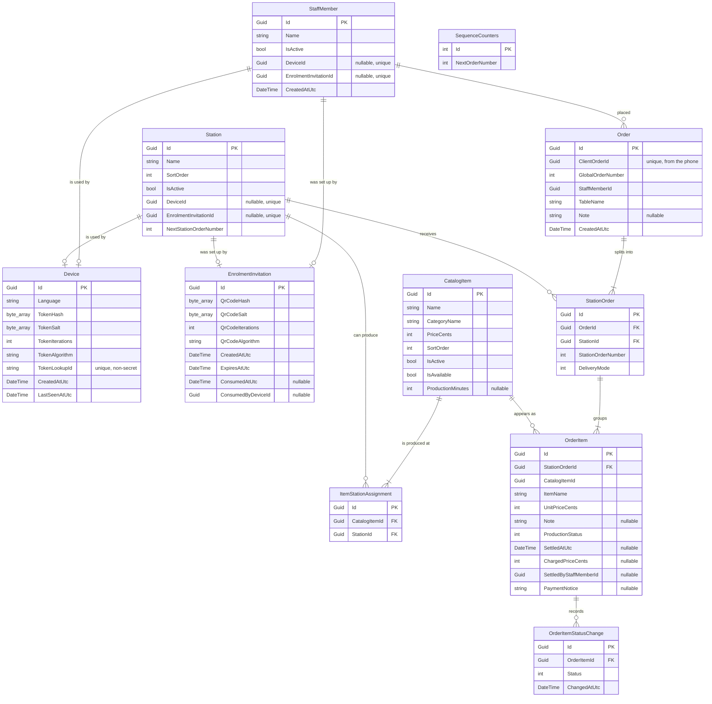

# System specification

Ordering system for volunteer fire department festivals.

Written to be read end to end by a human, not by a build tool.

Conventions used in this document:

* "Waiter" always means the person carrying orders and trays, never the machine. The machine is called
  "the backend" or "the laptop". In the code that person is `StaffMember`, and the app calls them
  "Kellner" in German and "waiter" in English.
* A place where food or drink is made and handed out is a **station**. In German it is always
  "Ausgabestelle", in English always "station". In the code it is `Station`. It is called by its own
  name ("Küche", "Theke innen") wherever a specific one is meant.
* Money is stored and calculated in integer cents. No decimal type appears anywhere.
* Times are stored in UTC and rendered in the laptop's local time zone.
* Every user-facing string in this document is given in German and English. Names the admin types in
  (item names, station names, waiter names) are data, not chrome, and are stored once in whatever
  language the fire department uses. The app does not translate them.
* Two numbers appear on screen, and each is written one way. The global order number is always
  "Bestellung 137" or "Order 137". The per-station sequence number is never shown on its own: the
  station tablet writes both together, as "Bestellung 137, hier Nummer 042" and "Order 137, number 042
  here". No `#` form and no "Nr." form exists anywhere in the product.

Contents:

1. Purpose and scope
2. Domain model
3. Production
4. Numbering
5. REST API
6. SignalR
7. Frontend screens
8. Failure behaviour on the phone
9. The program on the laptop and its setup
10. Testing strategy
11. What is deliberately not built, and what is still open

---

## 1. Purpose and scope

### 1.1 What the product does

A waiter walks table to table with their own phone, picks items and quantities, types the table name,
reads the running total aloud so the guest can pay cash, and places the order. The backend splits the
order by station and puts each station's part on that station's tablet. The people at the kitchen and
the bar work that list off exactly as they worked a pile of paper before. A waiter with a free hand
carries the tray out.

The product removes one step from the paper process: the walk from the table to the kitchen. Nothing
else about the process changes. Nobody at a station logs in, nobody is paged, and no screen tells a
waiter to come and fetch anything.

### 1.2 Why it exists

Orders get lost. A paper slip falls behind a fridge, a waiter forgets which table a tray belongs to,
or a slip is written twice and the kitchen produces the same order twice. Every design decision in
this document is answerable to that one problem. Two mechanisms carry the weight:

1. Every part of an order carries a global order number and a number of its own within the station it
   went to. The station's list runs 1, 2, 3, 4, so a missing number is visible to anyone reading the
   list. That is the same check the pile of paper offered, and it needs no screen, no login and no
   software knowledge.
2. Nothing is ever removed from a station's list by the software. An item leaves it because somebody
   at that station marked it ready. A failure is never allowed to look like a success.

### 1.3 Who uses it

| Role | Device | Technical ability assumed | Trained? |
|---|---|---|---|
| Waiter | Their own phone, any browser | None | No. Possibly never saw the tool before tonight. |
| Kitchen and bar staff | One tablet per station, standing at the station | None | No. Three buttons and a list. |
| Admin | The laptop on site | Can follow a printed checklist | Read the setup checklist once |

### 1.4 Scale

Fewer than ten stations. Fewer than ten waiters. A catalog of roughly twenty to sixty items. A few
dozen tables. Peak load is a handful of orders per minute. The system is not designed for scale, and
adding scale is not a goal. It is designed for reliability and for operation by people with little
technical ability.

### 1.5 Non-goals

The following are out of scope. They are listed so that a future change request can be answered with
"that was decided against", not with a redesign.

| Not in scope | Reason |
|---|---|
| Payments of any kind | Cash is handled by hand at the table. The app takes no payment, stores no payment data, and has no card reader. |
| Guest receipts, invoices, tax documents | Any of these would drag German fiscal law (KassenSichV, TSE, GoBD) into a hobby project. Nothing the app shows a guest is a receipt, and nothing is printed at all. |
| Printers of any kind | The fire department chose tablets before any printer was bought. There are no printers, no slips, no print state and no printing hardware anywhere in the product, and none will be added. |
| Notifying a waiter that food is ready | Deliberate, and section 3.5 gives the reasoning. Whoever passes the station takes the tray. |
| Stock, inventory, portion counts | An item is marked sold out by hand, in one tap, by whoever hears that the kitchen has run out. Counting portions is not attempted, because nobody will keep the count correct while serving. |
| Table reservations or floor plans | Tables are moved during the evening. Managing them as objects is more work than the problem is worth. |
| Zones or areas grouping stations | Almost every festival has one kitchen and one bar. Routing comes from the item itself, and section 2.5 describes the one remaining choice a waiter makes. |
| Cloud, remote access, multi-site | There is no internet on site. |
| Accounts, usernames, passwords | Nobody will manage credentials at a festival. Section 2.7 describes what replaces them. |
| Guest self-ordering | The waiter at the table is the product. |
| Reporting and analytics beyond a list of the evening's orders | Nobody will read it. The status change log in section 2.9 exists so that the question "how long did the kitchen actually take" can be answered later from the database, not so that a screen can be built for it now. |
| Tray tracking, delivery confirmation | A waiter carries the tray. The app is not told when it arrives. |
| Cancelling or correcting an order after it is placed | The moment an order is placed it is on a station's tablet and somebody may already be cooking it. Cancelling in software would tell the waiter the order is withdrawn while the kitchen carries on. Section 3.6 says what happens instead. |
| Deleting or cleaning up a mistaken order | It stays in the database. No money moves through the app and nothing aggregates orders, so a wrong order costs a line in a list the treasurer skims once. |

---

## 2. Domain model

### 2.1 Notation

Types are given as they exist in C#. `Guid` primary keys are generated on the backend, except
`Order.ClientOrderId`, which is generated on the phone. `string(n)` means a maximum length enforced
both in the database schema and in validation. All money is `int` cents. Enums are persisted as
integers with pinned values, so a member may be renamed freely but never reordered.

The whole schema is created by one migration, `20260906070525_InitialCreate`.

### 2.2 Entity relationship diagram



`SequenceCounters` has no relationship to anything: it is one row holding the next global order
number, and section 4 explains why the per-station counter lives on the station instead.

### 2.3 Station

A kitchen or a bar. There is no grouping above this: a station is the whole of the site structure the
system models.

| Field | Type | Notes |
|---|---|---|
| Id | Guid | |
| Name | string(40) | Shown at the top of the station's own tablet and on the waiter's summary screen |
| SortOrder | int | The order stations appear in, on the phone and in the admin |
| IsActive | bool | Switched off rather than deleted, because orders reference the station |
| DeviceId | Guid? | The tablet standing at this station, unique across the whole table. Null means no tablet has been set up yet. |
| EnrolmentInvitationId | Guid? | The QR code currently outstanding for this station, unique. Null when none is. |
| NextStationOrderNumber | int | The next number this station's list will show. See section 4. |

Invariants:

* A station cannot be switched off while it still has unfinished items. The refusal names how many,
  and the admin screen says so with `admin.stations.openTickets`.
* **A station cannot be switched off while it is the last active station of any active item.** The
  refusal names those items. This is what keeps the candidate set in section 2.5 non-empty, so
  routing never has to invent a station.
* At most one tablet per station, enforced by the unique index on `DeviceId`. Setting a tablet up
  again replaces the previous one, and the previous token stops working the moment it does.

### 2.4 CatalogItem

| Field | Type | Notes |
|---|---|---|
| Id | Guid | |
| Name | string(60) | Shown on the phone and on the station tablet |
| CategoryName | string(40) | Free text, used only to group buttons on the phone |
| PriceCents | int | Zero is allowed, for example for tap water |
| SortOrder | int | |
| IsActive | bool | Not on this festival's menu at all. Switched off rather than deleted, because orders reference items. |
| IsAvailable | bool | On the menu, but sold out tonight. Flipping it reaches every phone at once. |
| ProductionMinutes | int? | Roughly how long this item takes to make. Null means the item is handed over as soon as somebody reaches for it, which is what a drink does. Section 3.4 says how the estimate is built from it. |

**The two flags are two different things, set by two different people at two different times, and the
product never uses one word for both.**

| | `IsActive` false, "deaktiviert" / "deactivated" | `IsAvailable` false, "ausverkauft" / "sold out" |
|---|---|---|
| What it means | The item is not on this festival's menu | The item is on the menu and has run out tonight |
| Who sets it | The admin, at the laptop, setting up the event | Whoever hears that the kitchen has run out |
| When | Before the event, between events | During service, and very often reversed twenty minutes later when somebody finds another crate |
| How | The item editor | One toggle in the item list, one tap each way, no form and no dialog |
| On the phone | The item is not in the catalog at all | The item stays in the list, greyed, not selectable, labelled `catalog.soldOut` |

Sold out is reversed constantly by somebody who is busy, so it is one tap and nothing else.
Deactivation is a considered edit made once, so it lives in the editor where a considered edit
belongs.

**A sold-out item stays on the phone rather than disappearing from it.** An item that vanishes
silently sends a waiter hunting through categories for something that was there a minute ago,
wondering whether they are on the wrong screen. Greyed out with "Ausverkauft" underneath answers that
question at the moment it is asked, which is the moment the guest asks for it.

Invariants:

* **An item cannot be saved with no station, and an item with no station never appears in the
  catalog.** The admin form refuses to save and says why, and the API answers 422. This is the
  invariant the whole routing design rests on.
* `PriceCents >= 0`. `ProductionMinutes`, when set, is a whole number of minutes from 0 to 600.
* Editing a name or a price never changes an existing order. Every `OrderItem` carries the name and
  the price as they stood when the order was taken.
* **Marking an item sold out is allowed at any time and never refused.** It changes nothing about
  orders that already exist, and an order carrying that item is still accepted (section 5.4).

### 2.5 ItemStationAssignment and routing

Which stations are capable of producing an item. Bratwurst is assigned to the kitchen. Beer at a site
with two bars is assigned to both.

| Field | Type | Notes |
|---|---|---|
| Id | Guid | |
| CatalogItemId | Guid | |
| StationId | Guid | |

`(CatalogItemId, StationId)` is unique. An item's **candidate set** is its assigned stations that are
active. By the invariants in sections 2.3 and 2.4 the candidate set of an orderable item is never
empty, so routing has no nothing case and there is no fallback rule anywhere in the system.

**The routing rule, and the only routing rule in the system:**

1. **One candidate.** The item goes there. The waiter is never asked, and no station control is drawn
   for that item. This is the normal case at a site with one kitchen and one bar, and it is
   completely invisible.
2. **More than one candidate.** The waiter chooses, on the phone, at the moment the item is added.
   The choice is shown on the item in the summary screen and is changeable until the order is sent.

The choice belongs to the one item. It is not a session setting, not a device setting and not a shift
setting, and nothing about it is remembered for the next item or the next order. A waiter carrying one
tray to the marquee and the next to the terrace would otherwise be fighting a setting they never set.

This rule lives in one place and is used by order submission, by the phone's own preview and by the
tests. It is not reimplemented anywhere.

### 2.6 Table naming: free text, with suggestions

**A table is a free text name on the order, not an entity that orders point to.** There is no table
entity and no separate list of table names to maintain.

At a festival the tables are beer benches. They get moved, added and joined together during the
evening, and guests sit at whatever is standing. If the order required a foreign key into a table
list, then the first table that is not in the list blocks an order, and blocking an order is the exact
failure this product exists to prevent. Free text can never block.

**The suggestions come from the table names already typed on existing orders**, which
`GET /api/open-items/table-names` returns. It is read when the ordering screen opens, and it looks
only at the most recent orders, so the list cannot grow without a bound over a long festival. The
table field on the phone is a combobox: the waiter types freely, and the names already in use sit in
its dropdown. That is what keeps spellings consistent, and it needs no admin screen and no entity of
its own.

Invariants:

* `Order.TableName` is required and is between 1 and 40 characters.
* `Order.TableName` need not match any name already in use.

**The stored name is not normalised.** "Tisch 12", "tisch 12" and "T12" stay three different tables,
because grouping on the exact string is the rule a volunteer can predict, and normalising is code that
is easy to get subtly wrong. The dropdown of names already in use is what prevents the typo in the
first place, at the moment it would be made.

The open items screen groups by that exact name, so a table settles together rather than order by
order.

### 2.7 StaffMember, Station, Device and EnrolmentInvitation

There are no usernames and no passwords anywhere in the product.

**Every device is set up from the laptop, one at a time, with one QR code.** The admin puts the waiter
on the list or picks the station, creates the code for that owner by name, and the person holding the
phone or the tablet scans it with their own camera app. The browser that opens finishes the job and
asks for nothing, because the invitation already says whose device this is.

**One device per owner, and the owner points at the device.** A `StaffMember` row and a `Station` row
each carry a nullable `DeviceId` with a unique index over it, so a waiter has at most one phone and a
station has at most one tablet. The device row carries no owner of its own. That direction was chosen
because the question the product actually asks is "which device belongs to this person or this
station", and a row can answer it without a search.

**Setting a device up again replaces the previous one, in the same transaction, and the old token
stops working at that moment.** That one rule covers the three situations that occur. A phone is lost,
and whoever finds it must not be able to send orders to the kitchen. A battery dies and the waiter
borrows a colleague's handset for the rest of the evening. A tablet is swapped for a charged one
halfway through. Without the rule the lost phone keeps working all evening, and no amount of admin
diligence at 22:00 makes up for that.

**StaffMember** is the name shown on the order, the owner of the evening's orders, and the row in the
admin list.

| Field | Type | Notes |
|---|---|---|
| Id | Guid | |
| Name | string(40) | Typed by the admin when the person is put on the list, and changeable at any time afterwards |
| IsActive | bool | Taking somebody off the list signs their phone out in the same transaction |
| DeviceId | Guid? | Their phone, unique |
| EnrolmentInvitationId | Guid? | The QR code currently outstanding for them, unique |
| CreatedAtUtc | DateTime | |

An order belongs to a `StaffMember`, not to a phone. That is what makes a flat battery, a signed out
phone or a fresh setup survivable: the evening's history follows the human, so a waiter who finishes
the evening on a borrowed handset keeps the orders they took.

**The admin can rename a person at any time, and that is a safety valve rather than a convenience.**
The name on an order is whatever was typed into the waiter list, so sooner or later somebody is put
down as "Papa" or as a nickname the kitchen does not know. Renaming changes the row and not its
identity:
the person keeps their id and their orders, and `admin.staff.renameHelp` says that the new name counts
from the next order onwards.

**Device** is one enrolled phone or one enrolled tablet. The two are the same kind of row and are told
apart by which owner points at them.

| Field | Type | Notes |
|---|---|---|
| Id | Guid | |
| Language | string(2) | `de` or `en`. Set at enrolment to German, unless the redeeming browser's `Accept-Language` asks for English first. One tap in the settings sheet changes it afterwards. |
| TokenLookupId | string(32) | Non-secret random id, sent with every request so the backend can find the one row to verify against |
| TokenHash, TokenSalt, TokenIterations, TokenAlgorithm | | PBKDF2-HMAC-SHA512, per-token random salt, with the iteration count and the algorithm name stored alongside the hash so both can be raised later without invalidating existing devices |
| CreatedAtUtc, LastSeenAtUtc | DateTime | |

Signing a device out removes the row, which is what makes the token invalid: there is no revoked flag
to check and therefore no way for a stale read to miss it.

**EnrolmentInvitation** is the single-use, short-lived credential behind one QR code.

| Field | Type | Notes |
|---|---|---|
| Id | Guid | |
| QrCodeHash, QrCodeSalt, QrCodeIterations, QrCodeAlgorithm | | The long random value carried in the QR URL, hashed with the same PBKDF2-HMAC-SHA512 scheme as a device token |
| CreatedAtUtc, ExpiresAtUtc | DateTime | Lifetime five minutes |
| ConsumedAtUtc, ConsumedByDeviceId | | Set atomically by the successful redemption |

The QR URL is returned once, in the response that created the invitation, and after that it exists
only on the admin's screen and in one in-memory slot on the laptop that holds the single outstanding
invitation so the picture can be drawn. It is never written to the database and never fetchable again,
because persisting it beside its own hash would make the hashing decorative. Restarting the laptop
empties that slot, so an admin who reloads the page creates a new invitation instead, which is one
click.

Invariants:

* **At most one invitation is unconsumed at any moment, and the database enforces it rather than the
  code remembering to.** A computed column is 1 while `ConsumedAtUtc` is null and null afterwards, and
  a unique index over that column permits one such row and rejects a second. Creating an invitation
  consumes whichever one was outstanding in the same transaction that inserts the new one, so two
  admin tabs clicking within a second produce one outstanding invitation and one loser.
* Redemption is a single atomic update: the invitation moves from unconsumed to consumed in the same
  transaction that creates the device, so a photographed QR code cannot set up a second device.
* **An invitation expires the moment it is redeemed, and otherwise five minutes after it was
  created.** Five minutes is long enough to walk from the laptop to wherever the tablet is standing
  and unlock it, and short enough that a code somebody photographed over a shoulder is dead before
  they could use it.
* An invitation issued for a person or a station that has since been switched off is refused when it
  is redeemed, with `enrolment.staffMemberIsOffTheList` or `enrolment.stationIsOffTheList`.
* Tokens are never logged, never returned after enrolment, and never recoverable. A lost device is
  handled by setting its owner up again, which replaces it.

### 2.8 Order, StationOrder and OrderItem

| Order field | Type | Notes |
|---|---|---|
| Id | Guid | |
| ClientOrderId | Guid | Generated on the phone, unique index. This is the idempotency key. |
| GlobalOrderNumber | int | Allocated at acceptance |
| StaffMemberId | Guid | Who placed it. It holds no foreign key, so a waiter can be taken off the list without rewriting what they took. |
| TableName | string(40) | |
| Note | string(200)? | An order level note, shown on every station's tablet |
| CreatedAtUtc | DateTime | |

**An order has no stored status and no stored total.** Both are derived on every read, from the
station orders and from the items, so the two can never disagree with each other or with the
underlying rows. Section 3.3 gives the projection.

| StationOrder field | Type | Notes |
|---|---|---|
| Id | Guid | |
| OrderId | Guid | |
| StationId | Guid | |
| StationOrderNumber | int | Allocated at acceptance from `Station.NextStationOrderNumber` |
| DeliveryMode | enum | `Together` or `AsItComes`, chosen by the waiter before sending. Section 3.1. |

`(OrderId, StationId)` is unique, so a station can never receive two slices of one order, and every
item for that station is on the one slice. A slice has at least one item.

| OrderItem field | Type | Notes |
|---|---|---|
| Id | Guid | |
| StationOrderId | Guid | The slice this item was routed into |
| CatalogItemId | Guid | |
| ItemName | string(60) | The name as it stood when the order was taken |
| UnitPriceCents | int | The price the phone displayed. Never overwritten, not even when the item is given away. |
| Note | string(200)? | For example "ohne Zwiebeln", shown under the item on the tablet |
| ProductionStatus | enum | `Waiting`, `InProduction` or `Finished`. Section 3.2. |
| SettledAtUtc | DateTime? | Null means the item is still open. Non-null means it has been settled. This is the paid flag: there is no separate boolean, so a flag and a timestamp can never disagree. |
| ChargedPriceCents | int? | What was actually collected. Null while open, equal to the unit price on a normal settle, zero when the item was given away. |
| SettledByStaffMemberId | Guid? | Which waiter collected the money. Null while open. It holds no foreign key, exactly like `Order.StaffMemberId`. |
| PaymentNotice | string(200)? | The reason an item was given away. Required whenever `ChargedPriceCents` is below the unit price, otherwise null. |

**One item row is one physical portion. There is no quantity column: three beers are three rows.**
Rows carrying the same item name and the same note are counted together when a screen is rendered, so
the reader still sees "3 x Bier" rather than three repeated lines.

**Who took the order and who collected the money are two different people often enough that both are
recorded.** The waiter who walks the table writes `Order.StaffMemberId`; the waiter who later takes
the cash writes `SettledByStaffMemberId` on each item they settle. The field is stored and nothing
more: no response carries it and no screen shows it. It is there for the takings-per-waiter figures
the fire department will want after the festival.

**Payment is tracked per item, because a table often pays for only part of what is open**, and because
food and drink are sometimes given away, for example to the band playing at the festival. Everything
above the item is derived and never stored:

* An order is fully settled when all of its items are.
* A table's open amount is the sum of the unit prices over its unsettled items.
* What was given away is the unit price minus `ChargedPriceCents`, summed over settled items.

`POST /api/orders` carries `settleOnSend`. When it is true every item of the order is settled at its
displayed price the moment the order is accepted, which is the guest who pays on the spot, and the
waiter sending the order is recorded as the one who collected the money. When it is false every item
is left open, which is the table running a tab. Nothing else about the order depends on this field.

**No receipt is ever printed or issued to a guest.** Settlement is a note for the people running the
stand about what is still owed, not an accounting record and not a till.

Invariants:

* An order has at least one item, and at most 200.
* An accepted order is immutable except for the production status of its items and their settlement.
  Items are never added, removed, renamed or repriced, and an order is never cancelled or deleted.
* A settled item is never settled a second time. Settling an item that is already settled leaves the
  first settlement standing, so a double tap cannot double count and cannot overwrite the reason
  somebody typed earlier.
* `SettledAtUtc`, `ChargedPriceCents` and `SettledByStaffMemberId` are either all three null or all
  three set. One place in the code settles an item and it writes the three together.
* `ClientOrderId` carries a unique index and is the whole duplicate protection for a resubmission.
  Section 8.3 describes it from the phone's side.

### 2.9 OrderItemStatusChange

An append-only log. Every time an item's production status changes, one row is written.

| Field | Type | Notes |
|---|---|---|
| Id | Guid | |
| OrderItemId | Guid | |
| Status | enum | The status the item moved into |
| ChangedAtUtc | DateTime | |

**It exists so that the fire department can find out afterwards how long each step took**, which is
the question somebody always asks the morning after: how long did a Bratwurst really take when it was
busy, and how long did trays stand at the bar before somebody carried them out. Nothing in the running
system reads it.

**It is never read to decide the current state.** The current state is `OrderItem.ProductionStatus`
and only that. A log that is also a source of truth is a second place where the truth lives, and the
two would disagree the first time a write half succeeded. Nothing is ever updated or deleted in this
table.

### 2.10 Counters

There are exactly two counters and they live in the database, never in memory.

| Counter | Where it lives | Counts |
|---|---|---|
| The global order number | `SequenceCounters.NextOrderNumber`, one row | Orders, across the whole site |
| A station's own sequence number | `Station.NextStationOrderNumber`, one per station | The slices that station has received |

The per-station counter sits on the station rather than in a counter table because a station is
already the row the acceptance transaction has open, and a counter with a composite key would be a
second table to lock for no gain. Section 4 gives the allocation rules and says why gaps mean what
they mean.

---

## 3. Production

### 3.1 Delivery mode

Before sending, the waiter answers one question per station the order touches: should this station
hand its part of the order out **together**, or **as each item is ready**?

| | Together (`DeliveryMode.Together`) | As it is ready (`DeliveryMode.AsItComes`) |
|---|---|---|
| German | Zusammen | Sobald fertig |
| English | Together | As it is ready |
| What it means | The station holds everything back until the last item is ready | Each item goes out on its own as soon as it is ready |
| When it is right | A family eating together | A round of drinks, or a table that is happy to be served in waves |

**Together is the default**, because a table sitting down to eat is the ordinary case and a waiter who
answers nothing gets the answer that surprises nobody.

**The choice is fixed once the order is sent.** No screen changes it afterwards: not the phone, not
the tablet, not the admin. The station has already arranged its work around the answer by the time
anybody would want to change it, and a mode that can be flipped underneath a cook is a way to lose
half a tray.

A station that was not part of the order is not asked about. An order that touches two stations is
asked twice, once per card on the summary screen, and the two answers are independent: the kitchen may
hold the food back while the bar sends the drinks out as they are poured.

### 3.2 Production status

Every item moves through three states, in one direction only.

| State | German | English | Meaning |
|---|---|---|---|
| `Waiting` | wartet | waiting | Nobody has started it |
| `InProduction` | in Zubereitung | being prepared | Somebody at the station is making it |
| `Finished` | fertig | ready | It is made and can go out |

**Ready is final.** There is no way back from it, on any screen, for anybody. Marking something ready
tells a waiter to carry it out, and a state that can be taken back would be the software telling a
human something untrue about a tray that has already left. An item marked ready by mistake is answered
the way the paper process answered it: somebody says so at the station.

Transitions only move forward, and a request to move an item backwards is refused with
`station.statusAlreadyPassed`, which tells the reader to reload because the item is already further
along than their screen shows. A request naming an item that does not belong to this station is
refused with `station.itemNotAtThisStation`, and a request that names no item at all is refused with
`station.noItemsSelected`.

Every change appends a row to the log in section 2.9, in the same transaction that writes the new
status.

**Staff can advance one item or a whole slice.** One call carries a list of item ids and the one
status they are all to move to, so a station with eight beers on one order taps once rather than eight
times. The call is all or nothing: if a single item in the list cannot take the step, nothing at all is
written and the whole request is refused. That is why the card's own button works out its next step
from the card and then sends only the items that are in the status that step applies to, rather than
sending everything on the card and hoping.

### 3.3 Order status, a projection

`OrderStatus` is not stored. It is computed from the production statuses of the order's items
whenever somebody asks for it:

| Condition over the order's items | Order status |
|---|---|
| Every item is `Finished` | `Finished` |
| At least one item is `InProduction` or `Finished`, and not all are `Finished` | `InProduction` |
| Otherwise, which means every item is still `Waiting` | `Waiting` |

Storing it would be a second place for the same fact to live, and the first half-written transaction
would leave the two disagreeing. Deriving it costs one pass over rows the query has already loaded.

### 3.4 Estimates

Each catalog item may carry a production time in minutes. From those the phone shows the waiter,
before the order is sent, roughly how long the guest will be waiting.

* **The backend reports, per station, the minutes currently queued**: the production minutes of that
  station's unfinished items, added up, with a missing production time counting as zero. A station
  with nothing waiting reports zero.
* **The phone adds the item's own minutes** to its station's queued minutes, and that is the estimate
  it shows for the item: `catalog.readyIn` ("Fertig in etwa {count} Minuten" and "Ready in about
  {count} minutes"), or `catalog.readyNow` ("Sofort fertig" and "Ready right away") when the total is
  zero. An item that more than one station could produce is shown the shortest of those stations'
  answers, because that is the one the waiter would pick.
* **A slice sent together is ready when its slowest item is ready**, so the estimate shown for the
  whole card is the largest of its items' estimates: `review.sliceReadyIn` and `review.sliceReadyNow`.
* **A slice sent as it is ready has no single estimate**, and none is shown for the card. Its items
  leave the station one at a time, so a number for the whole card would be answering a question nobody
  asked. Each item still carries its own.

**Estimates are computed, never stored.** Nothing in the database holds a predicted time, nothing
compares a prediction against what happened, and no screen reports on the accuracy of an estimate.
It is an aid for the sentence "das dauert etwa zwanzig Minuten" at the table, and nothing else depends
on it.

**A missing production time counts as zero rather than blocking the estimate.** Most drinks will never
have one filled in, and an estimate that refuses to appear because somebody left a field empty is
worse than an estimate that is a little optimistic. `admin.items.productionMinutesHelp` tells the admin
to leave the field empty for items that are handed over right away.

**If the estimates cannot be loaded the order can still be sent.** The phone says so once, with
`estimates.loadFailed`, and every other control on the screen carries on working. An estimate is
decoration on the ordering path and is never allowed to stand in front of an order.

### 3.5 Nobody is notified

When an item is marked ready, the tablet shows the table name, with `station.finishedNotice`:
"Fertig für {table}. Schreiben Sie den Tisch auf das Tablett." and "Ready for {table}. Write the table
on the tray." Somebody at the station writes the table on the tray, and the tray stands there.

**No waiter is called, no phone buzzes, and no screen anywhere says that a tray is waiting.** Whichever
waiter next passes the station picks the tray up and takes it to the table written on it.

This is deliberate and it is worth saying plainly, because it looks like a missing feature and it is
not. A festival marquee is loud, phones are in aprons, and a waiter is usually mid-conversation with a
table. A notification that cannot be relied on is worse than none, because it teaches everybody to stop
walking past the station. The process the fire department already runs is that people pass the hatch
constantly, and this product is not trying to replace that.

### 3.6 A guest changes their mind

This happens several times an evening, and the product's answer is deliberately not a button.

**Before the order is sent** there is nothing to specify. The order is a cart on the phone. Removing an
item and starting over are ordinary editing, and the backend has never heard of the order.

**After the order is sent there is no cancel action, anywhere, for anybody.** The moment the order is
accepted it is on the station's tablet and somebody may already have started it. A cancel button would
clear the row on the waiter's phone, which reads as "that order is withdrawn", while the kitchen goes
on cooking. That is a system telling a human something untrue about the physical world, which is the
one defect this entire document is written against.

**What happens instead** is what happened before there was any software: the waiter walks over and
tells the station. That walk is short, it is certain, and it is the same walk any workable design would
have required. The extra order stays in the database, which costs nothing: no money moves through the
app, and the item can be settled free of charge with a typed reason if it was made and given away.

---

## 4. Numbering

Two numbers appear on the station tablet. Both matter, and they do different jobs.

* The **global order number** is how a person says one order out loud across the whole site.
  "Bestellung 137, wo ist das Bier dazu." It is shared by every station's slice of that order.
* The **per-station sequence number** is how a person sees at a glance that something is missing. The
  kitchen's slices run 1, 2, 3, 4. If the list jumps from 41 to 43, then 42 is missing and the station
  knows it without touching software.

The tablet writes them together, `station.order`: "Bestellung {order}, hier Nummer {sequence}" and
"Order {order}, number {sequence} here". The sequence number is zero padded to three digits, so the
rows stay the same visual width all evening and a jump is obvious in a list.

### 4.1 Allocation

Both counters start at 1. Allocation happens inside the single database transaction that accepts an
order:

1. Open a SQLite write transaction (`BEGIN IMMEDIATE`, which SQLite serializes, so there is exactly
   one writer). The busy timeout means a concurrent writer waits rather than returning `SQLITE_BUSY`
   to a waiter standing at a table.
2. Insert the `Order` row and take the next global order number from `SequenceCounters`.
3. For each station the order routes to, insert one `StationOrder` and take that station's next number
   from `Station.NextStationOrderNumber`.
4. Insert the items.
5. Commit.

Nothing else in the system allocates either number.

### 4.2 Why gaps mean what they mean

A gap in a station's list has to mean "something is missing", otherwise the station learns to ignore
gaps and the mechanism is dead. Three rules keep that true:

* **A number is allocated only by a transaction that commits.** If anything in the acceptance path
  fails, the whole transaction rolls back and the counter rolls back with it. There is no separate
  "get a number" call that can succeed while the order fails.
* **Counters are in the database, never in memory.** A restart, a crash, or a laptop that lost power
  mid-evening resumes at the exact next value. There is no in-process cache and no batch reservation,
  because both hand out numbers that may never be used.
* **Nothing is ever deleted or cancelled.** A committed number always has a slice behind it.

So every gap in a station's list means one thing and only one thing: that slice did not arrive, and
the admin order list can name which order it belonged to in five seconds.

### 4.3 Resetting the numbers

Numbers count up continuously and are reset by hand, before a new festival, from the admin overview:
`admin.numbers.reset`, with `admin.numbers.confirm` asking whether they should start at 1 again and
saying that orders already taken keep the numbers they have. The reset sets `SequenceCounters` and
every station's counter back to 1 in one transaction.

It is a deliberate action rather than a scheduled one because the only person who knows that yesterday
is over is the person standing at the laptop. Nothing about it deletes anything: yesterday's orders
keep their numbers and stay in the database, and section 9.8 describes the backup that is taken with
them.

---

## 5. REST API

One process, one port. The scheme, port and bind address live in one configuration object so a later
move to HTTPS is a setting rather than a rewrite.

### 5.1 Audiences and how each is authenticated

| Audience | Path prefix | Authentication |
|---|---|---|
| Waiter phones and station tablets | `/api/...` | `Authorization: Bearer <TokenLookupId>.<secret>`. The backend splits on the dot, loads the one device row by `TokenLookupId`, and verifies the secret with PBKDF2 using that row's stored salt, iteration count and algorithm. A device whose row is gone is rejected. |
| Admin | `/api/admin/...` | The request must arrive from the laptop itself: the loopback interface, or one of the addresses this process is bound to. No password exists because nobody would manage one. Requests to admin paths from any other address get 404, not 403, so a phone browsing the site learns nothing. |
| Enrolment and health | `/api/enrolment/redeem`, `/api/health`, `/api/language` | Anonymous, rate limited |

A phone and a tablet carry the same kind of token. What they may do differs by what their owner is:
`GET /api/session` answers with a `deviceKind` of `staffMember` or `station`, and that is the only
call both kinds of device share. `/api/catalog`, `/api/orders`, `/api/estimates`, `/api/stations` and
everything under `/api/open-items` answer only for a device a staff member points at, and
`/api/station/orders` and `/api/station/items/status` answer only for a device a station points at.
A device asking for the other kind's endpoint is refused with 403 and `auth.wrongDeviceKind`, which
tells the reader that this device is not set up for that screen.

Loopback only for the admin API is the right trade. It replaces a credential nobody would manage with
a physical constraint everybody understands: the admin is the person standing at the laptop. On an
open WiFi with plain HTTP any token-based admin login would be readable off the air, so the physical
constraint is genuinely stronger than the alternative, not merely simpler. Accepting the laptop's own
bound addresses as well is safe, because a request from a phone carries the phone's address, and it
removes the one case that otherwise looks like a broken program: the volunteer who reads
`http://192.168.1.23:5000` off the overview screen and types it into the laptop's own browser.

**The admin page is served from every address; the admin API is not.** A phone that opens `/admin`
gets one sentence, `admin.notOnLaptop`, telling the reader to open the admin pages on the laptop.
Serving a broken admin screen with no explanation to a curious waiter is worse than either extreme.

Rate limits apply per address on the anonymous paths and per device elsewhere. Exceeding one returns
429 with `session.tooManyRequests`, which tells the reader to wait a moment and try again.

Every error response uses the same shape. The message is not rendered here: the response carries the
key and its parameters, and the caller renders it in its own language from its own resource file. A
device has a stored language that an `Accept-Language` header does not know about, and a message that
exists both as a backend string and as a frontend string will drift.

```json
{
  "code": "ValidationFailed",
  "messageKey": "order.tableNameMissing",
  "parameters": {},
  "details": null
}
```

`details` is present only for admin callers and carries the technical text. A waiter's phone never
receives a stack trace or a socket error string.

**Database failures have a stated outcome, like every other failure.** A write that cannot complete
returns 503 with `review.sendFailedDatabase`, which tells the waiter to send the order again and says
that the order is still on their screen. It has a key of its own rather than reusing
`review.sendFailed`, which says the laptop could not be reached: in this case the laptop answered and
its disk did not, and a message that states the wrong cause sends somebody to check the WiFi. On
startup the backend verifies that the data folder is writable, and when it is not, the program window
shows the repair text naming the folder and the program does not start serving. A program that starts
and then silently fails every order is the worst possible response to a folder it cannot write to.

### 5.2 Enrolment and session

#### POST /api/enrolment/redeem

Anonymous. This is the only call a device can make before it has a token.

Request:

```json
{
  "code": "8f2a1c...",
  "name": "Anna",
  "userAgent": "Mozilla/5.0 ..."
}
```

`code` comes from the QR URL. `name` is what the waiter typed on their own phone. Every invitation the
admin can create names either a waiter or a station, so the name the phone sends is not read today: the
device takes its owner's name from the invitation. The field is still accepted, and the laptop still
refuses a redemption with `enrolment.nameMissing` when an invitation names nobody and no name was
typed, which is the one case no admin call can currently produce. `userAgent` is what the browser calls
itself. The device row has no column for it, so it is accepted and not kept.

Response 200:

```json
{
  "deviceId": "9a71...",
  "deviceToken": "K7f3...secret",
  "deviceKind": "staffMember",
  "staffMember": { "id": "c2f1...", "name": "Anna" },
  "station": null,
  "language": "de"
}
```

`deviceToken` is returned exactly once and never again. For a station's invitation `deviceKind` is
`station`, `station` names it and `staffMember` is null.

**One redemption does one of two things, decided by the invitation and not by the device.** An
invitation issued for a waiter writes the new phone to that person, who keeps their id and their
orders. An invitation issued for a station writes the new tablet to that station. Either way the
device row and the consumption of the invitation commit in one transaction. A person who is not on
the list yet is created in the admin pages first, with `POST /api/admin/staff-members`, and only then
invited.

| Status | When |
|---|---|
| 200 | Redeemed. The invitation is now consumed. |
| 400 | No code supplied, or the name is empty for an invitation that names nobody (`enrolment.codeMissing`, `enrolment.nameMissing`) |
| 404 | The laptop does not know this code (`enrolment.codeUnknown`) |
| 410 | The invitation was already used, has expired, or was replaced when the admin created a newer one (`enrolment.codeNoLongerValid`), or the person or the station it names is off the list (`enrolment.staffMemberIsOffTheList`, `enrolment.stationIsOffTheList`). All of them send the reader back to the laptop for a fresh QR code. |
| 429 | Rate limited |

#### GET /api/session

Device auth. Returns who this device is.

```json
{
  "deviceId": "9a71...",
  "deviceKind": "staffMember",
  "staffMember": { "id": "c2f1...", "name": "Anna" },
  "station": null,
  "language": "de"
}
```

401 when the token is unknown or its device row is gone.

#### PUT /api/session/language

Device auth. Body `{ "language": "de" | "en" }`. Returns 204. Stored on the device row so a reopened
page keeps the choice, and so every message the backend keys reaches this device in the right
language. An unsupported value is refused with `session.unsupportedLanguage`.

#### GET /api/language

Anonymous. Returns the language the laptop itself is set to, which is what a device that has no token
yet renders its welcome and enrolment screens in.

### 5.3 Catalog

#### GET /api/catalog

Device auth, waiter phones only. One call, everything the ordering screen needs.

```json
{
  "version": "2026-09-06T17:04:11.6210000+00:00",
  "categories": [ { "name": "Essen", "sortOrder": 1 } ],
  "items": [
    {
      "id": "...",
      "name": "Bratwurst mit Brot",
      "categoryName": "Essen",
      "priceCents": 350,
      "sortOrder": 1,
      "isAvailable": true,
      "stationIds": ["kitchen-id"],
      "productionMinutes": 12
    }
  ],
  "stations": [ { "id": "kitchen-id", "name": "Küche", "sortOrder": 1 } ]
}
```

`version` is simply the moment the catalog was read, written out in full. It is not a hash and not a
counter: it changes on every read, and its only job is to be a value the `CatalogChanged` push can
carry so the phone has something to compare and log.

`stationIds` holds the item's active candidate stations, always at least one. An item with exactly one
is routed silently. An item with more than one makes the phone ask, once, as the item is added.

* **Deactivated items are not in the payload at all.** They are not on this festival's menu, so there
  is nothing for the phone to draw.
* **Sold-out items are in the payload, with `isAvailable: false`.** The phone draws them greyed and
  not selectable with the reason underneath.

**Prices come from here and from nowhere else.** `priceCents` is the backend's current price, and it
is what the phone displays and what the phone adds up. The total stored on an order is computed by the
backend from its own prices at acceptance, so a phone holding a stale catalog produces a stale number
on a screen and never a stale number in the database.

The phone caches this in memory and refetches when the `CatalogChanged` push arrives, which is what
keeps an open basket current when a price is edited or an item sells out mid-order.

### 5.4 Orders

#### POST /api/orders

Device auth, and only for a device a `StaffMember` points at. The single most important endpoint in
the system.

Request:

```json
{
  "clientOrderId": "3f7c9d2e-...",
  "tableName": "Tisch 12",
  "note": null,
  "settleOnSend": false,
  "items": [
    { "catalogItemId": "...", "unitPriceCents": 350, "note": null, "stationId": null },
    { "catalogItemId": "...", "unitPriceCents": 350, "note": null, "stationId": null },
    { "catalogItemId": "...", "unitPriceCents": 400, "note": "ohne Ketchup", "stationId": "bar-marquee-id" }
  ],
  "deliveryModes": [
    { "stationId": "kitchen-id", "deliveryMode": "together" },
    { "stationId": "bar-marquee-id", "deliveryMode": "asItComes" }
  ]
}
```

`clientOrderId` is the submission id. **The phone generates it once, when the waiter first taps send,
and reuses the same value for every retry of that same order.** It is never regenerated, not by a
retry, not by a reload and not by setting the phone up again. Section 8.3 covers it from the phone's
side, and it is the whole reason a manual retry cannot produce a second order.

`unitPriceCents` is the price the phone displayed, and it is what the laptop stores on the item,
untouched, exactly as section 2.8 says. That is deliberate: the guest was quoted that price at the
table and the cash may already be counted against it, so the figure the evening is settled on is the
figure the waiter read out. A negative price is refused with `order.priceOutOfRange`, which tells the
waiter to reload the item list. The order's total is the sum of those stored prices and is derived on
every read.

`stationId` is the waiter's choice for that item. It is required when the item has more than one
active candidate station (`order.stationRequired`) and is omitted otherwise. When supplied it must
name one of that item's assigned stations (`order.stationNotAssignedToItem`).

`deliveryModes` carries one answer per station the order touches. A station that is missing from the
list is treated as `together`, which is the default the summary screen also starts from.

Response 201:

```json
{
  "orderId": "...",
  "globalOrderNumber": 137,
  "status": "waiting",
  "totalCents": 1050,
  "createdAtUtc": "2026-09-06T17:42:03Z",
  "stationOrders": [
    {
      "stationOrderId": "...",
      "stationId": "kitchen-id",
      "stationName": "Küche",
      "stationOrderNumber": 42,
      "deliveryMode": "together",
      "itemIds": ["...", "..."]
    }
  ]
}
```

`status` is the order status projected from the items, per section 3.3, so a freshly accepted order is
always `waiting`. Each entry of `stationOrders` names the delivery mode that slice was stored with,
which is the answer the waiter gave on the summary screen.

| Status | When |
|---|---|
| 201 | Accepted and numbered |
| 200 | The same `clientOrderId` was already accepted. The original order is returned unchanged, with its original numbers and its original slices. No second order is created. |
| 400 | No items (`order.noItems`), more than 200 items (`order.tooManyItems`), table name missing (`order.tableNameMissing`), longer than 40 characters (`order.tableNameTooLong`), or an item sent with a negative price (`order.priceOutOfRange`) |
| 401 | Unknown token |
| 409 | The same `clientOrderId` was used with different content (`order.submissionIdReused`). The message tells the waiter to take the change as a new order and to tell the station. |
| 422 | An item id is unknown (`order.unknownItem`), an item names a station it is not assigned to (`order.stationNotAssignedToItem`), an item omits the station when it has more than one candidate (`order.stationRequired`), or an item has no active station at all (`order.itemHasNoStation`) |
| 503 | The database could not be written. The order was not accepted and the phone offers the retry again. |

**The 200 answer is the one that keeps a manual retry safe, and it is worth being exact about.** When
the first submission reached the backend but its response was lost on the way back, the waiter sees a
failure and taps retry. Without the id the backend would create a second order with a second set of
numbers, both stations would see it, and the table would get everything twice. With it, the second
submission finds the row by the unique index on `ClientOrderId` inside the same `BEGIN IMMEDIATE`
transaction that would otherwise insert, and returns what already exists.

The body of a 200 is the body of the 201 it repeats, so the phone shows the same confirmation with the
same order number. To the waiter the two cases are the same event, and a screen that distinguished
them would be describing the network rather than the order.

**An item that went sold out, or was deactivated, after the catalog was fetched is accepted, not
rejected.** The guest ordered it, the waiter read the total aloud, and the cash may already be in their
apron. Only an item id that does not exist at all is refused, and that is a broken client rather than a
guest. The waiter usually learns before they send rather than after, because `CatalogChanged` reaches
the open basket and flags the item while they are still standing at the table. When they send it
anyway, which is the right thing to do, the accepted consequence is that a station may be asked for
something it has run out of, and it sends word back with the tray. That is what happens with a paper
order pad today.

There is no endpoint that cancels, edits or deletes an order. Section 3.6 gives the reasoning.

#### GET /api/estimates

Device auth, waiter phones only. What the phone needs to show a waiting time before the order is sent.

```json
{ "stations": [ { "stationId": "kitchen-id", "queuedMinutes": 24 } ] }
```

One entry per active station, in the stations' own sort order. `queuedMinutes` is that station's
unfinished items' production minutes added up, with a missing production time counting as zero. The
phone adds the item's own minutes on top, per section 3.4. When this call fails the phone shows
`estimates.loadFailed` and the order can still be sent.

#### GET /api/stations

Device auth, waiter phones only. The active stations with their names and sort order, as
`{ "stations": [ { "stationId": "...", "name": "Küche", "sortOrder": 1 } ] }`. The ordering screen
does not call it, because `GET /api/catalog` already carries the same list beside the items.

### 5.5 The open items endpoints

All of them are device authenticated and belong to the phones.

#### GET /api/open-items

Everything the open items screen needs, in one call.

```json
{
  "tables": [
    {
      "tableName": "Tisch 12",
      "openAmountCents": 700,
      "givenAwayAmountCents": 400,
      "items": [
        {
          "orderItemId": "...",
          "orderId": "...",
          "globalOrderNumber": 137,
          "itemName": "Bratwurst mit Brot",
          "note": null,
          "unitPriceCents": 350,
          "orderedAtUtc": "2026-09-06T17:42:03Z",
          "stationName": "Küche",
          "deliveryMode": "together",
          "productionStatus": "inProduction"
        }
      ],
      "givenAwayItems": [
        {
          "orderItemId": "...",
          "orderId": "...",
          "globalOrderNumber": 137,
          "itemName": "Bier",
          "waivedAmountCents": 400,
          "paymentNotice": "Getränk für die Kapelle",
          "settledAtUtc": "2026-09-06T18:10:31Z"
        }
      ]
    }
  ],
  "itemsWithoutAnOrderCount": 0
}
```

`items` holds only what is still unsettled, grouped by the exact table name, so a table settles
together rather than order by order. `openAmountCents` is the sum of the unit prices of that table's
unsettled items and is derived on every read, never stored.

**Each open item carries where it is in production**, which is what turns this screen into the answer
to "wo bleibt mein Essen". The phone renders `openItems.production.waiting`, `.inProduction` or
`.finished`, each naming the station, and underneath it `openItems.delivery.together` or
`.asItComes` so the waiter can tell a guest whether the rest is coming with it.

`givenAwayItems` is the record of what the table was given for free, so the reason somebody typed is
readable afterwards instead of only being stored. It covers the last 24 hours, which is the working
window of one festival evening.

`itemsWithoutAnOrderCount` counts unsettled items whose order the laptop can no longer resolve. Those
cannot be grouped under a table and are therefore missing from the list, so the count is reported
rather than dropped: the laptop logs each id at error level and the phone tells the waiter with
`openItems.listIncomplete` that the list is short and to ask at the table. The read does not fail over
it, because one broken row must not take the only screen showing what the tables owe away from every
table.

#### GET /api/open-items/table-names

The names the table field on the ordering screen offers in its dropdown.

```json
{ "tableNames": ["Tisch 12", "Tisch 3"] }
```

Distinct table names taken from the two hundred most recent orders, settled or not, sorted. The phone
reads it when the ordering screen opens rather than on every push.

#### POST /api/open-items/settle

Settles the named items at the price the phone displayed. Request: `{ "orderItemIds": ["...", "..."] }`

#### POST /api/open-items/settle-free-of-charge

Settles the named items at zero and stores the typed reason on each one. Request:
`{ "orderItemIds": ["...", "..."], "paymentNotice": "Essen für die Kapelle" }`

Response 200 for both, naming what actually changed:

```json
{
  "settledOrderItemIds": ["..."],
  "alreadySettledOrderItemIds": [],
  "otherPhonesWereTold": true
}
```

| Status | When |
|---|---|
| 200 | Applied. Items that were already settled are listed under `alreadySettledOrderItemIds` and were left exactly as they were. |
| 400 | Nothing selected (`order.settlementNoItemsSelected`), more than 500 items in one selection (`order.settlementTooManyItemsSelected`), or a free settle whose reason is missing (`order.settlementNoticeMissing`) or longer than 200 characters (`order.settlementNoticeTooLong`) |
| 401 | Unknown token |
| 422 | One of the ids is not an item the laptop knows (`order.settlementUnknownItem`). Nothing at all is settled. |
| 503 | The database could not be written. Nothing was settled and the phone offers the action again. |

**What happens when a step fails, stated plainly.** The whole call runs in one `BEGIN IMMEDIATE`
transaction, so a selection holding one bad id settles none of the selection rather than half of it.
An id that is already settled is skipped rather than settled again, so a double tap cannot collect
twice and cannot overwrite the reason somebody typed earlier. **Whenever `alreadySettledOrderItemIds`
comes back non-empty the phone says so with `openItems.someWereAlreadySettled`**, including when the
rest of the selection settled normally, and it names how many items somebody else had already taken so
the waiter can check whether they collected that cash a second time.

A successful settle pushes `OrderItemsSettled` to every phone, so a second phone looking at the same
table sees the items disappear instead of settling them again. That push happens after the transaction
has committed and is a side channel: if it fails the laptop logs it and answers
`"otherPhonesWereTold": false`, and the phone says with `openItems.otherPhonesWereNotTold` that the
items are settled but the other phones may still show a stale list. A committed settle is never
reported back as a failed one.

### 5.6 Station tablet endpoints

Device auth, and only for a device a `Station` points at. **Neither path names a station.** The tablet
does not say which station it is, because its token already does: the laptop reads the station off the
device and answers for that one. There is no way to ask for another station's work, and no way to
mistype an id into one.

| Method | Path | What it does |
|---|---|---|
| GET | /api/station/orders | This station's unfinished slices, lowest sequence number first, each with its delivery mode and every one of its items with its production status |
| POST | /api/station/items/status | Moves the items named in the body to the status named in the body |

**A slice is listed while at least one of its items is not ready, and it is then listed with all of
its items, the ready ones included.** The tablet needs both halves of that: a card whose last item has
just been marked ready has nothing left to do and leaves the screen, while a card that still has work
on it has to show what is already done, or the person reading it cannot tell what is left. Section 7.8
draws it.

The listing response:

```json
{
  "station": { "id": "kitchen-id", "name": "Küche" },
  "slices": [
    {
      "stationOrderId": "...",
      "globalOrderNumber": 137,
      "stationOrderNumber": 42,
      "tableName": "Tisch 12",
      "note": null,
      "deliveryMode": "together",
      "createdAtUtc": "2026-09-06T17:42:03Z",
      "items": [
        { "orderItemId": "...", "itemName": "Bratwurst mit Brot", "note": null, "productionStatus": "waiting" }
      ]
    }
  ]
}
```

The status change takes the items and the target status together:

```json
{ "orderItemIds": ["...", "..."], "status": "inProduction" }
```

`status` is `inProduction` or `finished`, and `orderItemIds` may name one item or every item of a
card. The whole call is one transaction and it is all or nothing: if one named item cannot take the
step, or belongs to another station, nothing at all is written.

It answers with **only the slices it actually changed**, in the same shape as the listing, plus the
table name for the ready notice:

```json
{
  "tableName": "Tisch 12",
  "slices": [
    {
      "stationOrderId": "...",
      "globalOrderNumber": 137,
      "stationOrderNumber": 42,
      "tableName": "Tisch 12",
      "note": null,
      "deliveryMode": "together",
      "createdAtUtc": "2026-09-06T17:42:03Z",
      "items": [
        { "orderItemId": "...", "itemName": "Bratwurst mit Brot", "note": null, "productionStatus": "finished" }
      ]
    }
  ]
}
```

`tableName` is filled in when every changed slice belongs to the same table, which is the ordinary
case, and is null when one call touched two tables at once. **A slice whose items have all just become
ready is in that answer too**, even though the listing would no longer include it, because that is
exactly the moment the tablet has to name the table for the tray. The tablet merges the answer into
the board it already holds rather than replacing it: a slice that came back fully ready leaves the
screen, every other slice that came back is redrawn, and the slices the call did not touch stay where
they were.

| Status | When |
|---|---|
| 200 | Applied |
| 400 | The body named no item at all (`station.noItemsSelected`) |
| 401 | Unknown token, or the device row behind it is gone |
| 403 | The token belongs to a waiter's phone rather than a station's tablet (`auth.wrongDeviceKind`) |
| 409 | An item cannot move to that status from where it is (`station.statusAlreadyPassed`) |
| 422 | The laptop does not know that item, or it belongs to another station (`station.itemNotAtThisStation`) |
| 503 | The database could not be written (`review.sendFailedDatabase`) |

**A refused change never leaves the tablet showing something that did not happen.** Every failure
carries a message key the tablet renders, and every one of them tells the reader what to do:
`station.statusAlreadyPassed` and `station.itemNotAtThisStation` say to reload the page,
`station.noItemsSelected` says to tap an item, `station.actionFailed` says to try again, and
`station.actionNotReached` says that the laptop could not be reached so nothing was changed. The last
two are the tablet's own wording for an answer it could not read and for a laptop it could not reach,
so they never arrive from the backend.

### 5.7 Admin endpoints

All admin paths return 404 to callers that are neither loopback nor one of the laptop's own bound
addresses.

**Stations**

| Method | Path | Body | Response |
|---|---|---|---|
| GET | /api/admin/stations | | 200 `{stations: [{stationId, name, sortOrder, isActive, hasDevice, lastSeenAtUtc, hasOutstandingInvitation}]}` |
| POST | /api/admin/stations | `{name, sortOrder}` | 201 `{stationId}`; 400 with `admin.stationNameMissing` when the name is blank |
| PUT | /api/admin/stations/{id} | `{name, sortOrder}` | 200 `{stationId}`, same refusal |
| POST | /api/admin/stations/{id}/deactivate | | 200 `{stationId}`; 409 with `admin.stationHasUnfinishedItems` when work is still open there, or `admin.itemsWouldHaveNoStation` when items would be left with no station. Both carry the count in `parameters`. |
| POST | /api/admin/stations/{id}/activate | | 200 `{stationId}` |

**Catalog**

| Method | Path | Body | Response |
|---|---|---|---|
| GET | /api/admin/items | | 200 `{items: [{itemId, name, categoryName, priceCents, sortOrder, isActive, isAvailable, productionMinutes, stationIds[]}]}`, deactivated items included |
| POST | /api/admin/items | `{name, categoryName, priceCents, sortOrder, productionMinutes, stationIds[]}` | 201 `{itemId}`; 400 for a missing name or category, or a `productionMinutes` outside 0 to 600 (`catalog.productionMinutesOutOfRange`); 422 when `stationIds` is empty (`admin.itemNeedsAStation`) or names only switched-off stations (`admin.itemHasNoActiveStation`) |
| PUT | /api/admin/items/{id} | same | 200 `{itemId}`, same refusals |
| POST | /api/admin/items/{id}/availability | `{isAvailable}` | 200, pushes `CatalogChanged`. The sold-out toggle. Never refused, in either direction, at any time. |
| POST | /api/admin/items/{id}/deactivate | | 200 |
| POST | /api/admin/items/{id}/activate | | 200, or 422 when every station the item belongs to is switched off |

`productionMinutes` is optional and may be left out entirely, which is what a drink looks like. When it
is sent it has to be a whole number of minutes from 0 to 600, and the admin screen says the same thing
with `admin.items.productionMinutesInvalid` before the call is ever made.

**The two item states are two endpoints on purpose.** `availability` is the sold-out toggle: one call,
one field, no confirmation step. `deactivate` takes an item off this festival's menu and asks for a
confirmation, because it is a considered edit. No screen or endpoint in the product treats them as one
concept.

`stationIds` is the whole assignment. There is no priority field: with more than one candidate the
waiter chooses.

**Waiters and stations, and their devices**

| Method | Path | Body | Response |
|---|---|---|---|
| GET | /api/admin/staff-members | | 200 `{staffMembers: [{staffMemberId, name, isActive, hasDevice, lastSeenAtUtc, hasOutstandingInvitation}]}` |
| POST | /api/admin/staff-members | `{name}` | 201 `{id, name}`. Puts a person on the list. 400 with `admin.personNameMissing` when the name is blank. |
| PUT | /api/admin/staff-members/{id} | `{name}` | 200 `{id, name}`. The rename, allowed at any time. The person keeps their orders. |
| POST | /api/admin/staff-members/{id}/deactivate | | 200, signing their phone out and consuming any invitation still outstanding for them in the same transaction. Their orders stay where they are. |
| POST | /api/admin/staff-members/{id}/activate | | 200 |
| GET | /api/admin/devices | | 200 `{devices: [{deviceId, deviceKind, ownerId, ownerName, language, createdAtUtc, lastSeenAtUtc}]}`, every phone and every tablet, oldest first. `deviceKind` is `staffMember` or `station`. |
| POST | /api/admin/devices/{deviceId}/revoke | | 200 `{deviceId}`. The device loses its access at once and has to be set up again. 404 when the laptop has no such device. |

**A person is created at the laptop, before their phone is invited.** The admin types the name into
the waiter list, and the invitation is then issued for that person by name, so the QR panel can say
whose phone it is and the phone itself never has to ask. `lastSeenAtUtc` is null until that person's
phone has actually called the laptop once.

**Enrolment**

| Method | Path | Body | Response |
|---|---|---|---|
| POST | /api/admin/enrolment/invitations | Exactly one of `{staffMemberId}` for a waiter's phone or `{stationId}` for a station's tablet | 201 `{invitationId, qrUrl, expiresAtUtc, ownerKind, staffMember, station, availableAddresses[]}`. Consumes any invitation still outstanding, and replaces the named owner's device in the same transaction. 400 with `enrolment.exactlyOneOwnerRequired` when the body names both or neither. 404 when that person or station does not exist. |
| GET | /api/admin/enrolment/invitations/{invitationId}/qr.svg | | 200, the QR code for that one invitation as an SVG, with `Cache-Control: no-store`. 410 when the invitation was already used (`admin.enrol.qrAlreadyUsed`), when a newer one replaced it (`admin.enrol.qrReplaced`), or when its five minutes ran out (`admin.enrol.expired`). 404 with `admin.enrol.qrUnavailable` when the laptop no longer holds the code the picture would encode, which is what a restart costs. |

`ownerKind` says which of the two the invitation is for, and exactly one of `staffMember` and `station`
is filled in beside it, so the QR panel can name the person or the station without asking a second
question. `availableAddresses` lists every address the laptop believes a phone can reach it on, which
is what the panel prints under the code for the case where a camera will not focus.

**The replacement inside the first call is the point of it rather than a side effect.** The usual
reason to issue a second QR code is that the first device has to stop working immediately: it is lost,
or it is flat and its owner is picking up a different handset. Waiting until the new device is set up
would leave the old one able to send orders in the meantime.

**The QR image is addressed by the invitation it belongs to, never by "the current one".** The picture
and the URL printed under it come from one invitation, so creating a second invitation can never leave
a panel showing one code as a picture and another as text.

The QR URL is built from the address the laptop is actually reachable on. The backend enumerates its
IPv4 addresses at startup and whenever an invitation is created, and picks the first of the following:

1. **Anything a phone cannot reach is left out**: an interface that is not up, a loopback interface, a
   tunnel interface, any IPv6 address, any loopback address, and any IPv4 link-local address in
   `169.254.0.0/16`. Every Windows laptop carries two or three link-local addresses on virtual
   adapters, and the operating system does not enumerate them in a stable order, so without this rule
   the QR code carries a dead address on some starts and a working one on others.
2. What is left is ordered: a private site address (`10.0.0.0/8`, `172.16.0.0/12`, `192.168.0.0/16`)
   before anything else, an address on an Ethernet or Wi-Fi interface before one on any other kind,
   and otherwise the numerically lowest address. The same laptop on the same network therefore picks
   the same address every start.
3. When nothing is left, the laptop falls back to `127.0.0.1`, which is honest: no phone can reach it
   and the operator is told there is no network.

This rule lives in one place in the backend, and the desktop window's own network check calls the same
code rather than repeating it. The URL has the form `http://192.168.1.23:5000/j/8f2a1c...`.

**The address the devices hold is the address in that QR code, and nothing else in the product
survives it changing.** A device's stored token lives in the browser's storage for that exact origin,
so a router reboot that hands the laptop a new address leaves every device holding a token it cannot
reach. There is no software recovery for that, which is why the setup checklist makes a fixed address
a step rather than a hope, and why the overview screen names the previous address when it changed with
`admin.overview.addressChanged`. The recovery, when it happens anyway, is that every device is set up
again from the new address, one at a time.

**Numbering, orders and housekeeping**

| Method | Path | Body | Response |
|---|---|---|---|
| POST | /api/admin/numbers/reset | | 200 `{stationCountersCleared}`, the number of stations whose own counter was put back. Sets the order number and every station's own number back to 1. Orders already taken keep their numbers. |
| GET | /api/admin/orders | `?status=&stationId=` | 200 `{orders: [{orderId, globalOrderNumber, tableName, totalCents, status, createdAtUtc, stationOrders: [{stationOrderId, stationName, stationOrderNumber, deliveryMode, status}]}]}`, newest first, at most 200 |

`status` filters on the projected order status and takes `waiting`, `inProduction` or `finished`; a
value that is none of those filters nothing rather than failing. `stationId` narrows the list to the
orders that touched one station. There is no date filter and no free text search.

**The CSV export, the backup button, the diagnostics page and the log endpoint do not exist yet.**
They are described in sections 9.8 and 11.2, and nothing in the API answers for them today.

### 5.8 Health

`GET /api/health` is anonymous and returns 200 with
`{"status": "ok", "activeStationCount": 2, "stationsWithADeviceCount": 1}`. It is what the setup
checklist tells the volunteer to open in a browser to prove the laptop is reachable from a phone, and
the two counts say in one line whether the stations are set up.

---

## 6. SignalR

One hub at `/hub`. Clients connect with the same bearer token they use for REST, passed as an
`access_token` query parameter, which is the transport SignalR supports for WebSockets. The admin
connects from the laptop.

### 6.1 Groups

| Group | Members | Joined by |
|---|---|---|
| `device:{deviceId}` | One device, phone or tablet. Used only to tell it that it has been signed out. | Every device, on connecting |
| `devices` | Every enrolled waiter phone | A device whose owner is a staff member |
| `station:{stationId}` | The tablet standing at one station | A device whose owner is a station |
| `admin` | The laptop's admin UI | A connection with no device token that comes from the laptop itself |

Every device joins its own `device:{deviceId}` group and exactly one of the other two, decided by what
its owner is: a waiter's phone joins `devices`, a station's tablet joins `station:{stationId}` for its
own station and nothing else. **A tablet never hears about another station's work**, because a tablet
that redrew on every other station's traffic would be doing nothing with it.

### 6.2 Events

| Event | Payload | Sent to | What the client does |
|---|---|---|---|
| `OrderAccepted` | `{orderId, globalOrderNumber, tableName, totalCents, stationOrders[]}` | `admin` | The admin order list gains a row. |
| `StationOrdersChanged` | `{stationId}` | that station's `station:{stationId}`, `admin` | The tablet refetches its own list. It is sent when an order reaches the station and again whenever one of its items moves, so one event covers both. |
| `OrderStatusChanged` | `{orderId, status}` | `devices`, `admin` | A phone showing the open items screen refetches, so a waiter reading it sees where the food is. `status` is `waiting`, `inProduction` or `finished`. |
| `OrderItemsSettled` | `{orderItemIds[], tableNames[]}` | `devices`, `admin` | The open items screen refetches, so a second phone looking at the same table sees the items disappear instead of settling them again. |
| `CatalogChanged` | `{version}` | `devices`, `admin` | The phone refetches the catalog. An item that just sold out stays in the picker, greyed and not selectable, and anything already in the basket for it is flagged rather than silently dropped. A changed price is picked up the same way. |
| `EnrolmentCompleted` | `{deviceKind, ownerId, ownerName, deviceId}` | `admin` | The QR code is replaced by the name of the person or the station, and the list gains their row, so the admin sees that somebody across the room finished without walking over to look at their device. |
| `DeviceRevoked` | `{deviceId}` | that device's `device:{deviceId}`, `admin` | The device clears its token and shows the enrolment screen with an explanation. **A half-built order on a phone is kept**, for the reasons in section 8.4. |

**There is no per-item event.** A station's tablet is told that its list changed and asks for the list;
a phone is told that an order's status changed and asks for the open items. Neither is told which item
moved, because neither draws a single item from a payload. That is the same rule as the paragraph
below, applied to the one place where a per-item push would have been tempting.

**A client refetches rather than rendering from a payload, and that is a rule rather than an
implementation preference.** Every event says that something changed; the client then asks the REST
endpoint that owns the screen it is drawing. That keeps one producer for every derived figure, and it
means an event that was missed during a reconnect costs nothing.

**A signed out device loses its connection as well as its token.** The same transaction that removes
the row takes that connection out of every group it holds and aborts it, and the hub refuses it if it
connects again. Pushing `DeviceRevoked` and letting the page clear its own token is what tells the
person holding the device what happened; it is not what enforces the revocation.

### 6.3 Delivery and reconnection

* SignalR is a push channel, not a source of truth. Every event has a REST equivalent, and after any
  reconnect the client refetches rather than assuming it missed nothing.
* Automatic reconnect is on, with the intervals 0, 2, 5, 10 and 30 seconds, then every 30 seconds
  indefinitely. Devices stay on the same page all evening and the connection has to come back on its
  own after a WiFi dropout.
* Connection state is visible in the header. Section 7.4 gives the wording.
* Nothing in the ordering path depends on SignalR. If the hub never connects, orders still submit over
  REST.

---

## 7. Frontend screens

### 7.1 How the text on every screen is written

These rules bind every string in this section and every string added later.

* **German and English are both complete.** A key that exists in one language is an unfinished change.
  Strings live in vue-i18n resource files, never as literals in a template, and the two languages
  carry the same placeholders.
* **German uses the Sie form throughout.** The tool is handed to volunteers who may not know each
  other, and mixing du and Sie across screens reads as sloppy. One form, everywhere.
* **Guidance is a complete sentence with a verb at the front.** "Tragen Sie einen Tisch ein, bevor Sie
  senden." Not "Tisch fehlt".
* **A message about a problem names the next step first and the cause second.** A message that only
  names a cause leaves a volunteer holding a phone with no idea what to do.
* **At most three sentences in any guidance block.** If more is needed, the block has more than one
  job and belongs at more than one place on the screen.
* **The app checks whatever it can check instead of writing a sentence about it.** A disabled button
  with a reason underneath beats a paragraph nobody reads.
* **One rule is stated in exactly one place.** The same rule written twice at two strengths reads as
  two rules and the reader cannot tell which one binds.
* **No jargon.** The words token, sync, queue, endpoint, session and cache never appear on a screen.
  "Der Laptop" and "das WLAN" are the two technical nouns a volunteer already owns.
* **One term per concept per language.** A station is always "Ausgabestelle" in German and "station"
  in English. The two delivery modes are always "Zusammen" and "Sobald fertig", "Together" and "As it
  is ready". The three production states are always "wartet", "in Zubereitung" and "fertig",
  "waiting", "being prepared" and "ready".
* **Every string with a `{count}` placeholder is resolved through vue-i18n's plural forms**, so a
  count of one reads correctly in both languages rather than producing "1 Artikeln".
* **The two numbers have one form each.** Always "Bestellung 137" or "Order 137" for the order, and
  the station tablet's own "Bestellung 137, hier Nummer 042" or "Order 137, number 042 here". No
  "Nr.", no "#", no "No.", on any screen.

### 7.2 Screen map

| Screen | Audience | Where |
|---|---|---|
| Welcome, on a device with no token | Anybody | `/` |
| Enrolment by QR code | Waiter or station | `/j/{code}` |
| Catalog and order building | Waiter | `/` |
| Summary, delivery mode and total | Waiter | `/review` |
| Open items | Waiter | `/open-items` |
| Settings sheet | Waiter | Opened from the header |
| Station tablet | Station staff | `/stations` |
| Admin configuration | Admin, on the laptop | `/admin/...` |

There is no shift-start screen. A waiter who has just set up their phone lands on the catalog and can
take an order immediately.

**The program window is not in this table and is not a web screen.** It belongs to the desktop
application and is specified in section 9.1, which also states why it never grows into a second admin
interface.

### 7.3 Welcome and enrolment by QR code

A device that has no token shows one screen, `welcome`, which tells the reader what to ask for:

| Key | Deutsch | English |
|---|---|---|
| `welcome.title` | Dieses Gerät ist noch nicht eingerichtet. | This device is not set up yet. |
| `welcome.body` | Bitten Sie die Person am Laptop, Sie als Kellner anzulegen oder das Tablet einer Ausgabestelle einzurichten. Sie zeigt Ihnen einen QR-Code, den Sie mit der Kamera scannen. | Ask the person at the laptop to add you as a waiter, or to set up the tablet of a station. They show you a QR code, which you scan with the camera. |

**The scan happens in the device's own camera app**, which opens the URL in the browser. The web app
never asks for the camera. It cannot: `getUserMedia` needs a secure context and this product is served
over plain HTTP, so an in-page scanner is not a feature that was skipped, it is a feature that cannot
exist here.

Scanning opens `/j/{code}`, and that screen redeems the code straight away without asking anything.
The invitation already names the waiter or the station it was created for, so a phone lands on the
ordering screen and a tablet lands on its station's page, both without a single tap. The screen below
is what it falls back to if the laptop answers that the invitation names nobody and a name is
therefore needed. No admin call creates such an invitation today, so nobody currently sees it, and it
is kept because it is the one thing standing between a nameless invitation and a device that cannot
finish setting itself up.

| Key | Deutsch | English |
|---|---|---|
| `enrol.title` | Dieses Telefon einrichten | Set up this phone |
| `enrol.intro` | Geben Sie Ihren Namen ein, damit die Küche sieht, wer die Bestellung aufgenommen hat. | Enter your name so the kitchen can see who took the order. |
| `enrol.nameLabel` | Ihr Name | Your name |
| `enrol.continue` | Weiter | Continue |
| `enrol.error.codeUsed` | Lassen Sie sich am Laptop einen neuen QR-Code geben. Dieser Code gilt nicht mehr. | Ask at the laptop for a new QR code. This code is no longer valid. |
| `enrol.error.noConnection` | Prüfen Sie, ob Sie im WLAN des Festes sind. Dieses Telefon erreicht den Laptop nicht. | Check that you are on the festival WiFi. This phone cannot reach the laptop. |
| `enrol.orderHeld` | Ihre angefangene Bestellung ist noch da. Sie steht wieder auf dem Bildschirm, sobald das Telefon eingerichtet ist. | The order you had started is still here. It comes back on the screen as soon as the phone is set up. |
| `enrol.codeSpent` | Lassen Sie sich am Laptop einen neuen QR-Code zeigen. Dieser wurde schon benutzt. | Ask for a new QR code at the laptop. This one has already been used. |
| `enrol.codeSpentWithSession` | Dieser QR-Code wurde schon benutzt. Sie können mit diesem Telefon weiterarbeiten. | This QR code has already been used. You can carry on with this phone. |

The button stays disabled until a name has been typed, so no sentence about the field being empty is
needed. `enrol.codeSpentWithSession` is what a device that already has a working token sees when
somebody scans a spent code on it: nothing is broken, so it says so and offers to carry on.

**Names are typed at the laptop, not on the phone.** The admin puts a waiter on the list and then
creates that person's QR code, which is what lets the phone finish setting itself up without asking
anybody anything at a loud festival. What it costs is that the admin does the typing, and the rename
in section 2.7 is what pays for a name that turns out to be wrong.

### 7.4 The header, always visible

**Purpose.** One fact the waiter needs without looking for it: whether the phone is talking to the
laptop.

The destinations sit on the left and the connection state on the right. When the connection is
healthy, that side is quiet. A permanent "connected" badge would train people to ignore that corner.

The settings button opens a sheet with the language choice and the name this phone is serving under.
Language is a device setting, so a waiter whose phone is set to English gets English from the app and
in every message the laptop sends them.

| Key | Deutsch | English |
|---|---|---|
| `header.reconnecting` | Keine Verbindung zum Laptop. Es wird weiter versucht. | No connection to the laptop. The app keeps trying. |
| `header.backOnline` | Die Verbindung ist wieder da. | The connection is back. |
| `header.openItems` | Offene Posten | Open items |
| `header.settings` | Einstellungen | Settings |
| `settings.person` | Sie bedienen als {name}. | You are serving as {name}. |
| `settings.language` | Sprache | Language |

**The row of destinations stays at the top of the screen** rather than moving to the thumb zone at the
bottom. Navigation is tapped a handful of times an evening while "Weiter zur Übersicht" and
"Bestellung senden" are tapped constantly, and on the summary screen a bottom row would sit directly
under the send button. A waiter aiming for send in the dark and landing on a destination is thrown off
the screen mid-send, which frightens the one person the product exists to reassure.

### 7.5 Catalog and building an order

**Purpose.** Turn what a guest says into items with as few taps as possible, one handed, in the dark.

* A tab per category across the top, and under it the items of the category whose tab is open.
  Categories are ordered by name, and so are the items inside each one. There is no search field: a
  festival menu is short enough that one tap reaches any category, and every control that is not
  there is one a volunteer cannot get lost in.
* One row per item, showing the name, the price and, when the item has a production time or its
  station has a queue, the estimate from section 3.4. Touch targets are at least 56 by 56 logical
  pixels with 8 pixels of spacing.
* Tapping the name or the price adds one portion and does nothing else: nothing opens and nothing is
  asked. A count and a minus button appear at the start of the row.
* A **Hinweis** button on each row asks for the note before anything is added, in a dialog naming the
  item. Confirming adds exactly one portion carrying that note; backing out adds nothing.
* **A portion carrying a note leaves the group and stands on its own line under the item**, with its
  own count, its own minus and a plus that adds another portion carrying the same note. The same
  happens for a portion routed to a station of its own, which is how the station is shown and changed.
* A sold-out item stays in the grid, greyed, not tappable, with `catalog.soldOut` under the name.
* The basket bar at the bottom, always visible, showing the number of items, the running total and the
  button to the summary.

| Key | Deutsch | English |
|---|---|---|
| `catalog.title` | Bestellung aufnehmen | Take an order |
| `catalog.soldOut` | Ausverkauft | Sold out |
| `catalog.itemNote` | Hinweis für diese Position | Note for this item |
| `catalog.lineNotePlaceholder` | Zum Beispiel: ohne Zwiebeln | For example: no onions |
| `catalog.basketEmpty` | Noch nichts ausgewählt | Nothing chosen yet |
| `catalog.basketSummary` | {count} Artikel, {total} | {count} items, {total} |
| `catalog.toReview` | Weiter zur Übersicht | Go to the summary |
| `catalog.itemSoldOut` | Fragen Sie den Gast, ob er etwas anderes möchte. {name} ist gerade ausverkauft. | Ask the guest whether they would like something else. {name} has just sold out. |
| `catalog.lineNoLongerOnTheMenu` | Nicht mehr auf der Karte. | No longer on the menu. |
| `catalog.readyNow` | Sofort fertig | Ready right away |
| `catalog.readyIn` | Fertig in etwa {count} Minuten | Ready in about {count} minutes |
| `catalog.orderNote` | Hinweis für die Küche | Note for the kitchen |
| `line.whereTitle` | Wo soll {item} zubereitet werden? | Where should {item} be prepared? |
| `line.whereHelp` | Die Auswahl gilt nur für diese Position. | The choice applies to this item only. |
| `line.station` | Ausgabestelle: {name} | Station: {name} |
| `line.changeStation` | Ausgabestelle ändern | Change the station |

**Where an item is prepared.** Most items can be prepared in exactly one place, and for those the
waiter is never asked and no station control is drawn. For the few items that more than one station
can produce, tapping the item opens a sheet with one large button per station, and the item is added
once the waiter picks.

**When an item sells out while it is already in the basket**, everything already chosen stays exactly
where it is and the item is flagged with `catalog.itemSoldOut`. Silently deleting something a guest
already ordered would be a change the waiter never sees. The flag usually arrives while they are still
standing at the table, which is the point of the live push: they ask the guest for a second choice
instead of coming back to it with a tray.

### 7.6 Summary, delivery mode and total

**Purpose.** Three jobs: let the waiter check what they took down, ask how each station should hand its
part out, and show the total large enough to read out at arm's length in the dark.

* **One card per station, and the card is what that station will see.** Its header names the station,
  its rows are the items, and the note for the kitchen sits at the bottom of every card it will reach.
  Two stations are two cards, so the split is a thing the waiter can see rather than a heading they
  have to read.
* Items are sorted by name, and an item carrying a note follows the plain line of the same item. They
  are written `9 x Bier`, the same way the station tablet writes them, so the two screens can be
  compared without translating between two notations.
* **Under each card, the delivery question**, `review.deliveryQuestion`, with two large buttons.
  Together is selected when the screen opens. Under the chosen button stands the one sentence that
  says what it means, and under that the estimate for the card.
* The table field, the total and the send buttons in a footer that stays within reach while the items
  scroll. The total is in the largest type on the screen.

| Key | Deutsch | English |
|---|---|---|
| `review.title` | Bestellung prüfen | Check the order |
| `review.tableIs` | Tisch: {name} | Table: {name} |
| `review.line` | {count} x {item} | {count} x {item} |
| `review.goesTo` | Geht an {name} | Goes to {name} |
| `review.deliveryQuestion` | Wie soll {name} die Positionen ausgeben? | How should {name} hand the items out? |
| `review.deliveryTogether` | Zusammen | Together |
| `review.deliveryAsItComes` | Sobald fertig | As it is ready |
| `review.deliveryTogetherHelp` | Die Ausgabestelle hält alles zurück, bis die letzte Position fertig ist. | The station holds everything back until the last item is ready. |
| `review.deliveryAsItComesHelp` | Jede Position wird für sich ausgegeben, sobald sie fertig ist. | Each item comes out on its own as soon as it is ready. |
| `review.sliceReadyNow` | Alles ist sofort fertig. | Everything is ready right away. |
| `review.sliceReadyIn` | Alles ist in etwa {count} Minuten fertig. | Everything is ready in about {count} minutes. |
| `review.total` | Gesamt | Total |
| `review.send` | Bestellung senden | Send the order |
| `review.sendAndSettle` | Bestellung senden und abrechnen | Send the order and settle it |
| `review.sending` | Wird gesendet | Sending |
| `review.sent` | Bestellung {number} ist angekommen. | Order {number} has arrived. |
| `review.back` | Zurück zur Auswahl | Back to the items |
| `review.removeLinesNoLongerOnTheMenu` | Artikel entfernen, die nicht mehr auf der Karte stehen | Remove the items that are no longer on the menu |

**Two send buttons, because the two cases are decided at the table.** "Bestellung senden" leaves every
item open for the table to settle later. "Bestellung senden und abrechnen" settles every item at its
displayed price, which is the guest who pays on the spot. The order that reaches the stations is
identical either way.

**Nothing else is editable on this screen.** It is the check before sending, and every change to the
items is made where the order is built. The one exception is the button that removes items the laptop
no longer has, which appears only while at least one such item is on the order. Nothing is removed on
its own: a guest really did order the item, and the waiter has to see what disappears so they can
offer a replacement.

**When sending fails.** The screen keeps the order exactly as it was, with every item, station,
delivery mode and the total, and shows the failure with the retry button directly under it. Nothing is
cleared, and nothing is sent in the background. Section 8 describes the mechanism.

| Key | Deutsch | English |
|---|---|---|
| `review.sendFailed` | Tippen Sie auf "Noch einmal senden". Der Laptop war nicht erreichbar, die Bestellung steht noch vollständig hier. | Tap "Send again". The laptop could not be reached, and the order is still here in full. |
| `review.sendFailedDatabase` | Tippen Sie auf "Noch einmal senden". Der Laptop konnte die Bestellung gerade nicht speichern, sie steht aber noch vollständig hier. | Tap "Send again". The laptop could not save the order just now, and the order is still here in full. |
| `review.retry` | Noch einmal senden | Send again |

Prices are formatted by locale: `10,50 €` in German and `€10.50` in English. Both use the euro sign
because the money is euros in both languages, and the symbol goes where each language puts it, because
this is the number a waiter reads out loud.

### 7.7 Open items

**Purpose.** Show what each table still owes, so a table can be settled later, and answer the question
a guest asks while it is open: where is my food.

One panel per table, holding its unsettled items with their price, the order they came from, and one
line saying where each one is in production and how it will come out. Selecting items shows the
selected amount, and two actions settle them: at their displayed price, or free of charge with a typed
reason.

| Key | Deutsch | English |
|---|---|---|
| `openItems.title` | Offene Posten | Open items |
| `openItems.empty` | Es ist nichts offen. Alle Tische sind abgerechnet. | Nothing is open. Every table is settled. |
| `openItems.tableOpen` | Offen: {amount} | Open: {amount} |
| `openItems.wholeTable` | Ganzen Tisch auswählen | Select the whole table |
| `openItems.fromOrder` | Bestellung {number} | Order {number} |
| `openItems.production.waiting` | Wartet bei {station}. | Waiting at {station}. |
| `openItems.production.inProduction` | In Zubereitung bei {station}. | Being prepared at {station}. |
| `openItems.production.finished` | Fertig bei {station}. | Ready at {station}. |
| `openItems.delivery.together` | Kommt zusammen mit dem Rest der Bestellung. | Comes together with the rest of the order. |
| `openItems.delivery.asItComes` | Kommt, sobald es fertig ist. | Comes as it is ready. |
| `openItems.selected` | Ausgewählt: {amount} | Selected: {amount} |
| `openItems.settle` | Abrechnen | Settle |
| `openItems.settleFreeOfCharge` | Kostenlos abrechnen | Settle free of charge |
| `openItems.freeOfChargeHelp` | Schreiben Sie auf, warum diese Positionen nichts kosten. Der Grund bleibt bei der Bestellung gespeichert. | Write down why these items cost nothing. The reason stays saved with the order. |
| `openItems.reasonPlaceholder` | Zum Beispiel: Essen für die Kapelle | For example: food for the band |
| `openItems.givenAwayHeading` | In den letzten 24 Stunden kostenlos abgegeben: {amount} | Given away free of charge in the last 24 hours: {amount} |

**A free settle always carries a reason.** The confirm button stays disabled until one is typed, so
nothing is given away without a note somebody can read the next morning.

### 7.8 The station tablet page

**Purpose.** This is the screen that replaced the pile of paper. One tablet stands at each station, on
`/stations`, showing that station's work and nothing else.

**Two columns, because the station does two different things with them.**

| Column | Key | Deutsch | English |
|---|---|---|---|
| Left | `station.togetherHeading` | Bestellungen, die zusammen rausgehen | Orders that go out together |
| Right | `station.singleHeading` | Positionen, die rausgehen, sobald sie fertig sind | Items that go out as they are ready |

The left column holds whole slices, each a card that stays together until the last of its items is
ready. **An item on such a card that is already ready stays on the card**, marked as ready, because
the card is the unit of work and the person reading it needs to see what is done and what is not. The
right column holds the single items of the slices sent as it is ready, each standing on its own,
because each one leaves the station on its own, and an item that is ready leaves the column at once.
Oldest first in both columns.

**What a card carries**, in this order, which is the order somebody reads while cooking: the two
numbers, the table, the time it was taken, how it goes out, then the items with their status and their
notes.

| Key | Deutsch | English |
|---|---|---|
| `station.order` | Bestellung {order}, hier Nummer {sequence} | Order {order}, number {sequence} here |
| `station.orderedAt` | Aufgenommen um {time} | Taken at {time} |
| `station.deliveryTogether` | Geht zusammen raus | Goes out together |
| `station.deliveryAsItComes` | Geht raus, sobald fertig | Goes out as it is ready |
| `station.note` | Hinweis: {note} | Note: {note} |
| `station.orderNote` | Hinweis zur Bestellung: {note} | Note for the order: {note} |
| `station.status.waiting` | wartet | waiting |
| `station.status.inProduction` | in Zubereitung | being prepared |
| `station.status.finished` | fertig | ready |

**Two buttons on an item, and one on a card, and no others.**

An item carries whichever of these two its current status allows, and nothing when it is ready:

| Key | Deutsch | English |
|---|---|---|
| `station.start` | Zubereitung beginnen | Start preparing |
| `station.finish` | Fertig melden | Mark as ready |

A card in the left column carries one button, whose action is worked out from the card rather than
chosen by the reader. While anything on the card is still waiting, it starts everything that has not
started. Once nothing is waiting, it marks everything that is being prepared as ready. Once everything
is ready the button is gone.

| Key | Deutsch | English |
|---|---|---|
| `station.startAll` | Ganze Bestellung beginnen | Start the whole order |
| `station.finishAll` | Ganze Bestellung fertig melden | Mark the whole order as ready |

**It is one button rather than two because the card only ever has one sensible next step.** A station
with eight beers on one order should tap once, not eight times, and it should not have to decide which
of two bulk actions it wanted. The step applies in one transaction, so a card is never half moved.

**When something is marked ready the table name appears.**

| Key | Deutsch | English |
|---|---|---|
| `station.finishedNotice` | Fertig für {table}. Schreiben Sie den Tisch auf das Tablett. | Ready for {table}. Write the table on the tray. |
| `station.dismiss` | Verstanden | Understood |

That notice is the whole handover. Nobody is called and nothing is sent to a phone, for the reasons in
section 3.5. Somebody writes the table on the tray, the tray stands at the hatch, and the next waiter
who passes takes it.

**A card leaves the screen when every one of its items is ready**, and an item in the right hand
column leaves when it is ready. Nothing else removes anything, and the sequence number in the header
of each card is what makes a missing one visible.

**What the page says when there is nothing to do, and when something goes wrong:**

| Key | Deutsch | English |
|---|---|---|
| `station.empty` | Im Moment ist nichts zuzubereiten. | There is nothing to prepare right now. |
| `station.loadFailed` | Laden Sie die Seite neu. Der Laptop war nicht erreichbar, deshalb kann diese Liste veraltet sein. | Reload the page. The laptop could not be reached, so this list may be out of date. |
| `station.actionFailed` | Versuchen Sie es noch einmal. Die Änderung wurde nicht gespeichert. | Try again. The change was not saved. |
| `station.actionNotReached` | Tippen Sie noch einmal. Der Laptop war nicht erreichbar, deshalb wurde nichts geändert. | Tap again. The laptop could not be reached, so nothing was changed. |
| `station.statusAlreadyPassed` | Laden Sie die Seite neu. Diese Position ist schon weiter, als hier steht. | Reload the page. This item is already further along than it shows here. |
| `station.itemNotAtThisStation` | Laden Sie die Seite neu. Diese Position gehört nicht zu dieser Ausgabestelle. | Reload the page. This item does not belong to this station. |
| `station.noItemsSelected` | Tippen Sie eine Position an. Es war nichts ausgewählt, deshalb wurde nichts geändert. | Tap an item. Nothing was selected, so nothing was changed. |
| `auth.wrongDeviceKind` | Dieses Gerät ist für diesen Bildschirm nicht eingerichtet. Lassen Sie es am Laptop neu einrichten. | This device is not set up for this screen. Have it set up again at the laptop. |

**The page has a visible language switch**, labelled `station.language`, with the two options written
in their own language, "Deutsch" and "English". A tablet is set up once and then stands at a station
for the evening, and the person who works it may not be the person who set it up.

The page keeps itself current over SignalR, so nobody has to refresh it: every `StationOrdersChanged`
for its own station makes it fetch its list again, which covers an order arriving and an item moving
alike. Its own taps are the one thing it does not refetch for, because the status call already answers
with the slices it changed and the tablet merges those into what it is showing. When the connection
drops it says so and keeps trying, and it refetches the whole list when it comes back rather than
assuming it missed nothing.

### 7.9 Admin configuration

Runs on the laptop, in a browser. The volunteer gets here by clicking "Verwaltung öffnen" in the
program window rather than by typing an address, and this is the only administrative interface the
product has. Opened from a phone, the same page renders one sentence and nothing else.

| Key | Deutsch | English |
|---|---|---|
| `admin.notOnLaptop` | Klicken Sie am Laptop im Fenster "Bestellsystem" auf "Verwaltung öffnen". Auf dem Telefon lässt sich die Verwaltung nicht öffnen. | Press "Open the admin pages" in the Ordering system window on the laptop. The admin pages do not open on a phone. |

**Overview.** The first screen. It is a readiness list, not a dashboard: every item is either done or
names exactly what is missing.

| Key | Deutsch | English |
|---|---|---|
| `admin.overview.ready` | Alles ist eingerichtet. Sie können jetzt die Telefone und die Tablets einrichten. | Everything is set up. You can now set up the phones and the tablets. |
| `admin.overview.missingStation` | Legen Sie mindestens eine Ausgabestelle an, zum Beispiel Küche und Theke. | Create at least one station, for example Kitchen and Bar. |
| `admin.overview.missingItems` | Legen Sie die Artikel mit ihren Preisen an. | Create the items with their prices. |
| `admin.overview.itemsWithoutStation` | Ordnen Sie {count} Artikeln eine Ausgabestelle zu. Ohne Ausgabestelle können sie nicht bestellt werden. | Give {count} items a station. Without one they cannot be ordered. |
| `admin.overview.stationWithoutTablet` | Richten Sie das Tablet für {name} ein. Ohne Tablet sieht diese Ausgabestelle ihre Bestellungen nicht. | Set the tablet up for {name}. Without a tablet this station cannot see its orders. |
| `admin.overview.address` | Die Telefone erreichen den Laptop unter {url}. | Phones reach the laptop at {url}. |
| `admin.overview.addressChanged` | Richten Sie alle Telefone noch einmal ein. Die Adresse des Laptops war zuletzt {previous} und ist jetzt {current}. | Set every phone up again. The laptop's address was {previous} and is now {current}. |

The overview also holds the numbering reset, because it is the one thing an admin does between one
festival and the next:

| Key | Deutsch | English |
|---|---|---|
| `admin.numbers.title` | Bestellnummern | Order numbers |
| `admin.numbers.help` | Die Bestellnummer und die eigenen Laufnummern jeder Ausgabestelle zählen fortlaufend. Setzen Sie sie vor einem neuen Fest auf 1 zurück. | The order number and each station's own sequence numbers count up continuously. Reset them to 1 before a new festival. |
| `admin.numbers.reset` | Nummern zurücksetzen | Reset the numbers |
| `admin.numbers.confirm` | Sollen die Nummern jetzt auf 1 zurückgesetzt werden? Bereits aufgenommene Bestellungen behalten ihre Nummern. | Reset the numbers to 1 now? Orders already taken keep their numbers. |
| `admin.numbers.done` | Die Nummern beginnen wieder bei 1. | The numbers start at 1 again. |

**Stations.** One row per station, with the button that sets its tablet up.

| Key | Deutsch | English |
|---|---|---|
| `admin.stations.title` | Ausgabestellen | Stations |
| `admin.stations.help` | Eine Ausgabestelle ist eine Küche oder eine Theke. Jede Ausgabestelle bekommt ein Tablet, auf dem die Bestellungen stehen, die sie zubereiten soll. | A station is a kitchen or a bar. Each station gets a tablet that shows the orders it has to prepare. |
| `admin.stations.new` | Neue Ausgabestelle | New station |
| `admin.stations.setUpDevice` | Tablet einrichten | Set up the tablet |
| `admin.stationHasUnfinishedItems` | Diese Ausgabestelle hat noch unfertige Bestellungen und kann jetzt nicht abgeschaltet werden. Arbeiten Sie die Bestellungen ab und versuchen Sie es danach erneut. | This station still has unfinished orders and cannot be switched off yet. Finish the orders and try again afterwards. |
| `admin.itemsWouldHaveNoStation` | Ordnen Sie {count} Artikeln zuerst eine andere Ausgabestelle zu oder nehmen Sie sie von der Karte. Sonst bleiben sie ohne Ausgabestelle und können nicht bestellt werden. | Give {count} items a different station first, or take them off the menu. Otherwise they are left with no station and cannot be ordered. |
| `admin.stations.deactivateBody` | Die Ausgabestelle verschwindet aus der Liste und nimmt keine Bestellungen mehr an. Die bisherigen Bestellungen bleiben gespeichert. Sie können die Ausgabestelle später wieder einschalten. | The station disappears from the list and takes no more orders. The orders placed so far stay saved. You can switch the station back on later. |

**"Tablet einrichten" is where a station's tablet comes from**, and it opens the same QR panel the
waiter list opens. Tapping it on a station that already has a tablet replaces that tablet: the panel
says so, and the old one stops working the moment the code is created rather than when the new one
finishes scanning.

**Items.** One line per item under a heading per category, ordered by name, which is the same order the
phones show.

| Key | Deutsch | English |
|---|---|---|
| `admin.items.title` | Artikel | Items |
| `admin.items.price` | Preis in Euro | Price in euros |
| `admin.items.productionMinutes` | Zubereitungszeit in Minuten | Preparation time in minutes |
| `admin.items.productionMinutesHelp` | Lassen Sie das Feld leer bei Artikeln, die sofort ausgegeben werden, zum Beispiel Getränke. | Leave the field empty for items that are handed over right away, for example drinks. |
| `admin.items.productionMinutesInvalid` | Tragen Sie ganze Minuten von 0 bis 600 ein. | Enter whole minutes from 0 to 600. |
| `admin.items.soldOut` | Ausverkauft | Sold out |
| `admin.items.soldOutUndo` | Wieder verfügbar | Available again |
| `admin.items.deactivateBody` | Der Artikel verschwindet von den Telefonen und kann nicht mehr bestellt werden. Die bisherigen Bestellungen bleiben gespeichert. Sie können ihn später wieder aktivieren. | The item disappears from the phones and can no longer be ordered. The orders placed so far stay saved. You can activate it again later. |
| `admin.itemNeedsAStation` | Kreuzen Sie mindestens eine Ausgabestelle an, damit der Artikel bestellt werden kann. | Tick at least one station so the item can be ordered. |
| `admin.assignment.help` | Kreuzen Sie die Ausgabestellen an, an denen ein Artikel zubereitet werden kann. | Tick the stations where an item can be prepared. |

**Sold out is a toggle in the item list, and that is a design requirement rather than a layout note.**
It is set by somebody who has just been told the kitchen is out of Bratwurst, and unset twenty minutes
later when somebody finds another crate. One tap each way, in the list, with no editor to open and no
dialog to confirm. Taking an item off the menu lives in the item editor instead, where a considered
edit belongs, and it asks for a confirmation.

**Waiters and devices.**

| Key | Deutsch | English |
|---|---|---|
| `admin.staff.title` | Kellner | Waiters |
| `admin.staff.help` | Richten Sie die Telefone nacheinander ein. Ein Kellner hat genau ein Telefon. | Set the phones up one after another. A waiter has exactly one phone. |
| `admin.staff.new` | Neuer Kellner | New waiter |
| `admin.staff.noPhone` | Kein Telefon eingerichtet | No phone set up |
| `admin.staff.newCode` | Telefon neu einrichten | Set the phone up again |
| `admin.staff.renameHelp` | Ändern Sie den Namen, wenn ein Kellner sich vertippt hat. Ab der nächsten Bestellung gilt der neue Name. | Change the name when a waiter mistyped it. The new name is used from the next order onwards. |
| `admin.staff.deactivateBody` | Der Name verschwindet aus der Liste, und das angemeldete Telefon wird abgemeldet. Die bisherigen Bestellungen bleiben gespeichert. Sie können den Kellner später wieder aufnehmen. | The name disappears from the list and the enrolled phone is signed out. The orders placed so far stay saved. You can put the waiter back on the list later. |
| `admin.devices.title` | Geräte | Devices |
| `admin.devices.help` | Hier stehen alle Telefone und Tablets, die eingerichtet wurden. Melden Sie ein Gerät ab, wenn es verloren ging oder an jemand anderen weitergegeben wurde. | Every phone and every tablet that was set up is listed here. Sign a device out when it was lost or handed to somebody else. |
| `admin.devices.ownerStaffMember` | Telefon von {name} | Phone of {name} |
| `admin.devices.ownerStation` | Tablet an der Ausgabestelle {name} | Tablet at {name} |
| `admin.devices.revokeBody` | Das Gerät verliert sofort seinen Zugang und muss mit einem neuen QR-Code wieder eingerichtet werden. Die bisherigen Bestellungen bleiben gespeichert. | The device loses its access at once and has to be set up again with a new QR code. The orders placed so far stay saved. |

**One device list holds phones and tablets together**, because the question an admin asks at 21:00 is
"which of these things is signed in", and splitting it into two lists would mean guessing which list
to open.

**The QR panel** is the same for a waiter and for a station, and the difference is invisible to the
person holding the device.

| Key | Deutsch | English |
|---|---|---|
| `admin.enrol.title` | Telefon einrichten | Set up a phone |
| `admin.enrol.titleStation` | Tablet einrichten | Set up a tablet |
| `admin.enrol.validity` | Der QR-Code gilt fünf Minuten und für ein Gerät. | The QR code is valid for five minutes and for one device. |
| `admin.enrol.forSomebodyNew` | Scannen Sie diesen QR-Code mit der Kamera des Telefons. Geben Sie danach am Telefon den Namen ein. | Scan this QR code with the phone camera. Then enter the name on the phone. |
| `admin.enrol.forSomebodyKnown` | Scannen Sie diesen QR-Code mit der Kamera des Telefons. | Scan this QR code with the phone camera. |
| `admin.enrol.forStation` | Scannen Sie diesen QR-Code mit der Kamera des Tablets an der Ausgabestelle {name}. | Scan this QR code with the camera of the tablet at {name}. |
| `admin.enrol.done` | {name} hat das Telefon eingerichtet. | {name} has set up their phone. |
| `admin.enrol.doneStation` | Das Tablet an der Ausgabestelle {name} ist eingerichtet. | The tablet at {name} is set up. |
| `admin.enrol.expired` | Erstellen Sie einen neuen QR-Code. Dieser wurde fünf Minuten lang nicht gescannt. | Create a new QR code. This one was not scanned for five minutes. |
| `admin.enrol.qrAlreadyUsed` | Erstellen Sie einen neuen QR-Code. Dieser wurde schon von einem Gerät benutzt. | Create a new QR code. This one has already been used by a device. |
| `admin.enrol.qrReplaced` | Verwenden Sie den neueren QR-Code. Dieser hier wurde ersetzt, als ein neuer erstellt wurde. | Use the newer QR code. This one was replaced when a newer one was created. |
| `admin.enrol.qrUnavailable` | Erstellen Sie einen neuen QR-Code. Dieser lässt sich nicht mehr anzeigen. | Create a new QR code. This one cannot be shown any more. |
| `admin.enrol.newQrCode` | Neuen QR-Code erstellen | Create a new QR code |
| `admin.enrol.copyUrl` | Adresse kopieren | Copy the address |

Every invitation is created for a named waiter or a named station, so the panel shows
`admin.enrol.forSomebodyKnown` or `admin.enrol.forStation`. `admin.enrol.forSomebodyNew` belongs to an
invitation that names nobody, which no admin call creates today.

**A QR code that cannot be drawn is a sentence, never a broken picture.** When the laptop refuses to
render the code, the panel drops the picture, the validity line and the printed address, because all
three would be lying, and puts one of the sentences above in their place with the "Neuen QR-Code
erstellen" button under it.

**Nothing here has to stay open.** The invitation lives in the database for its five minutes, so a
closed tab, a reload or a dropped connection does not cancel it. What a reload does cost is the code
itself, which is shown once and never fetched again, so the admin creates another one.
`admin.enrol.done` arrives over SignalR while the panel is open and is how the person at the laptop
sees that somebody across the room finished.

**Backup and diagnosis, which are specified here and not built yet.** The wording below is written and
sits in both locale files, and no screen renders it and no endpoint answers for it. Section 11.2 lists
it with the other things that were designed once and are still waiting.

| Key | Deutsch | English |
|---|---|---|
| `admin.backup.create` | Sicherungsdatei anlegen | Create a backup file |
| `admin.backup.done` | Kopieren Sie die Datei {name} auf einen USB-Stick. Sie enthält den ganzen Verlauf und liegt im Ordner {path}. | Copy the file {name} onto a USB stick. It holds the whole history and is in the folder {path}. |
| `admin.backup.help` | Legen Sie die Sicherungsdatei über diese Schaltfläche an. Die Datenbankdatei einfach zu kopieren, während das Programm läuft, kann die letzten Bestellungen auslassen. | Create the backup file with this button. Copying the database file while the program is running can leave out the most recent orders. |
| `admin.diagnostics.logHelp` | Hier steht, was das Programm heute Abend getan hat. Diese Datei hilft, wenn eine Ausgabestelle nichts bekommen hat. | This holds what the program did this evening. The file helps when a station received nothing. |

---

## 8. Failure behaviour on the phone

### 8.1 What is possible and what is not

Plain HTTP means no secure context, which means no service worker and no installed app. A device is
online-only, and nothing in this product runs while its page is closed.

That single fact decides the design of this whole section. **There is no background queue, no retry
timer, no give-up window for a submission, and no data structure holding orders that are waiting to be
sent.** A queue that only runs while somebody is looking at the screen is not a queue, it is a timer
with a promise attached, and a volunteer who reads "5 Bestellungen warten auf die Verbindung" and puts
the phone in their apron has been told something the product cannot keep.

What exists instead is smaller and true: the order stays on the screen, and the waiter taps a button.

All of the rules below live in `src/core/`, as plain TypeScript with no Vue and no DOM, with unit
tests. Components read the store; they do not implement sending logic.

### 8.2 The draft cart, and why it is not a queue

The order being built lives in `localStorage` under the key `draftOrder`, and it is written on every
change: an item added, an item removed, a station chosen, a note typed, the table entered, a delivery
mode picked.

```json
{
  "tableName": "Tisch 12",
  "note": null,
  "lines": [
    {
      "catalogItemId": "...",
      "note": null,
      "stationId": null,
      "name": "Bratwurst mit Brot",
      "unitPriceCents": 450
    }
  ],
  "clientOrderId": null,
  "deliveryModes": { "kitchen-id": "together" }
}
```

Its only job is that a reload does not lose a half-built order. `localStorage` survives a tab being
closed, a browser being killed and a phone rebooting, which is why the device token lives there too.
On page load the app reads `draftOrder` and puts the order back on the screen exactly as it was. A
draft that cannot be read is reported with `order.draftLost` rather than silently discarded.

**Each line also carries `name` and `unitPriceCents`, a snapshot of the item as it stood when the line
was added.** While the item is still in the catalog, `CatalogChanged` refreshes both from the current
catalog, so an open basket tracks a changed name or price. If the item has since vanished, the line
renders greyed from its last snapshot with `catalog.lineNoLongerOnTheMenu`, but it is not dropped: it
still counts toward the total, and the summary screen offers the one button that removes exactly those
lines. The app never removes such a line by itself, because the guest ordered something and the waiter
needs to see what falls away in order to offer them something else.

**This is a draft cart and not a queue, and the distinction is load-bearing.** A draft cart holds one
order, the one on the screen, and nothing ever sends it except a person tapping the send button. It has
no retry loop, no ordering, no head, no ages, and no state beyond "the waiter has not sent this yet".
Any implementation that gives it a list, a timer or a `state` field has rebuilt the queue this section
deliberately removed, and it should be rejected in review no matter what it is called.

The draft is cleared when the order is accepted, and only then.

### 8.3 Sending an order, and the submission id

When the waiter taps send:

1. The app generates a `clientOrderId`, a UUID, **once**, and writes it into the draft before the
   request starts.
2. It posts the order.
3. On 201 or 200 it shows the confirmation with the order number, clears the draft, and returns to the
   catalog.
4. On any failure it leaves everything on the screen, shows `review.sendFailed`, and waits.

Tapping "Noch einmal senden" repeats step 2 with **the same `clientOrderId`**. It is regenerated by
nothing: not a retry, not a reload, not setting the phone up again. A new id is created only when the
next order is started.

**This id is the whole reason a manual retry is safe, and the case it covers is the one a volunteer
cannot see.** If the first submission reached the backend and its response was lost coming back, then
an order exists, with numbers, already on the stations' tablets, while the phone shows a failure. The
waiter taps retry, because that is what the screen told them to do. Without the id the backend would
create a second order and the table would get everything twice. Two identical orders in one evening is
the second worst outcome in this system, and it would be produced by the honest behaviour of a waiter
following an instruction.

**The phone shows that answer exactly as it shows a first-time success**, with the same wording and the
same order number, because to the waiter it is the same event: the order arrived.

### 8.4 The specific failure cases

**WiFi drops while the waiter is still picking items.** Nothing happens. The basket is local. The
header shows the reconnect line so the waiter is not surprised at the moment they send.

**WiFi drops after tapping send.** The request fails, the order stays on the screen in full, and the
retry button is under the message. The waiter can walk ten metres towards the marquee and tap again.

**The request left and the answer never came.** The dangerous one, and section 8.3 is entirely about
it. The retry carries the same `clientOrderId`, so exactly one order exists either way.

**Sending fails several times.** The order stays on the screen and the retry button stays there too.
Writing the order on paper and carrying it to the station is the honest fallback when the laptop is not
reachable, and it is what the crew were doing last year.

**Reconnect.** The connection comes back, the store refetches the catalog and whatever the current
screen needs, and replaces what it holds. The phone never has to work out what it missed.

**The device was signed out while it was offline**, either from the devices list or because the admin
set its owner up again. The next call answers 401. The app clears the token, **keeps the draft order**,
and shows the enrolment screen with `enrol.orderHeld` saying the started order is still there. Throwing
away a half-built order because an admin tapped the wrong row would be destroying a guest's order to
solve an administrative problem.

**The device is signed out and set up again.** The person keeps their identity and everything attached
to it, because the QR code the admin issued names them and the redemption reuses their row rather than
creating one. The orders they already placed are unaffected.

**An item sold out, or a price changed, while the basket was open.** The line stays and is flagged, the
phone shows the backend's new price, and the order is still accepted when sent.

**Two phones send the same order.** Not prevented, and not preventable: two waiters can genuinely take
the same table. The station sees two orders with two different numbers, which is the same situation as
two paper slips, and is resolved the same way. The `clientOrderId` protects against one order being
sent twice, not against two people taking the same order, which is a problem software cannot see.

---

## 9. The program on the laptop and its setup

### 9.1 The desktop application

The program the volunteer starts is an **Avalonia desktop application**, not a console window. The
window is what the operator sees all evening, and it exists to make three failures impossible or
visible: the program being closed by accident, the laptop going to sleep, and nobody noticing that no
device can reach the laptop.

**How the code is split.**

| Project | Role |
|---|---|
| `GastronomyApp.Core` | Domain models, ports, use cases. No framework dependencies. |
| `GastronomyApp.Infrastructure` | EF Core SQLite, device token store. |
| `GastronomyApp.Api` | **A library.** It configures and returns the web application: REST endpoints, SignalR hub, static frontend, composition root. It hosts nothing by itself and has no entry point. |
| `GastronomyApp.Desktop` | **The executable.** The Avalonia window, and the host that starts and runs the web application in the same process. |
| `*.Tests` | Unit tests against Core, integration tests against Infrastructure and the API. |

**One process serves the devices.** The desktop application does not launch a service or a second
long-lived executable. Two servers would mean two things to close, two things to crash, and a
volunteer who can see one of them running while the other is gone.

**The one exception is the setup step.** Elevation on Windows is always a new process: a program
running as a standard user cannot raise its own token, so the firewall rule and the access control
grant in section 9.3 cannot be performed in process. What the program launches for them is itself,
elevated, with a setup argument. That process creates the firewall rule, grants the `Users` group
modify rights on the data folder, and exits. It hosts no web application, opens no port and lives for
a second or two, and it is exempt from the single-instance mutex because it never hosts the server.

#### The boundary between the window and the admin pages

**The admin interface is the web page, and the desktop window never becomes a second one.** The web
admin has to exist regardless, because the devices are browsers and the person setting them up is
already in a browser. A second administrative surface in the window would have to be kept true against
the first, and the two would disagree on the evening one of them was not updated.

The window is a launcher and a status light. What lives in it:

1. **Nothing at all while the server is healthy.** No line saying that the program is running, because
   the window being on the screen is the proof. A window that always says everything is fine trains
   the operator to stop reading it.
2. **Errors in plain language, on the window.** The port is already taken, the data folder cannot be
   written to, no network was found, the server stopped. These are shown where the person is looking,
   not written to a log nobody opens.
3. **Buttons: open the admin pages, open the data folder, repair the setup, quit.** The button that
   opens the admin pages is the largest and is never hidden behind a menu.
4. **The language picker**, because it is one of the few settings that cannot live in a web page
   served by the very server being configured.

#### Closing the window may never end the evening

**Clicking the window's close button minimises the window. It never stops the server.** Quitting
happens only through the quit button, and the quit button asks for confirmation first.

This is the entire justification for the desktop application existing. In a console design, the one
gesture every computer user makes without thinking, clicking the cross in the corner, would end
ordering for the whole festival, and the only defence would be a bold line in a checklist that the
person who closed the window had not read.

**The program does not open a browser by itself when it starts.** A volunteer restarting the program at
20:30 because something looked wrong does not want a browser window arriving on top of what they were
doing.

#### Only one instance may run

A second launch must not produce a second server. The application takes a named mutex when the window
starts; when the mutex is already held, the second instance signals the first over a named pipe, the
first brings its window to the front, and the second exits without showing anything. The port bind is
the backstop for the case the mutex cannot catch, such as a second Windows user signed in through fast
user switching, and that surfaces as the plain "the port is already taken" message rather than a crash.

#### The port and the bind address

**The port is chosen by Windows and never typed.** On first start the program asks for a free port and
writes it down. Every later start tries that port; when it is taken the program asks for another one,
writes that down, and tells the operator in the window that everybody has to set their device up again.
That is not a courtesy: a device's token lives in `localStorage`, which browsers scope to the full
origin, so a new port means the token is gone rather than merely stale. The retry happens only for
"address already in use" and at most ten times.

**The server always answers on every network interface.** It is the only value that keeps working when
DHCP hands the laptop a different address tomorrow. The admin pages are restricted separately, by
refusing any `/api/admin` request whose caller is not the machine itself, so binding wide costs
nothing.

#### Logging

Serilog writes a rolling daily file into `%ProgramData%\GastronomyApp\logs\`, kept for fourteen days.
The window and the server it hosts write to the same file. Recorded: the port asked for and granted,
the data folder, startup and shutdown, every bind exception, and the whole enrolment lifecycle, because
when devices fail to set up at a festival the log is the only account of what happened. **Device tokens
and enrolment codes never appear in it.** Ids, addresses and outcomes are what a phone call about a
failed setup is actually about, and those are what is written.

### 9.2 Where the data lives

**The database, the log and the backup files live in `C:\ProgramData\GastronomyApp\`.** They do not
live beside the executable.

The reason is the realistic case at a fire department: several people take turns operating the laptop
and they do not all sign in as the same Windows user. `ProgramData` is reachable no matter who signs
in. A folder under a user's own profile is not, and a folder beside the executable depends on where
somebody happened to drop it.

**The permissions trap, which breaks exactly the case this choice exists to serve.** A new folder
created under `ProgramData` inherits an access control list that gives its creator full control and
everyone else read access only. So the volunteer who sets the system up at home can write to it, and
the different volunteer who signs in at the festival can read the database and cannot write to it.
Orders then start failing for a reason nobody present could guess, on the evening it matters.

**When the application creates its folder it therefore grants the `Users` group modify rights on it,
explicitly**, with `ContainerInherit` and `ObjectInherit` so files and subfolders created later carry
it too. This needs no administrator rights, because the owner of a folder may always change that
folder's own access list, but it does have to be done deliberately.

**The grant needs no administrator rights only for the folder's owner, which is why the repair is not
tied to first run.** The check is not "have we run before" but **"is the required state present"**,
evaluated on every start:

* If the data folder does not exist, the program creates it and grants the `Users` group modify rights,
  which needs nothing elevated because it is creating the folder it then owns.
* If the folder exists and the current user can write to it, nothing happens and nothing is shown.
* **If the folder exists and the current user cannot write to it, the program offers the elevated
  repair in section 9.3 and does not offer a different folder.** Any Windows user who can answer the
  UAC prompt can run it, which is the point: the person locked out is by definition not the owner.

**What this means for updating the program.** The executable and the data are in different places, so
replacing the executable with a newer one does not touch the database, the log or the backups. An
update is a file copy, and the evening's history survives it.

**On platforms other than Windows** the data folder is the platform's own per-user application data
location and the access control grant does not happen. Version 1 targets Windows.

### 9.3 First run, and the one elevation

**The program does not run as an administrator.** Three reasons are worth keeping written down: a UAC
prompt on every start is a scary dialog put in front of exactly the person who cannot judge it; a
laptop whose operator is a standard user could not run the program at all; and a web server bound to
every interface on an open WiFi is a much larger liability with full machine rights behind it.

Instead, **the work that needs elevation happens in one short elevated step**, and the program runs as
a normal user for the rest of its life. Two things happen in that step:

1. **The inbound firewall rule for the program is created.**
2. **The data folder is created and made writable by anyone who may sign in** (section 9.2).

**Both actions are idempotent, and the step is offered whenever its result is missing rather than once
per installation.** Creating a firewall rule that already exists replaces it with the same rule.
Granting `Users` modify rights on a folder that already has them changes nothing. So the program checks
the required state on every start and offers the step whenever something is missing, which is what
makes it a repair as well as a first run.

**The two actions are attempted independently, and a failure in one is never told as a decline.** A
laptop whose policy forbids firewall changes fails the first action, and the second one still has to
happen, because a data folder nobody can write to fails every order. The elevated process attempts
both, writes what went wrong for each into the log file, and reports back that elevation was granted
and a step still failed. Telling somebody they declined a prompt they accepted sends them to fix the
wrong thing.

#### Why the firewall rule is created deliberately and never left to the prompt

The Windows Defender Firewall prompt that appears when a program first listens on a port looks like it
solves this, and it does not.

* **The prompt cannot be re-triggered.** Once a decision has been recorded for a program, Windows does
  not ask again. A volunteer who clicked "Cancel" while carrying a crate of glasses has silently
  decided the question for every future evening.
* **Worse, Microsoft documents that when the user lacks administrative rights, block rules are created
  no matter which button is clicked.** The prompt in that case is not a question. It is a block rule
  with a dialog in front of it, and the devices cannot reach the laptop afterwards.

So the rule is created with an elevated command during first run. It is scoped to the program rather
than to a bare port, restricted to the private profile and to the local subnet, and it allows the
inbound TCP connection the devices need.

#### The repair button afterwards

Somebody will decline the elevation, and somebody will arrive at a laptop where the rule was never
created or where the data folder belongs to a colleague. The window therefore keeps **"Einrichtung
reparieren"** available for the rest of the program's life. It runs the same elevated step with the
same two idempotent actions.

**It is one button rather than two because a volunteer cannot tell the two failures apart.** Devices
that cannot reach the laptop and orders that cannot be written both look like "the program is broken",
and asking somebody at 20:00 to work out which of two repairs they need is asking them to diagnose.
If nobody present can answer the UAC prompt, the fallback is instructions and nothing else: the
program opens the Windows firewall settings and does not pretend the repair happened.

### 9.4 What the admin configures, in order

The order matters, because each step needs the one before it. The overview screen enforces it by
naming the next missing thing rather than letting the admin wander.

1. **Stations.** One per kitchen or bar. At a normal site this is two rows.
2. **Items and prices**, with a preparation time for anything that takes a while.
3. **Assignment.** Tick which stations can produce each item. An item must have at least one.
4. **Reset the numbers**, if this is a new festival rather than a second evening of the same one.
5. **Set up the station tablets.** One per station, from the stations page.
6. **Set up the phones.** Last, because a phone fetches the catalog when it is set up. One waiter at a
   time: create a QR code, that person scans it and types their name, and their name appears in the
   list. There is no separate step for entering the waiters' names, because setting a phone up is what
   creates them.

### 9.5 Setup checklist, English

Print this page and take it with you.

**At home, the day before**

1. Copy the program onto the laptop and start it. The first time, Windows asks once whether the
   program may make a change: confirm it. The program uses that one moment to allow access from the
   network and to create its data folder, and it never asks again.
2. In the program window, click "Open the admin pages".
3. Create the stations, for example Kitchen and Bar.
4. Enter the items with their prices. Where an item takes a while to make, fill in the preparation
   time in minutes as well, so the waiters can tell a guest roughly how long they will wait. Leave the
   field empty for drinks and anything else that is handed over right away.
5. Tick, for each item, which stations can prepare it. Food usually gets only the kitchen. Beer at a
   site with two bars gets both, and the waiter then picks one while taking the order.
6. Take one phone, set it up, and place a couple of practice orders so you have seen the screens once
   before the evening. Delete nothing afterwards: reset the numbers in step 12 and the practice orders
   simply stay in the history.

**On site, before the guests arrive**

7. Switch on the WiFi router and connect the laptop to the same network the phones and the tablets
   will use.
8. **Switch off client isolation in the WiFi router.** It is sometimes called AP isolation or guest
   mode. With it switched on the phones cannot reach the laptop, and nothing else in this list will
   help.
9. **Give the laptop a fixed address.** Either reserve one for it in the router, which is usually
   called a DHCP reservation, or set a static address on the laptop's WiFi adapter. If the address
   changes during the evening, every phone and every tablet loses the laptop at once and every one of
   them has to be set up again, one at a time.
10. Plug the laptop into power and leave the lid open. The program keeps the laptop awake by itself,
    so there is nothing to change in the power settings. A closed lid still sends it to sleep.
11. Take one phone and scan the QR code shown on the admin pages. Seeing any page from the program at
    all is the proof that the devices reach the laptop. If nothing opens, go back to step 8, and then
    use "Repair the setup" in the program window.
12. Reset the order numbers, so the evening starts at 1. Orders you took while practising keep the
    numbers they already have.
13. **Set up one tablet per station.** Open the stations page, tap "Set up the tablet" on the first
    station, and scan the QR code with the camera of the tablet that will stand there. The tablet then
    shows that station's orders and nothing else. Carry it to the station, plug it in, and leave it
    switched on: the screen has to stay awake all evening.
14. Set the phones up one at a time. Open the waiter list, tap "New waiter" and type that person's
    name, then tap "Set the phone up again" on their row and let them scan the QR code with their
    camera. Their phone is ready without them typing anything, and you move on to the next person.
15. Place one order from a phone and watch it appear on the right station's tablet. That is the whole
    system proven in ten seconds, and it is worth doing before the first guest sits down.

**During the festival**

16. Leave the program running. Clicking the cross in the corner only puts the window away: the program
    carries on taking orders, and only "Quit the program" stops it.
17. Show whoever is working a station the three things their tablet does: start preparing, mark as
    ready, and the same two for a whole order at once. When something is marked ready the tablet shows
    the table, and that is what gets written on the tray.
18. **Nobody is called when food is ready.** The tray stands at the hatch with the table written on
    it, and whichever waiter passes next takes it. Tell the waiters that once at the start of the
    evening, because it is the one thing about the system that is not obvious from a screen.
19. When a station tells you something has run out, walk to the laptop and tap that item to "Sold out"
    in the item list. The laptop is the only place that switch exists, and one tap puts the item back
    when another crate turns up.
20. **If a tablet dies, set up a replacement.** Open the stations page, tap "Set up the tablet" on that
    station, and scan the code with another tablet or with any spare phone. The station's orders are
    all still there: nothing was stored on the device.

**Afterwards**

21. Look at the station tablets one last time and make sure every list is empty. That is the one check
    that catches an order nobody produced, and it takes five seconds.
22. Click "Open the data folder" in the program window and copy the whole folder onto a USB stick,
    with the program still running. It holds the evening's orders. The backup button described in
    section 9.8 is not built yet, which is why the whole folder is copied rather than one file: the
    most recent orders can still be sitting beside the database rather than in it.

### 9.6 Setup checklist, German

Drucken Sie diese Seite aus und nehmen Sie sie mit.

**Zu Hause, am Tag vorher**

1. Kopieren Sie das Programm auf den Laptop und starten Sie es. Beim ersten Start fragt Windows einmal
   nach, ob das Programm eine Änderung vornehmen darf: bestätigen Sie das. Das Programm gibt in diesem
   einen Moment den Zugriff aus dem Netzwerk frei und legt seinen Datenordner an, und danach fragt es
   nie wieder.
2. Klicken Sie im Programmfenster auf "Verwaltung öffnen".
3. Legen Sie die Ausgabestellen an, zum Beispiel Küche und Theke.
4. Tragen Sie die Artikel mit ihren Preisen ein. Wo ein Artikel eine Weile braucht, tragen Sie auch die
   Zubereitungszeit in Minuten ein, damit die Kellner einem Gast ungefähr sagen können, wie lange er
   wartet. Bei Getränken und allem anderen, was sofort über die Theke geht, lassen Sie das Feld leer.
5. Kreuzen Sie bei jedem Artikel an, welche Ausgabestellen ihn zubereiten können. Essen bekommt meist
   nur die Küche. Bier bekommt an einem Platz mit zwei Theken beide, und der Kellner wählt dann beim
   Aufnehmen aus.
6. Richten Sie ein Telefon ein und geben Sie ein paar Übungsbestellungen auf, damit Sie die Bildschirme
   einmal gesehen haben. Löschen Sie danach nichts: Sie setzen in Schritt 12 die Nummern zurück, und
   die Übungsbestellungen bleiben einfach im Verlauf stehen.

**Am Festplatz, bevor die Gäste kommen**

7. Schalten Sie den WLAN-Router ein und verbinden Sie den Laptop mit demselben Netz, das die Telefone
   und die Tablets nutzen.
8. **Schalten Sie im WLAN-Router die Client-Isolierung aus.** Sie heißt manchmal AP-Isolation oder
   Gastmodus. Solange sie eingeschaltet ist, erreichen die Telefone den Laptop nicht, und nichts
   anderes aus dieser Liste hilft dagegen.
9. **Geben Sie dem Laptop eine feste Adresse.** Reservieren Sie ihm eine im Router, das heißt dort
   meist DHCP-Reservierung, oder stellen Sie am WLAN-Adapter des Laptops eine feste Adresse ein. Wenn
   sich die Adresse während des Abends ändert, verlieren alle Telefone und alle Tablets auf einen
   Schlag die Verbindung, und jedes einzelne muss neu eingerichtet werden.
10. Schließen Sie den Laptop ans Stromnetz an und lassen Sie ihn aufgeklappt. Das Programm hält den
    Laptop von selbst wach, an den Energieeinstellungen müssen Sie nichts ändern. Zugeklappt geht er
    trotzdem in den Ruhezustand.
11. Nehmen Sie ein Telefon und scannen Sie den QR-Code, der in der Verwaltung steht. Schon dass
    überhaupt eine Seite des Programms erscheint, ist der Beweis, dass die Geräte den Laptop
    erreichen. Wenn sich nichts öffnet, gehen Sie zurück zu Schritt 8 und nehmen Sie danach im
    Programmfenster "Einrichtung reparieren".
12. Setzen Sie die Bestellnummern zurück, damit der Abend bei 1 anfängt. Die Bestellungen aus der
    Übung behalten die Nummern, die sie schon haben.
13. **Richten Sie an jeder Ausgabestelle ein Tablet ein.** Öffnen Sie die Seite Ausgabestellen, tippen
    Sie bei der ersten Ausgabestelle auf "Tablet einrichten" und scannen Sie den QR-Code mit der Kamera
    des Tablets, das dort stehen soll. Danach zeigt das Tablet die Bestellungen genau dieser
    Ausgabestelle und sonst nichts. Tragen Sie es an die Ausgabestelle, schließen Sie es ans Stromnetz
    an und lassen Sie es eingeschaltet: der Bildschirm muss den ganzen Abend wach bleiben.
14. Richten Sie die Telefone nacheinander ein. Öffnen Sie die Liste der Kellner, tippen Sie auf "Neuer
    Kellner" und geben Sie den Namen dieser Person ein. Tippen Sie danach in ihrer Zeile auf "Telefon
    neu einrichten" und lassen Sie sie den QR-Code mit der Kamera scannen. Das Telefon ist fertig
    eingerichtet, ohne dass die Person etwas eingeben muss, und Sie machen mit der nächsten Person
    weiter.
15. Geben Sie eine Bestellung von einem Telefon auf und sehen Sie zu, wie sie auf dem Tablet der
    richtigen Ausgabestelle erscheint. Damit ist das ganze System in zehn Sekunden geprüft, und das
    lohnt sich, bevor der erste Gast sitzt.

**Während des Festes**

16. Lassen Sie das Programm laufen. Ein Klick auf das Kreuz in der Ecke legt nur das Fenster weg: das
    Programm nimmt weiter Bestellungen an, und nur "Programm beenden" hält es an.
17. Zeigen Sie den Leuten an einer Ausgabestelle die drei Dinge, die ihr Tablet kann: Zubereitung
    beginnen, fertig melden, und dasselbe für eine ganze Bestellung auf einmal. Wenn etwas fertig
    gemeldet wird, zeigt das Tablet den Tisch, und genau der wird auf das Tablett geschrieben.
18. **Es wird niemand gerufen, wenn etwas fertig ist.** Das Tablett steht mit dem Tisch darauf an der
    Ausgabe, und der nächste Kellner, der vorbeikommt, nimmt es mit. Sagen Sie das den Kellnern einmal
    am Anfang des Abends, denn es ist das Einzige am System, das man einem Bildschirm nicht ansieht.
19. Wenn eine Ausgabestelle meldet, dass etwas alle ist, gehen Sie zum Laptop und tippen Sie den
    Artikel in der Artikelliste auf "Ausverkauft". Nur am Laptop gibt es diesen Schalter, und ein
    Tippen stellt den Artikel wieder zurück, wenn noch eine Kiste auftaucht.
20. **Wenn ein Tablet ausfällt, richten Sie ein Ersatzgerät ein.** Öffnen Sie die Seite
    Ausgabestellen, tippen Sie bei dieser Ausgabestelle auf "Tablet einrichten" und scannen Sie den
    Code mit einem anderen Tablet oder mit irgendeinem freien Telefon. Die Bestellungen der
    Ausgabestelle sind alle noch da: auf dem Gerät war nichts gespeichert.

**Danach**

21. Sehen Sie zum Schluss noch einmal auf die Tablets und prüfen Sie, dass jede Liste leer ist. Das ist
    die eine Kontrolle, die eine Bestellung findet, die niemand zubereitet hat, und sie dauert fünf
    Sekunden.
22. Klicken Sie im Programmfenster auf "Datenordner öffnen" und kopieren Sie den ganzen Ordner auf
    einen USB-Stick, während das Programm noch läuft. Darin stehen die Bestellungen des Abends. Die
    Schaltfläche für die Sicherungsdatei aus Abschnitt 9.8 ist noch nicht gebaut. Deshalb wird der
    ganze Ordner kopiert und nicht eine einzelne Datei: die letzten Bestellungen können noch neben der
    Datenbank liegen statt in ihr.

### 9.7 Configuration that is not in the UI

**`appsettings.json` is no longer a file any human opens.** It ships beside the executable, it holds
the shipped defaults for the scheme, the port, the bind address and the log level, and a volunteer
never sees it. Asking somebody with little technical ability to edit JSON on the evening the port is
taken was never a workable answer.

What a volunteer changes is written to `settings.json` in `C:\ProgramData\GastronomyApp\`, which
overrides the shipped defaults. That location is fixed and is not itself configurable, because the data
folder path is one of the settings stored in it and a setting cannot say where it is kept. The scheme,
host and port stay in one options object, so a later move to HTTPS is a setting rather than a rewrite.

### 9.8 The backup, and why it is a button

**This is designed and not built yet.** There is no backup endpoint, no backup screen and no
diagnostics screen in the code today. The reasoning below is kept because it is the design somebody
will build from, and section 11.2 lists it as outstanding.

SQLite runs in WAL mode, which is the right journal mode for one writer and several readers. It also
means that the most recent transactions live in `gastronomy.db-wal` rather than in `gastronomy.db`, so
copying the one file a volunteer can see loses the end of the evening, silently, which is the worst
possible way to lose data.

The backup screen therefore has a button. It runs `VACUUM INTO` a dated file in the data folder, which
produces one consistent file with everything in it, and then names that file on screen so the volunteer
knows exactly which one to drag onto the USB stick.

**Finding that file is the program window's job, not the admin page's.** A web page cannot open a
folder on the machine it is served from. So the admin screen names the file and the path, and the
window's "Datenordner öffnen" button is what actually opens it.

---

## 10. Testing strategy

Test first, every time, including bug fixes. A failing run that can be quoted is the gate before any
production code is written. Two layers per change, unit and integration, with end to end coverage
required for the order placement flow and for the station production flow.

### 10.1 Unit tests

**Backend core**, with fakes for every port, no database:

| Class under test | What is proven |
|---|---|
| Order total calculation | Totals, including zero priced items and large quantities, and that the total reported is the sum of the prices stored on the items |
| Order routing | One candidate routes with no input, more than one requires the item to name a station, a named station that is not assigned to the item is rejected, and the candidate set is never empty for an orderable item |
| Order status projection | The table in section 3.3, exhaustively over every combination of item statuses, including that no combination falls through |
| Production status transitions | Every forward step is allowed, every backward step is refused, ready is terminal, and one item in a list that cannot take the step refuses the whole list rather than moving the rest |
| Estimates | A station's queued minutes count only unfinished items, a missing production time counts as zero, an item's estimate is the queue plus its own minutes, and a together slice's estimate is the largest of its items' |
| Enrolment invitation verification | The QR code verifies against its own hash, a wrong code is refused, an expired one is refused, and a consumed one is refused |
| Device token hashing | A token verifies against its own hash, a different token does not, and a stored iteration count is honoured |

**Frontend core** (Vitest, `src/core/`, no component mounting):

| Module | What is proven |
|---|---|
| `basket` | Adding, removing, note handling, choosing and changing an item's station, and total formatting in both locales |
| `collapse` | Portions carrying the same item and the same note are counted into one rendered line, and a note keeps its line apart |
| `itemPositions` | The portions of one item are found in the draft with their positions, grouped by note and station |
| `grouping` | Items are grouped under their category, and both the categories and the items inside them are ordered by name |
| `routingPreview` | The same rules as the backend resolver, with a shared fixture set so the two cannot drift |
| `draftCart` | Written on every change including the delivery modes, restored on load exactly as it was, cleared only on acceptance, kept across a sign out, and holding no list, no timer and no retry state |
| `submission` | The id is generated once on the first send, reused by every retry, not regenerated by a reload or a fresh setup, and a new order gets a new id |
| `catalogItemState` | A sold-out item is rendered and not selectable, a deactivated item is absent from the payload, and a sold-out item already in the basket stays and gains the flag |
| `sequenceNumber` | Zero padded to three digits, and wider numbers are not truncated |

### 10.2 Integration tests

In-memory SQLite (`Data Source=:memory:`) and temp directories from `Path.GetTempPath()`, disposed in
teardown. No test touches a developer's real database or filesystem.

| Area | Scenarios |
|---|---|
| Numbering | Sequential allocation, no gaps under 200 concurrent submissions, correct resumption after a simulated restart, per station independence, the reset putting both counters back to 1, and a rolled back transaction consuming no number |
| Idempotency | The same `clientOrderId` twice returns the same order with 200 and creates no second slice, a different body with the same id returns 409, a hundred parallel duplicates create exactly one order |
| Order acceptance | Split across stations, the name and price recorded as they stood, an item that names a station, a sold out item still accepted, delivery modes stored per slice, and a station missing from `deliveryModes` defaulting to together |
| Production status | A forward step writes the item and one log row in one transaction, a backward step is refused with the message key and writes nothing at all, advancing a whole card writes every named item and its log rows at once, a slice whose items are all ready leaves the station listing, and the answer to the call still carries that slice so the tablet can name the table |
| The status change log | One row per change, in order, never updated, never deleted, and never read by any query that decides current state |
| Configuration invariants | An item cannot be saved without a station, and a station cannot be switched off while it is the last one for an item or while it has unfinished work |
| Authentication | Valid token, unknown token, a token whose device row is gone, a station's token refused on a waiter endpoint and the other way round, a tablet refused another station's work, admin path from a foreign address returns 404, and admin path from the laptop's own address succeeds |
| Enrolment | Two invitations created concurrently leave exactly one outstanding, the invitation is consumed by the first redemption and the second is refused, expiry, creating an invitation consumes the one that was outstanding and replaces the named owner's device in the same transaction, a redemption naming a person keeps that person's id and their earlier orders, and an owner can never hold two devices |
| SignalR | Each event reaches exactly the groups listed in section 6.2 and no others, a station's tablet receives only its own station's events, and signing a device out removes its connection from every group and aborts it in the same transaction |
| Settlement | A selection holding one bad id settles none of it, an already settled item is skipped rather than settled twice, a free settle stores the reason on every item, and the response names what was already settled |
| Storage failures | A busy database waits rather than failing, a write failure returns 503 with a message key, and a read-only data folder refuses to start with a stated reason |
| Localization | Every resource key exists in both `Strings.de.resx` and `Strings.en.resx`, every vue-i18n key exists in both locales, and every key's placeholder set is identical in both languages |

### 10.3 End to end tests

Playwright, against the real backend.

**Order placement flow, required**

1. A phone is set up by scanning a code, builds an order, sends it, and sees the confirmation with the
   order number.
2. An order that spans two stations produces two slices with one shared order number and two
   independent sequence numbers.
3. An item with one candidate station is added with a single tap and never asks where it goes.
4. An item with two candidate stations asks once, the chosen station appears on the item and in the
   summary, and changing it before sending moves the item.
5. The total shown on the summary screen matches the total the backend stored.
6. **The WiFi drops between tapping send and the request leaving.** The order stays on screen in full,
   the retry button appears, the connection comes back, one tap sends it, and exactly one order
   exists.
7. **The answer to a submission is lost on the way back.** The waiter taps retry, the retry carries the
   same `clientOrderId`, and afterwards exactly one order exists with one set of numbers. The phone
   shows the same confirmation it would have shown the first time.
8. A price is changed at the laptop between the catalog fetch and the send. The order is accepted and
   the phone shows the new total.
9. A phone is lost. The admin sets its owner up again, the old phone returns to the enrolment screen
   with its half-built order intact and can no longer send orders, and a second handset is set up under
   the same name and sends the next order as that same person.

**Station production flow, required**

1. A station tablet is set up from the stations page and lands on its own station's list.
2. An order is placed with one station's part together and another's as it is ready. The first appears
   as a whole card in the left column of that station's tablet, the second as single items in the
   right column of the other's.
3. Each item advances from waiting to being prepared to ready, and the tablet shows the table name
   when it becomes ready.
4. A whole card is advanced in one tap and every item of it moves.
5. A card leaves the screen when its last item is ready, and a single item leaves when it is ready.
6. Ready is final: the tablet offers nothing that moves an item back, and a request that tries is
   refused.
7. The open items screen on a waiter's phone shows where each of a table's items is in production, and
   it changes without a reload while somebody at the station advances them.
8. Two orders arriving at once at one station both appear, with consecutive sequence numbers and in
   order.

**Admin flow**

1. Configure a station, an item and an assignment from an empty database, set up a tablet and a phone,
   and place an order end to end.
2. Mark an item sold out and watch it grey out on an open phone without a reload, with the item already
   in a basket kept and flagged, then mark it available again and watch it come back.
3. Reset the numbers and watch numbering restart at 1 while old orders keep their numbers.
4. Put two waiters on the list at the laptop and set their phones up one after the other, rename the
   second one after a nickname was typed for them, and see the new name on the next order while the
   order already taken keeps the old one.

### 10.4 What is not tested

No mutation testing and no coverage gate. Load testing is not attempted, because the load is a handful
of orders per minute. The Windows integrations of the desktop application are verified by hand once on
a real machine, and `docs/manual-verification.md` is that list.

---

## 11. What is deliberately not built, and what is still open

### 11.1 Decisions that closed a question

**No printers, ever.** The fire department chose tablets before any printer hardware was bought.
Printing is not deferred and not a version 2 item: it is gone, and nothing about slips, print state,
paper or printer hardware exists anywhere in the product.

**Nobody is notified when food is ready.** Section 3.5 gives the reasoning. A notification that cannot
be relied on in a loud marquee is worse than none, because it teaches everybody to stop walking past
the station.

**Delivery mode cannot be changed after sending.** Section 3.1. The station has already arranged its
work around the answer by the time anybody would want to change it.

**Ready is final.** Section 3.2. A state that can be taken back would be the software telling a human
something untrue about a tray that has already left.

**Admin access is from the laptop and nowhere else.** Section 5.1. On an open WiFi with plain HTTP,
any admin credential reachable from the network is readable off the air. That means marking an item
sold out is a walk to the laptop, and the owner has accepted that.

**German uses the Sie form throughout**, on the phones, on the tablets, in the admin pages, in the
program window and in the printed checklist. A fire department crew says du to each other, but the text
is read by whoever is holding the device, including people helping out for one evening, and Sie is the
form that is never wrong for any of them.

**A name the devices could use instead of an IP address.** Deferred, and the findings that decided it
are recorded here so nobody has to rediscover them. A WiFi repeater in NAT mode passes IP traffic and
never passes multicast, so a `.local` name would fail for exactly the waiters standing furthest from
the access point. Android 11 and older cannot resolve `.local` at all. A WiFi network with no internet
can leave cellular as the phone's default network, and cellular is documented as excluded from `.local`
resolution. Chrome may treat a typed `.local` name as a search term, which on a network with no
internet produces an offline error page that a volunteer reads as "the system is down". Windows has no
built-in way to advertise a hostname. The QR code degrades gracefully across all of that, and a name
does not.

One finding that is not actionable now but is worth watching: **Android 17 will gate all local network
traffic behind a permission**, with no documented browser exemption yet. That would affect the QR code
path too, so it is a risk to the product as it stands rather than an argument about a future version.

### 11.2 Specified once, and not built

These were designed in an earlier version of this document and do not exist in the code. They are
recorded so that nobody rebuilds one by accident, and so that the reasons are findable if one is asked
for again.

**A six digit enrolment code as a fallback for a broken camera.** The invitation carries a hashed QR
code and nothing else, so there is no second secret to verify a typed code against. Some German and
English strings for such a screen are still in the locale files and are not reachable from anything.
If the fallback is wanted, it is a second hashed secret on the invitation, a cap on wrong attempts,
and a screen, and it should be specified before it is built rather than pieced together from the
leftover strings.

**Event sessions and practice runs.** An earlier design scoped the numbering to a named evening and
had a practice mode whose orders were kept out of the treasurer's figures. Neither exists. Numbering is
reset by hand from the admin overview instead (section 4.3), and a practice order is simply an order
that was taken before the numbers were reset.

**A curated list of table names in the admin.** The suggestions come from the table names already
typed on orders (section 2.6). A few strings for an admin screen are left in the locale files and are
not reachable from anything.

**The backup button and the diagnostics screen.** Section 9.8 explains why copying the database file
by hand is not good enough and why the backup belongs behind a button. Neither the button nor the
endpoint behind it exists, and neither does the diagnostics screen that would show the version, the
paths and the log file. The German and English wording for both is written and sits unused in the
locale files. Until they are built, what a volunteer can actually do is copy the whole data folder
with the program running, which the setup checklist now says.

**A CSV export of the evening for the treasurer.** An earlier version of this document specified a
semicolon separated, byte-order-marked file that German Excel opens correctly. No endpoint answers for
it. The format is worth keeping if it is asked for again, because the two details that make it work,
the semicolon and the byte order mark, are exactly the two a first attempt gets wrong.

### 11.3 Genuinely open

1. **How long a station tablet's list should stay on screen after everything is ready.** Today a card
   leaves as soon as its last item is ready, which is right while it is busy and may be too abrupt at
   the end of the evening, when somebody wants to look back at what just went out. Nothing is lost when
   it disappears, because the row is in the database, but there is no screen at the station that shows
   it. Worth watching on one real evening before anything is built.

2. **Whether one tablet per station is enough at a busy kitchen.** The model allows exactly one, and
   the reasoning is that two screens showing the same list would let two cooks start the same item.
   A real evening will say whether a large kitchen wants a second read-only screen, which is a
   different thing from a second tablet and should be specified as one if it is wanted.

3. **Whether the production times the admin types turn out to be worth typing.** The estimate is only
   as good as the numbers behind it, and nobody has yet filled a real menu in. The status change log in
   section 2.9 is what will answer this after the first festival: it holds how long each step actually
   took, so the guesses can be compared against the evening rather than argued about.
